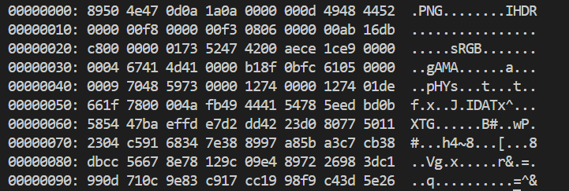
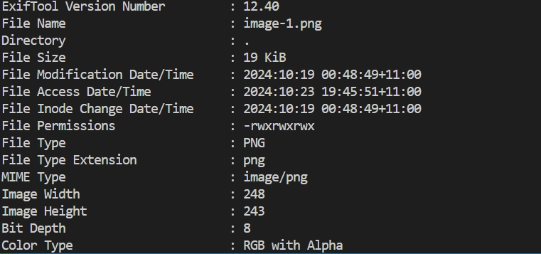
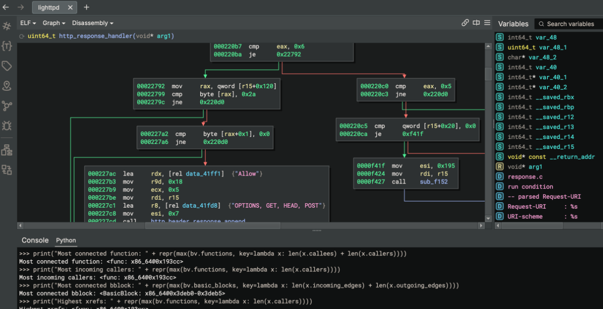
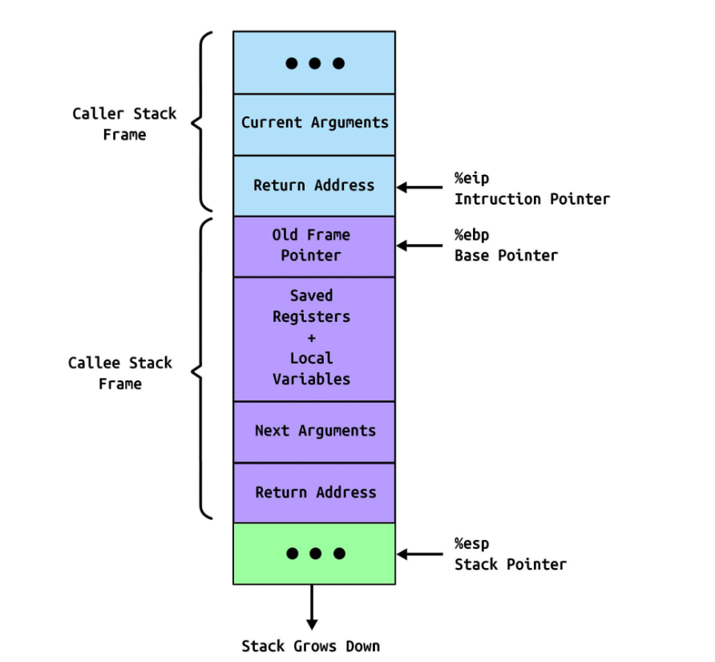
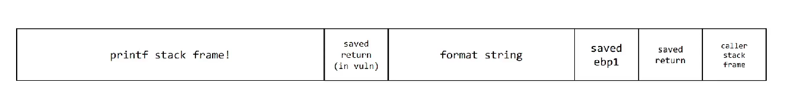

# Something Awesome Project 

The project provides write-ups of picoCTF. The purpose of this is to provide a learning tool for
beginners to learn about the foundations of capture-the-flag challenges. PicoCTF is a Jeopardy-style
CTF consisting of challenges related to [general skills](#general-skills), [cryptography](#cryptography), [web exploitation](#web-exploitation), [forensics](#forensics), [reverse engineering](#reverse-engineering) and [binary exploitation](#binary-exploitation).

## How to Mark
There includes five main-subsections corresponding to each challenge-type. Within each challenge there are two components. A theortical component which is compilation of my background research on the topics and a practical component which is the write-ups. The write-ups are represented by a hyper-link to a particular challenge with approximately 10-15 write-ups per challenge-type. 

Within each write-up it is divided up as per the template provided on the Github repo. There is a initial prepartory stage which involves the initial research, static and dynamic analysis of the program. There is then an attack phase which dictates the payload and method of exploitation utilised in order to obtain the flag. There is then a lessons-learnt tab which dictates the challenges which were required in order to overcome the problem. 
Good examples where I gained the most in each exercise include .... TODO: INSERT TO MAKE EASIER

As per the Table of Contents below this section there is a diary entry which is a weekly reflection on the progress of the project. It is divided up into **'what I did?'**, **'What challenges I faced'** and **'How to fix these errors'**.
## Table of Contents
- [Disclaimer](#disclaimer)
- [Features](#features)
- [Challenges](#challenges)
  - [General Skills](#general-skills)
  - [Cryptography](#cryptography)
  - [Classical Ciphers](#classical-ciphers)
    - [Classical Cipher Notation](#classical-ciphers-notation)
    - [Caesar Cipher](#caesar-cipher)
    - [Caesar Crypt-analysis](#caesar-crypt-analysis)
    - [Vigenere Cipher](#vigenere-cipher)
    - [Vigenere Crypt-analysis](#vigenere-crypt-analysis)
    - [Substitution Cipher](#substitution-cipher)
    - [Substitution Crypt-analysis](#substitution-crypt-analysis)
    - [Classical Cipher Crypt-analysis](#classical-cipher-crypt-analysis)
    - [RSA](#rsa)
    - [RSA Crypt-analysis](#rsa-crypt-analysis)
    - [Diffie Hellman](#diffie-hellman)
    - [Diffie Hellman Crypt-analysis](#diffie-hellman-crypt-analysis)
    - [Side-Channel Attacks](#side-channel-attacks)
    - [Post Quantum Cryptography](#post-quantum-cryptography)
    
  - [Web Exploitation](#web-exploitation)
    - [SQL Injection](#sql-injection)
    - [XSS Injection](#xss-injection)
    - [PHP](#php)
    
  - [Forensics](#forensics)
    - [File Formats](#file-formats)
    - [Meta-Data](#meta-data)
    - [Disk Imaging](#disk-imaging)
    - [Steganography](#steganography)
    
  - [Reverse Engineering](#reverse-engineering)
    - [Disassemblers](#disassemblers)
    - [Debuggers](#debuggers)
    
  - [Binary Exploitation](#binary-exploitation)
    - [Stack](#stack)
    - [Registers](#registers)
    - [Calling Conventions](#calling-conventions)
    - [Buffer Overflow](#buffer-overflow)
    - [ret2win](#ret2win)
    - [ret2libc](#ret2libc)
    - [GOT](#got)
    - [Format String Vulnerabilities](#format-string-vulnerabilities)

- [Diary](#diary)
  - [Week 1](#week-1)
  - [Week 2](#week-2)
  - [Week 3](#week-3)
  - [Week 4](#week-4)
  - [Week 5](#week-5)
  - [Week 6](#week-6)
  - [Week 7](#week-7)
  - [Week 8](#week-8)
- [Usage](#usage)
- [Contributing](#contributing)
- [License](#license)
- [Acknowledgments](#acknowledgments)

## Disclaimer
The information below is to be taken with a grain of salt. It has been my intepretation from the resources I've consumed. There may be some mistakes and details which may be incorrect.
## Challenges
## General Skills
General skills consist of using the basic tools and tricks of the trade such as Linux commands e.t.c. The skills learnt from these
challenges form the prequesite knowledge required for not just CTFs but computing literacy for a computer-science student. 
## Cryptography
Cryptography is the process of obsfucating information from unauthorised people. Usually modern cryptographic algorithms must
satisfy three properties: 
TODO: Add definitions
1. Confidentiality
2. Integrity
3. Authentication

Within CTF challenges they usually begin with basic classical ciphers such as the Caesar cipher. Moderate challenges may include
a substitution cipher or Vigenere ciphers which may require a more sophisticated cryptanalytic attack.
## Basic Mathematical Notation

## Classical Ciphers
These tend to be part of the easy-medium level challenges within the CTF. Classical ciphers in the real world refers to cryptographic schemes which typically were used prior to the 1970s where *strong* algorithms which relied on computers paved the way for modern cryptography. 
### Classical Ciphers Notation 
- $c_i$ is the $i^{th}$ character of the ciphertext.
- $m_i$ is the $i^{\text{th}}$ character of the decrypted plaintext.
- $k_i$ is the $i^{\text{th}}$ character of the key.
- $k$ is the key used during encryption.
- $||$ means concatentation
### Caesar Cipher
The Caesar Cipher is one of the most simple and recognizable ciphers in the world named after the Roman leader Julius Caesar. It functions by shifting all letters of the alphabet by a fixed number. They are amongst the most **beginner** friendly cryptography challenges.

Suppose we want to encrypt the message $m = m_1 || m_2 || m_3 || ... || m_n$. The encryption algorithm $E$ is defined as:

$$
E(k) = (m_i + k) \mod 26 = c_i
$$

The ciphertext would be:

$$
c = c_1 || c_2 || ... || c_n
$$

Given a ciphertext $c = c_1 || c_2 || c_3 || ... || c_n$, the decryption algorithm $D$ is defined as:

$$
D(k) = (c_i - k) \mod 26 = m_i
$$

### Caesar Crypt-analysis
Assuming the key-space is consisting of English letters [A-Z], there are only 26 possible keys. Therefore it would be 
trivial for any attacker to brute force all keys. For example,
```
def caesar_cipher_brute_force(ciphertext):
    english_alphabet = 'ABCDEFGHIJKLMNOPQRSTUVWXYZ'
    candidate_plaintext = []
    ciphertext = ciphertext.upper()

    # Loops through all possible shifts 
    for shift in range(0, 25):
        decrypted_message = ''
        for char in ciphertext:
            if char in alphabet:
                original_index = (alphabet.index(char) - shift) % 26
                decrypted_message += alphabet[original_index]
            else:
                decrypted_message += char  # Non-alphabet characters remain unchanged       
        candidate_plaintext.append((shift, decrypted_message))
    return results
```
### Vigenere Cipher

The Vigenère cipher is a method of encrypting alphabetic text using a simple form of polyalphabetic substitution. A keyword is used to determine the shift for each letter in the plaintext. It essentially encrypts each letter of the plain-text

Given a plaintext $m = m_1 || m_2 || m_3 || ... || m_n$ and a keyword $k = k_1 || k_2 || k_3 || ... || k_n$, the encryption algorithm $E$ is defined as:

$$c_i = (m_i + k_i) \mod 26$$

Given a ciphertext $c = c_1 || c_2 || c_3 || ... || c_n$ and a repeating key $k = k_1 || k_2 || k_3 || ... || k_n$, the decryption algorithm $D$ is defined as:

$$m_i = (c_i - k_i + 26) \mod 26$$

### Vigenere Crypt-analysis

### Substitution Cipher
Suppose an example substitution dict is as follows `dict` is as follows 
| Plaintext | A | B | C | D | E | F | G | H | I | J | K | L | M | N | O | P | Q | R | S | T | U | V | W | X | Y | Z |
|-----------|---|---|---|---|---|---|---|---|---|---|---|---|---|---|---|---|---|---|---|---|---|---|---|---|---|---|
| Ciphertext| Q | W | E | R | T | Y | U | I | O | P | A | S | D | F | G | H | J | K | L | Z | X | C | V | B | N | M |

Given a plaintext $m = m_1 || m_2 || m_3 || ... || m_n$ and a substitution dictionary `dict`, the encryption algorithm $E$ is defined as:

$$c_i = dict(m_i)$$

For example, $dict(A) = Q, dict(B) = W \cdots dict(Z) = M$

Given a ciphertext $c = c_1 || c_2 || c_3 || ... || c_n$ and the substitution dictionary `dict`, the decryption algorithm $D$ is defined as:

$$m_i = dict^{-1}(c_i)$$
where, $dict^{-1}$ is as follows (the inverse table)

| Ciphertext | Q | W | E | R | T | Y | U | I | O | P | A | S | D | F | G | H | J | K | L | Z | X | C | V | B | N | M |
|------------|---|---|---|---|---|---|---|---|---|---|---|---|---|---|---|---|---|---|---|---|---|---|---|---|---|---|
| Plaintext  | A | B | C | D | E | F | G | H | I | J | K | L | M | N | O | P | Q | R | S | T | U | V | W | X | Y | Z |

### Substitution Crypt-analysis


## Modern Cryptography
These challenges tend to be medium-hard level questions which exploit a deliberate use of *weak* parameters. In the real-world these schemes

### RSA
TODO: Add content for RSA.

### RSA Crypt-analysis
TODO: Add content for RSA Crypt-analysis.

### Diffie Hellman
TODO: Add content for Diffie Hellman.

### Diffie Hellman Crypt-analysis
TODO: Add content for Diffie Hellman Crypt-analysis.

### Side-Channel Attacks
TODO: Add content for Side-Channel Attacks.

### Post Quantum Cryptography
TODO: Add content for Post Quantum Cryptography.
TODO: Insert typical challenges

TODO: Insert more information about broader topics
#### Medium
- [Custom Encryption](https://github.com/kaliypsocraft/something-awesome/blob/main/crypto/custom_encryption/la_cifra_de.md)
- [Mini RSA](https://github.com/kaliypsocraft/something-awesome/blob/main/crypto/mini_rsa/mini_rsa.md)
- [Pixelated](https://github.com/kaliypsocraft/something-awesome/blob/main/crypto/pixelated/pixelated.md)
- [RSA Oracle](https://github.com/kaliypsocraft/something-awesome/blob/main/crypto/rsa_oracle/rsa_oracle.md)
- [Dachshund Attacks](https://github.com/kaliypsocraft/something-awesome/blob/main/crypto/dachshund_attacks/dachshund_attacks.md)
- [Mind Your P and Qs](https://github.com/kaliypsocraft/something-awesome/blob/main/crypto/mind_your_p_and_qs/mind_your_p_and_qs.md)
- [No Padding No Prob](https://github.com/kaliypsocraft/something-awesome/blob/main/crypto/no_padding_no_prob/no_padding_no_prob.md)
- [Spelling Quiz](https://github.com/kaliypsocraft/something-awesome/blob/main/crypto/spelling_quiz/spelling_quiz.md)
- [Substitution 1](https://github.com/kaliypsocraft/something-awesome/blob/main/crypto/substitution_1/substitution_1.md)

#### Hard
- [SRA](https://github.com/kaliypsocraft/something-awesome/blob/main/crypto/sra_hard/sra_hard.md)
- [Power Analysis: Warm Up](https://github.com/kaliypsocraft/something-awesome/blob/main/crypto/power_analysis_0/power_analysis_0.md)

## Web Exploitation
### SQL Injection
  It is one of the first web exploitation techniques a student learns when undertaking an introduction to security course. It involves an 
  attacker inserting malicious SQL queries into an entry field. It is a common attack vector against websites. It is an example of the dangers of 
  mixing **data** and **control**. 
### XSS Injection
TODO: Add content for XSS Injection.

### PHP
TODO: Add content for PHP.
TODO: Add other web exploitation attack vectors

TODO: Insert typical challenges

TODO: Insert more information about broader topics
### picoCTF Challenges
#### Medium
- [Java Code Analysis](https://github.com/kaliypsocraft/something-awesome/blob/main/web_exploit/javacode_analysis/javacode_analysis.md)
- [More SQLi](https://github.com/kaliypsocraft/something-awesome/blob/main/web_exploit/more_sqli/more_sqli.md)
- [Most Cookies](https://github.com/kaliypsocraft/something-awesome/blob/main/web_exploit/most_cookies/most_cookies.md)
- [Picobrowser](https://github.com/kaliypsocraft/something-awesome/blob/main/web_exploit/picobrowser/picobrowser.md)
- [Web Cookies](https://github.com/kaliypsocraft/something-awesome/blob/main/web_exploit/web_cookies/web_cookies.md)
- [Web Gauntlet 1](https://github.com/kaliypsocraft/something-awesome/blob/main/web_exploit/web_gauntlet_1/web_gauntlet_1.md)
- [Web Gauntlet 2](https://github.com/kaliypsocraft/something-awesome/blob/main/web_exploit/web_gauntlet_2/web_gauntlet_2.md)

  ### Hard
- [Notepad](https://github.com/kaliypsocraft/something-awesome/blob/main/web_exploit/notepad/notepad.md)
- [Javascript Kiddie](https://github.com/kaliypsocraft/something-awesome/blob/main/web_exploit/javascript_kiddie/javascript_kiddie.md)


## Forensics
Forensics challenges typically involve analysing a static file compared to other challenge-types whereby an executable program/remote server is involved. Within the context of CTFs they require candidates to find or reconstruct hidden information within these static files.
### File Formats/Signatures
Recognising file formats and signatures can be useful in CTF challenges.
File formats are a way for data to be encoded for computer storage. For example, `.pdf` or `.png` files.

 File signatures are used to identify and verify the contents of a file.  It can be found via running `xxd <file_name> | head`. This prints the first 10 lines (given by the `head` command) of a [hexdump](#hexdump) of a file. Running `xxd image-1.png | head` provided the following output:  
> Note: first line is PNG

This [page](#https://en.wikipedia.org/wiki/List_of_file_signatures) has a table of file signatures. For example this can be useful in challenges where the endianness of a file is swapped. Therefore knowing or revising magic numbers associated with common file types such as `.jpg` can be useful. 

Another useful command is `exiftool <filename>` which also provides the meta-data in the form: 

### Disk Imaging
TODO: Add content for Disk Imaging.

### Steganography
TODO: Add content for Steganography.
### Hexdump

#### Medium
- [Disk Disk Sleuth](https://github.com/kaliypsocraft/something-awesome/blob/main/forensics/disk_disk_sleuth/disk_disk_sleuth.md)
- [Endianess V2](https://github.com/kaliypsocraft/something-awesome/blob/main/forensics/endianess_v2/endianess_v2.md)
- [Op Oni](https://github.com/kaliypsocraft/something-awesome/blob/main/forensics/op_oni/op_oni.md)
- [Packets Primer](https://github.com/kaliypsocraft/something-awesome/blob/main/forensics/packets_primer/packets_primer.md)
- [Sleuthkit Apprentice](https://github.com/kaliypsocraft/something-awesome/blob/main/forensics/sleuthkit_apprentice/sleuthkit_apprentice.md)
- [Trivial Flag Transfer Protocol](https://github.com/kaliypsocraft/something-awesome/blob/main/forensics/trivial_flag_transfer_protocol/trivial_flag_transfer_protocol.md)
- [Eavesdropping](https://github.com/kaliypsocraft/something-awesome/blob/main/forensics/eavesdropping/eavesdropping.md)
- [Like 1000](https://github.com/kaliypsocraft/something-awesome/blob/main/forensics/like_1000/like_1000.md)
- [Op Orchid](https://github.com/kaliypsocraft/something-awesome/blob/main/forensics/op_orchid/op_orchid.md)
- [Scan Surprise](https://github.com/kaliypsocraft/something-awesome/blob/main/forensics/scan_surprise/scan_surprise.md)
- [Sleuthkit Intro](https://github.com/kaliypsocraft/something-awesome/blob/main/forensics/sleuthkit_intro/sleuthkit_intro.md)

#### Hard
- [Investigative Reversing 1](https://github.com/kaliypsocraft/something-awesome/blob/main/forensics/investigative_reversing_1/investigative_reversing_1.md)
- [Investigative Reversing 2](https://github.com/kaliypsocraft/something-awesome/blob/main/forensics/investigative_reversing_2/investigative_reversing_2.md)
- [Web Net 0](https://github.com/kaliypsocraft/something-awesome/blob/main/forensics/web_net_0/web_net_0.md)

## Reverse Engineering
TODO: Define Reverse Engineering
Reverse engineering often requires students to interpret machine code or bytecode to understand its functionality. Once they can interpret the machine code, they typically manipulate it to obtain the flag. In a challenge, a candidate is usually presented with a compiled C program. They must use a combination of disassemblers and debuggers to analyze the program's control flow.
TODO: Insert typical challenges
### Disassemblers
Disassemblers converts machine code into human readable assembly code - in some cases even into 'pseudo' C such as in BinaryNinja and Ghidra for example. This makes it an excellent tool for reverse engineering challenges as it enables the candidate to have an enhanced understanding of the control flow. Disassemblers such as BinaryNinja also provide a control-flow graph view to provide a clearer picture of the logic-flow of code.


> BinaryNinja's graph view - Credits: https://binary.ninja/

### Debuggers
Debuggers are used for dynamic code analysis enabling a user to view and alter the state of a program in run-time. `gdb` (GNU debugger) is a common debugger used in CTFs in general, for example above in [binary exploitation](#binary-exploitation).
#### Medium
- [Crack Me 0x100](https://github.com/kaliypsocraft/something-awesome/blob/main/reverse_eng/crack_me_0x100/crack_me_0x100.md)
- [Picker 1](https://github.com/kaliypsocraft/something-awesome/blob/main/reverse_eng/picker_1/picker_1.md)
- [Picker 2](https://github.com/kaliypsocraft/something-awesome/blob/main/reverse_eng/picker_2/picker_2.md)
- [Picker 3](https://github.com/kaliypsocraft/something-awesome/blob/main/reverse_eng/picker_3/picker_3.md)
- [Packer](https://github.com/kaliypsocraft/something-awesome/blob/main/reverse_eng/packer/packer.md)
- [Win Anti Dbg 0x100](https://github.com/kaliypsocraft/something-awesome/blob/main/reverse_eng/win_anti_dbg_0x100/win_anti_dbg_0x100.md)
- [Win Anti Dbg 0x200](https://github.com/kaliypsocraft/something-awesome/blob/main/reverse_eng/win_anti_dbg_0x200/win_anti_dbg_0x200.md)

#### Hard
- [Keygenme](https://github.com/kaliypsocraft/something-awesome/blob/main/reverse_eng/keygenme/keygenme.md)
- [GDB Baby Step 4](https://github.com/kaliypsocraft/something-awesome/blob/main/reverse_eng/gdb_baby_step_4/gdb_baby_step_4.md)
- [Not Crypto](https://github.com/kaliypsocraft/something-awesome/blob/main/reverse_eng/not_crypto/not_crypto.md)


## Binary Exploitation
TODO: Add format strings and buffer overflow definition
### Stack
The stack exists in a computer's RAM and 



> Image courtesy of [here](#https://www.cameronwickes.co.uk/stack-frames-pointers/)

## Registers
Registers are accessible memory locations within a processor that hold data crucial for computation, such as memory addresses, instructions, and numbers used for calculations. In CTFs, understanding various registers is essential for tracking the **return address**, **stack pointer**, and **base pointers**.

Modern processors typically have either 32-bit or 64-bit registers, meaning they can hold up to 32 or 64 bits of data, respectively. Key registers for binary exploitation include:
- **Instruction Pointer**: Holds the address of the next instruction to be executed.
  - `eip` (32-bit)
  - `rip` (64-bit)
- **Stack Pointer**: Points to the top of the stack.
  - `esp` (32-bit)
  - `rsp` (64-bit)


> Example of 32-bit registers


> Example of 64-bit registers

---

## Calling Conventions
Calling conventions are standardized ways of passing function parameters, either on the stack or stored in registers. This standardization enables interoperability between machines and compilers. If `Machine A` and `Machine B` used different conventions for passing arguments, they could produce different outputs for the same function.

In a 32-bit system, function arguments are typically pushed onto the stack **from right to left**. For example:

```c
int equation(int a, int b, int c) {
  return a + b - c;
}

```
The order of arguments pushed onto the stack would be: c $\rightarrow$ b $\rightarrow$ a. If this convention is not followed, the function may behave unexpectedly:

```
equation(1, 2, 3) = 0
equation(3, 2, 1) = 4

```

## Buffer Overflow
A buffer overflow occurs when data exceeds the allocated memory buffer size, potentially accessing or overwriting other areas of memory. Unsafe functions like gets can lead to buffer overflows. For example:
``` c
Copy code
void unsafe() {
  int buffer[5];
  gets(buffer);
}
```

In this case, if a user inputs more than 5 bytes of data, they can access unintended areas of the stack.

## Global Offset Table (GOT) and Procedure Linkage Table (PLT)
The Global Offset Table (GOT) and Procedure Linkage Table (PLT) are tables used in dynamically linked executables to resolve function addresses at runtime. When a function is first called, its address is stored in the GOT via the PLT, so future calls can directly access the function without additional lookups.

- PLT: Acts as an intermediary, initially directing calls to dynamically linked functions to their proper locations by using the GOT.
- GOT: Stores the resolved addresses of functions, allowing direct access on subsequent calls.
In binary exploitation, modifying the GOT can enable redirection of function calls, which is helpful in specific types of attacks like ret2libc.

## ret2win
In ret2win challenges, the goal is to override the return address (stored in eip on a 32-bit system or rip on a 64-bit system) with the address of a function that prints or contains the flag. These challenges typically involve:

Finding the address of the target function.
Using input to overflow the stack and overwrite the return address, redirecting it to the target function.

## ret2libc
ret2libc attacks aim to execute code in the C standard library (libc) to gain shell access or execute other functions on a remote server. To achieve this, the attacker:

Leverages the GOT to obtain the libc base address.
Locates the addresses of system, a command string like /bin/sh, and exit.
Constructs an input that sets the return address to system, with /bin/sh as the argument.
This approach allows attackers to bypass the need for shellcode by leveraging already-present code in the binary.
### Format String Vulnerabilities
A format string vulnerability occurs when user input is improperly passed as the format argument to variadic functions (can take a variable number of parameters) like `printf` or `scanf`. For example, 

```c
char str[] = "Hello world!"
printf("%s", &str)
```
> The `printf` function expects a single argument.

A vulnerable example is, 

```c
printf("%p %p %p %p %p %p")
```
> The `printf` function expects 5 arguments but receives none from the user. It then reads data from the stack which it may unauthorised to do so.



> Photo credits: [here](#https://www.youtube.com/watch?v=QOgD3jPHyRY)

For example, if the format string is "`%x.%x.%x.%x`", printf will output four consecutive values from the stack in hexadecimal, potentially exposing critical data such as memory addresses, return pointers, or hidden values. 

Additionally, format strings like "`%n$x`" allow an attacker to specify which stack argument to read, providing more control over what is accessed.

One of the most dangerous format specifiers is `%n`, which causes `printf` to write the number of characters printed so far into a memory address specified by the attacker. This can be exploited to overwrite sensitive areas in memory.

For example, suppose we want to override a variable on the stack. We can write to this address with a new value we want.

Example payload 1:
Given an offset of 1, we write 0 $\rightarrow$ 0x0804a048 and 0 $\rightarrow$ 0x0804a04c
> `%3$llnaaH\xa0\x04\x08`

Example payload 2:
Given an offset of 1, we write 5 $\rightarrow$ 0x0804a048 and 10 $\rightarrow$ 0x0804a04c
>`%5c%6$lln%5c%7$hhnaaH\xa0\x04\x08L\xa0\x04\x08`

Example payload 3:
Given an offset of 1, we write 5 $\rightarrow$ 0x0804a048 and 0 $\rightarrow$ 0x0804a04c
>`%5c%4$llnaaaH\xa0\x04\x0`

Example payload 4:
Given an offset of 1, we write 0 $\rightarrow$ 0x0804a048 and 5 $\rightarrow$ 0x0804a04c
>`%5$lln%5c%6$hhnaH\xa0\x04\x08L\xa0\x04\x08`

NOTE: `L` $\rightarrow$ `\x4c` and `H` $\rightarrow$ `\x48`

TODO: Insert more information about broader topics
#### Medium
- [Basic File Exploit](https://github.com/kaliypsocraft/something-awesome/blob/main/bin_exploit/basic_file_exploit/basic_file_exploit.md)
- [Buffer Overflow 2](https://github.com/kaliypsocraft/something-awesome/blob/main/bin_exploit/buffer_overflow_2/buffer_overflow_2.md)
- [Clutter Overflow](https://github.com/kaliypsocraft/something-awesome/blob/main/bin_exploit/clutter_overflow/clutter_overflow.md)
- [Fmt Str 2](https://github.com/kaliypsocraft/something-awesome/blob/main/bin_exploit/fmt_str_2/fmt_str_2.md)
- [Fmt Str 3](https://github.com/kaliypsocraft/something-awesome/blob/main/bin_exploit/fmt_str_3/fmt_str_3.md)
- [Heap 1](https://github.com/kaliypsocraft/something-awesome/blob/main/bin_exploit/heap_1/heap_1.md)
- [Heap 2](https://github.com/kaliypsocraft/something-awesome/blob/main/bin_exploit/heap_2/heap_2.md)
- [Heap 3](https://github.com/kaliypsocraft/something-awesome/blob/main/bin_exploit/heap_3/heap_3.md)
- [VNE](https://github.com/kaliypsocraft/something-awesome/blob/main/bin_exploit/vne/vne.md)
- [Two Sum](https://github.com/kaliypsocraft/something-awesome/blob/main/bin_exploit/two_sum/two_sum.md)
#### Hard
- [Here is Libc](https://github.com/kaliypsocraft/something-awesome/blob/main/bin_exploit/here_is_libc/here_is_libc.md)
- [Ropfu](https://github.com/kaliypsocraft/something-awesome/blob/main/bin_exploit/ropfu/ropfu.md)
## Diary
  The diary serves as a logbook for weekly evaluations in order to enhance productivity and to maintain purpose. 
  Each week consists of a more detailed overview of what is conducted in order to advance the state of the project. 
  The intention behind the diary is to be mindful and to maximise intent with all activities on a day to day basis.
## Week 1
### What I did?
- Week 1 was just getting the cogs moving and selecting between projects. At this stage, I was debating between a cryptography research project or a CTF write-up.

### What I need to improve?
- Reduce screen time
- Be swift and decisive with choosing a project

### How to fix errors?
- Be mindful and deliberate with the selection of tasks and projects.

## Week 2
### What I did?
- Solving SQL Injections and Buffer Overflows (being hands-on)
- These tasks further assisted me on my CTF write-ups/tutorial project.
- They exposed me to more CTF-related challenges and gave me some insight into the thinking patterns required for CTFs and the psychology behind them.

### What I need to improve?
- Develop a deeper understanding of SQL injection techniques and their real-world applications.
- Practice more buffer overflow exercises to improve my confidence in exploiting this vulnerability.

### How to fix errors?
- Use online platforms like Hack The Box and TryHackMe to practice SQL injections and buffer overflow challenges.
- Set weekly goals for specific vulnerabilities to focus on, ensuring steady progress.

## Week 3
### What I did?
- Conducted Wargames specifically on XSS Injection-related tasks.
- Continued my Something Awesome Project - made a website via Canva.
- Wrote Something Awesome Project Write-Ups on a markdown file ready to transfer over.
- Finished 12 CTF challenges related to SAP.
- Attended B-Sides!
- There was a talk on exploitation of AI models and modern cryptographic attacks which intrigued me.
- Engaged in discussions with industry professionals during the B-Sides event, gaining insights into emerging trends in cybersecurity.
- Developed a better understanding of different types of XSS attacks and their mitigations.

### What I need to improve?
- Strengthen my knowledge of different types of web vulnerabilities beyond XSS.
- Enhance my ability to articulate findings and strategies in my write-ups for better clarity.

### How to fix errors?
- Dedicate time to researching and practicing additional web vulnerabilities, such as CSRF and RCE.
- Seek feedback on my write-ups from peers or mentors to improve my communication skills and technical accuracy.

## Week 4
### What I did?
- Completed advanced web exploitation challenges, particularly focusing on session management vulnerabilities.
- Began learning about heap exploitation techniques, which will add depth to my Something Awesome Project.
- Drafted additional CTF write-ups for the ongoing project, covering techniques like Cross-Site Scripting (XSS) and SQL Injection.

### What I need to improve?
- Refine my understanding of heap exploitation, as some concepts are still unclear.
- Improve time management between different tasks (CTF challenges, research, and project write-ups).

### How to fix errors?
- Set aside focused study sessions specifically for heap exploitation concepts, using resources like wargames or tutorials.
- Create a more structured daily schedule to balance CTF challenges, project progress, and personal research.

## Week 5
  ### What I did?
- This week conducted format strings practice on picoCTF as that is what we learnt in the Thursday Extended lecture
- Conducted post-quantum cryptography research specifically post-quantum digital signatures
- Read into a data structure 
  ### What I need to improve?
- Once again phone has stolen my attention at times.
- Rushing into a problem rather than taking the time to slow down and think.
- Hitting dead ends in problems and feeling demoralised.
  ### How to fix errors?
- Set aside time to be cognizant of *how to* solve a problem rather than diving straight in.
- Be mindful and intentional in everything I do and be methodical in my thinking
## Week 6
 ### What I did?
- Finished half my picoCTF wargame challenges
- About a 1/3 way through the write-ups
- Did some research into a cryptographic data structure called a vector commitment. 
  ### What I need to improve?
- Increase the speed at which I output write-ups
- There is some formatting errors in the write-ups namely with the pictures not correctly aligned.
  ### How to fix errors?
- Given a deadline of approximately 14 days. I need to conduct approximately 8-10 exercises a day. Since there is five challenge types, it would be wise
to conduct one-two exercises per challenge-type a day.
- The end-state of this is that I will be finished within a week. This will enable me another week to edit and flesh out the responses. I will give myself 30 minutes per challenge. Therefore at the very least it will be 3 - 5 hours of work per day.
- Break this up into 2-3 deep work blocks. 

## Week 7


## Week 8

### Building

```bash
# Example build command
make
