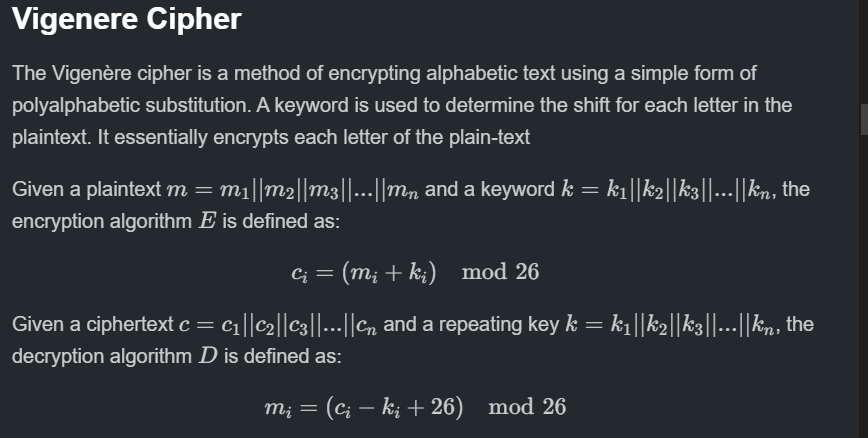
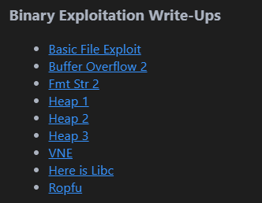
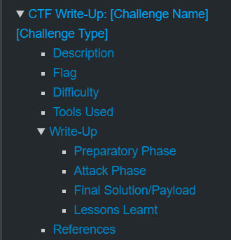

# Something Awesome Project 

!!! tip GitHub Link
    The project is on a [Github link](https://github.com/kaliypsocraft/something-awesome) containing the write-ups and challenges conducted in `picoCTF`. The link to this page is [here](https://github.com/kaliypsocraft/something-awesome).
    
    **NOTE**: Using the Github version to view `REPORT.md` via the preview tab may be easier to navigate due to the table of contents on the right-hand side. Be advised the callout blocks (`!!! tip` and `!!! warning`) do not render on the Github preview.

    Please reference last-edit/commit to prove that editing of the document was not conducted after `1800 04 NOV 24`.

!!! warning Mission Statement
    The goal of this project was to deepen my understanding of foundational cybersecurity concepts while creating a tool that helps other beginners learn from my experience.

    The intended outcome is to grasp essential cybersecurity principles and develop a set of introductory teaching tools that offer a strong foundation for further expansion. 

## Table of Contents
- [How To Mark](#how-to-mark)
- [Challenges Experienced](#challenges-experienced)
  - [Binary Exploitation](#binary-exploitation)
  - [Binary Exploitation Fixes 🔧](#binary-exploitation-fixes-wrench)
  - [Web Exploitation](#web-exploitation)
  - [Web Exploitation Fixes 🔧](#web-exploitation-fixes-)
  - [Cryptography](#cryptography)
  - [Cryptography Fixes 🔧](#cryptography-fixes-)
  - [Forensics](#forensics)
  - [Forensics Fixes 🔧](#forensics-fixes-)
  - [Reverse Engineering](#reverse-engineering)
  - [Reverse Engineering Fixes 🔧](#reverse-engineering-fixes-)

- [Diary Reflection](#diary)
  - [Week 1](#week-1)
  - [Week 2](#week-2)
  - [Week 3](#week-3)
  - [Week 4](#week-4)
  - [Week 5](#week-5)
  - [Week 6](#week-6)
  - [Week 7](#week-7)
  - [Week 8](#week-8)
- [References](#references)

## How to Mark

This document is solely to document the summary of obstacles experienced. includes **five main-subsections** corresponding to **each CTF challenge-type**. Within each challenge-type containing 5-10 write-ups providing the **analysis**, **critical-thinking** and **reflection** component. The following sub-sections goes into more detail about how to intepret each document on the repository. 

!!! note `cat REPORT.[pdf|md]`
    At each section it includes a tree of obstacles/challenges - obtained along the way in learning how to solve these CTF problem. For example conducting buffer-overflow attacks requires knowledge on how the stack operates $\rightarrow$ role of certain registers such as `eip` or `rip`. Note these trees are **non-exhaustive** and they simply are what I experienced thus far in the 6-7 weeks of conducting `picoCTF`. They are constantly growing as I gain more knowledge.

```
└── <Problem Type>
    ├── <Challenge 1>
    │   ├── <Sub-Challenge 1>
    |   ├── <Sub-Challenge 2>
    │   └── <Sub-Challenge 3>
    │
    ├── <Challenge 2>
    │   ├── <Sub-Challenge 1>
    │   └── <Sub-Challenge 2>
    └── <Challenge n>
```
> Example tree of obstacles

#### Other Files
On the Github, `ANALYSIS.md` provides write-ups of picoCTF. PicoCTF is a Jeopardy-style CTF consisting of challenges related to [cryptography](#cryptography), [web exploitation](#web-exploitation), [forensics](#forensics), [reverse engineering](#reverse-engineering) and [binary exploitation](#binary-exploitation). In the given Github [link](https://github.com/kaliypsocraft/something-awesome) contains an `ANALYSIS.md` file which contains the following:

!!! note `cat ANALYSIS.md`
     It includes **five main-subsections** corresponding to **each CTF challenge-type**. Within each challenge-type there are two components. A **theoretical component** which is a compilation of my background **research** on the topics and a **practical component** which are represented by the write-ups. The write-ups contains much of the **analysis**, findings and **personal reflections** along the way. The write-ups are represented by a hyper-link to a particular challenge with approximately 5-10 write-ups per challenge-type. Below are some examples:


> Example of theoretical component 


> Example of practical component

!!! note What is in a write-up
    
    Within each **write-up** it is divided up as per the template provided on the Github repo.  
    1. There is a initial **preparatory stage** which involves the initial **research**, static and dynamic analysis of the program. 

    2. There is then an **attack phase** which dictates the payload and method of exploitation utilised in order to obtain the flag. 

    3. There is then a **lessons-learnt** tab which dictates the **challenges** which were required in order to overcome the problem. 

> Example template for each write-up

!!! info Examples
    Below are some stand-out write-ups conducted on exercises which I got alot out of them.
    
    **Binary Exploitation**: [ret2libc](https://github.com/kaliypsocraft/something-awesome/blob/main/bin_exploit/here_is_libc/here_is_libc.md), [use-after-free](), [format-string]()

    **Cryptography**: [small-priv-exponent-rsa](), [chosen-plain-text-attack]()
    
    **Web Exploitation**: [jwt](https://github.com/kaliypsocraft/something-awesome/blob/main/web_exploit/javacode_analysis/javacode_analysis.md), [sql-injection]() 


    **Forensics**: [network-analysis](https://github.com/kaliypsocraft/something-awesome/blob/main/forensics/trivial_flag_transfer_protocol/trivial_flag_transfer_protocol.md), [disk-imaging](), [steganography]()

    **Reverse Engineering**: [anti-debugger](), [disassembler-used]()


## Challenges Experienced 
!!! note Introduction
    The CTF medium provides immediate feedback on the progress of tasks. The concepts and techniques required were often just out-of-reach and required reading documentation and online material in order to attack problems. 
    
    The following sections outlines the specific obstacles experienced along the way during the conduct of the CTF and the writing of the report. There are two main components - first consists of the hurdles experienced (marked with an orange warning sign) and second the fixes utilised to rectify the issues.


###  General Obstacles
!!! info Overview of Obstacle
    The general consensus with most of the challenges was knowing **where to start** and **what tools to use** - by extension **how to use the tools**. Since I was a beginner to CTFs intepreting a problem was difficult as I had no frame of reference for some challenges.

!!! warning Where To Start?
    Most challenges whereby I had limited-no experience required atleast an hour of background reading and researching in order to tackle them. The following sub-sections dictates the specific challenges experienced within each challenge-type.

    Often-times in medium-hard problems  I would be led down a rabbit-hole thinking it would solve the problem. However, it often would lead to deadends and further discourage the candidate. For example, spending an hour researching a topic and attempting to apply it to no avail. This obstacles span beyond CTFs and into real-world professional development. 

    These experiences were essential in the development of skills 

---


### Binary Exploitation

```
└── Binary Exploitation
    ├── Buffer Overflow ──── Heap Overflow
    │   ├── ret2win                 └── use-after-free 
    |   │       └── gdb
    │   ├── rop chains 
    │   │       └── return oriented programming 
    │   └── ret2libc                └── gadgets
    │           └── registers
    ├── Format String Vulnerabilities
    │   ├── arbitary read
    │   └── arbitary write
    │                   └── format specifiers
    │                              └── specific sizes   
    ├── Gdb
    ├── Ghidra
    └── BinaryNinja
     
```
The main sub-challenge types I encountered in the binary-exploitation class were **buffer overflows** and **format string exploitations**. There was also one challenge which involved a **heap overflow**, exploiting a **use-after-free exploit**.

!!! info Overview of Obstacle
    In general, binary exploitation exercises required me to implement attacks such as buffer overflows and format string exploitations. 

!!! warning Buffer Overflows
    1. The primary challenges with **buffer overflows** emerged when basic protections like **NX and canaries** were introduced, requiring a higher level of skill to bypass. Exploiting these vulnerabilities also demanded a solid understanding of **gdb** and how the **stack** functioned. Initially, using gdb was challenging, but it became essential for navigating these attacks.

    2. Another key skill was grasping calling conventions, especially for ret2libc challenges. Sometimes I would spend hours troubleshooting, only to discover that differences between 32-bit and 64-bit calling conventions were causing issues. 


    3. For example, ret2libc challenges often involved complex concepts. Occasionally, I struggled to understand why certain steps e.g. like selecting specific gadgets were necessary in online tutorials. Tackling these new concepts often created a web of dependencies, which required focused study and practice to unravel.

    4. Understanding the GOT/PLT was al

!!!! warning Format String Vulnerabilities

    1. Learning format string exploits extended upon the knowledge from buffer overflows. The main challenges associated with format string vulnerabilities was understanding the impact of certain format specifiers. For example using `%p | %p` or `%x | %x` to find the offset was relatively straightforward. However, then using this information to conduct arbitary writes took some time to wrap my head around. 

    NOTE: This is still an area which requires more tinkering. The challenge which I wrote to an address was conducted using pwntools and the payload it produced used alot of different-sized 
!!! info Fixes :wrench:
    Using a story made understanding GOT/PLT easier. I made an analogy which is noted in `REPORT.md` about a new retail shop worker (`PLT`), their work directory to find items (`GOT`) and the customer (the binary). 

    Watching online tutorials from peop

    To improve in binary exploitation, I practiced with tools like `GDB` (GNU Debugger) and `pwntools`, which helped me better understand register manipulation and memory management. Visual aids, such as online stack visualization tools, also allowed me to grasp the flow of stack frames and memory layouts. 

    Visualising format string vulnerabilities via drawing out a stack 
    Reading the documentation provided by `printf(3) man` ([link](https://man7.org/linux/man-pages/man3/printf.3.html)) solidified my understanding. 


---

### Web Exploitation
```
└── Web Exploitation
    ├── Web Frameworks
    │    └── Injection-based attacks
    │       ├── SQL ── different version syntax
    |       ├── XSS
    │       └── CSRF
    │
    ├── Web Tokens
    │   └──JWT
    │   
    └── Request Headers
```
!!! info Overview of Obstacle
    Web exploitation presented several challenges, primarily due to my limited knowledge of web development and network fundamentals. It was overwhelming taking in all the data from learning basic `.html` and all the nuances associated with web development. In the end however, it has spurred a new interest in this world which hopefully will be reinforce din COMP6483.

!!! warning Web Frameworks
    
    Familiarity with web development frameworks and applications is essential for web exploitation, as is a strong grasp of the skills commonly used in penetration testing. My limited understanding of HTTP request headers, including `GET`, `POST`, `PUT`, and `DELETE`, initially hindered my progress.

    Having a poor understanding of web frameworks and how code interacts between a client and server was a liability in my journey to web exploitation.

!!! warning  Injection-based Attacks
    SQL injection challenges, in particular, required a deep understanding of syntax. For example, certain tasks included keyword filters, prompting research into alternative SQL commands or obfuscation techniques to bypass these restrictions. 
    
    A note worthy challenge was me not noticing that column number mattered and kept querying a database that expected $n$ columns but only providing $k$ column in a search, where $n \neq k$. 
    
    XSS injection challenges also required some basic understanding of HTML syntax in order to be effective. 


!!! info Fixes :wrench:
    Addressing challenges in web exploitation required learning web fundamentals, so I worked through beginner courses in SQL, HTML, and network protocols.

    For SQL injection tasks, I experimented with different types from SQLite to MySQL to understand their syntax differences. 

    Using applications like `Burp Suite` improved my understanding of request/response patterns and helped in identifying and exploiting vulnerabilities.

---

### Cryptography
```
└── Cryptography
    ├── Classical Ciphers
    │   ├── Caesar Cipher/ROT-13
    |   ├── Vigenere Cipher
    │   └── Substitution Cipher
    │
    ├── Modern Cryptography
    │   ├── RSA ── Wieners Attack 
    │   └── Side channel attacks 
    └── XOR Ciphers
```

!!! info Overview of Obstacle
    My experience in cryptography provided a helpful foundation for tackling challenges, yet integrating pwntools for payload crafting and optimization still posed a learning curve. 

!!! warning Manual Decryption
    I also challenged myself to manually develop decryptors for classical ciphers like Vigenère and substitution ciphers, avoiding automated tools. For example more advanced frequency-based attacks using logarithm tables and 'fitness' scores were a non-trivial task to understand. Source:  This exercise helped deepen my understanding of encryption techniques and respect for even classical ciphers.

!!! warning  Side-Channel Attacks
    The Power Analysis exercise introduced me to the hands-on application of side-channel attacks, where I learned to analyze cryptographic operations by measuring power consumption. This approach required a mix of precision and knowledge about how power variations can reveal sensitive data.

    I vastly underestimated my ability to assimulate the information 
!!! info Fixes :wrench:
    Improving my skills in cryptography meant getting more hands-on experience with `pwntools` for payload generation. 

    Building custom decryptors using taught me practical cryptanalysis skills, which I complemented by researching side-channel attacks to better understand physical vulnerabilities in cryptographic systems.

---
### Forensics 
```
└── Forensics
    ├── File Formats
    │   ├── Hex Dumps
    |   ├── Metadata
    │   └── Endianness
    │
    ├── Network Analysis
    │   ├── Wireshark
    │   └── Packet Capture Analysis
    ├── Disk Imaging
    └── Steganography
```

!!! info Overview of Obstacle
    The main challenge I experienced with digital forensics was just a lack of knowledge within the field of files, network analysis and steganography. Furthermore, it required some 

!!! warning File Formats
    Forensics required research into file formats, forensic tools, and interpreting hex dumps. This involved a comprehensive understanding of file signatures, types, and low-level data structures. I worked with Linux command-line tools such as `strings` and `xxd` to extract hidden data and identify file characteristics, which helped build an understanding of file system layouts and common forensic analysis techniques.
!!! warning Network Analysis
    The main challenge associated with network analysis was getting a basic understanding of the fundamentals of networks. By extension, grasping the fundamentals of Wireshark. The latter software from face value had a lot fo moving parts and functionality. It at times caused decision paralysis as I did not know the best tool for the job or had suspcions that it had 

!!! warning  Disk Imaging
    Analysing disks and having an understanding of basic data storage lingo such as partitions, volume system and file system types required research. Without this knowledge using tools such as `Sleuthkit` lacked intention and often was just copied from the documentation. 

    Using Autopsy was also a new software I learnt. However with the challenges I did in this CTF is was relatively straightforward to open a case and click around until I found something of interest. Therefore, this can be an area of improvement in terms of developing my intentional use of tools such as Autopsy.

!!! warning  Steganography
    My only prior knowledge was LSB Steganography and so it was still a relatively new skill to learn about. It was challenging to be intentional with the use of forensic photo apps such as [this](https://29a.ch/photo-forensics/#forensic-magnifier). I often just turn the dials hoping for the best. 

    Using new libraries such as `steghide` also required some reading of documentation and more research online. 


!!! info Fixes :wrench:
    To build my forensics skills, I spent time learning Linux commands more thoroughly, focusing on tools like `xxd`, `strings`, and `hexdump` to analyze file structures and metadata. 

    Learning to use Sleuthkit


---
### Reverse Engineering
```
└── Reverse Engineering
    ├──────────── Debuggers
Assembly Language      ├── gdb
    │                  └── windbg
    │
    ├── Disassemblers
    │   ├── BinaryNinja
    │   └── Ghidra
    └── C programming language
```

!!! info Overview of Obstacle
    The obstacles encountered in reverse engineering were closely tied to those in binary exploitation. However, this was more related to a tool-based understanding. In binary exploitation, challenges often stemmed from a lack of technical knowledge about low-level systems. In most reverse engineering tasks I conducted, however, it was sometimes difficult to interpret the information provided by the tools.

!!! warning Disassemblers
    Getting a grip of the basics of Ghidra and BinaryNinja, much of the obstacles involved staying mentally switched on with the flow of the programs. These devices had a lot of control over flow and diagram views which at times was confusing. Often with all these tools at my disposal, knowing what to use was down to trial and error.

!!! warning Debuggers
    Learning how to use `gdb` was a fundamental skill to obtain.
    I spent considerable time experimenting with different debugging techniques, using breakpoints and stepping through code to monitor how variables and memory addresses changed. This challenge stemmed over into binary exploitation, however in this case

!!! warning Assembly Language 
    Since I had limited experience with assembly language and machine code, interpreting disassembly output required me to understand each instruction’s purpose and how it affected the program’s flow. I had to recognize common patterns, such as loops, conditional branches, and function calls, and learn to navigate register manipulation, memory addressing, and the stack layout. Additionally, understanding the differences between architectures (e.g., x86 vs. x64) was essential, as each has unique conventions and instruction sets.

!!! warning C Programming Language 
    Gaining depth in the C language was essential, as many low-level operations rely heavily on C for interacting closely with system resources. I worked on strengthening my understanding of pointers, memory management, and data structures like linked lists and binary trees. Knowing how C translates to assembly also helped me connect high-level code to low-level execution, which was crucial for debugging and for recognizing vulnerabilities like buffer overflows or format string exploits.


!!! info Fixes :wrench:
    For reverse engineering, I used disassemblers like `Ghidra` and debuggers such as `Gdb` to develop a structured approach to understanding disassembly. Working withassembly code snippets allowed me to understand common instruction sets and patterns. This further assisted in the obstacles in the binary exploitation problem sets.

    Regular practice with `gdb` step-through debugging helped me better interpret function calls and memory allocations in unfamiliar binary files, ultimately boosting my confidence with low-level code.

---

### Other Challenges
!!! warning Communication and Logistics 
    Other issues were logistical but still impacted my workflow. I frequently encountered PATH issues and package errors that required considerable time and patience to resolve. Often, I turned to Stack Overflow or community forums for troubleshooting. In some cases, the solutions required manual adjustments to environment settings or reconfiguration of dependencies to ensure all tools worked smoothly.

    Another challenge was effectively conveying new concepts in text. This tested my ability not only to understand the knowledge deeply but also to communicate it clearly.

### Meta-Challenges

!!! warning Formatting of Markdown
    Learning basic Markdown formatting turned out to be a useful skill to keep in my toolkit, as documentation is often written in Markdown. Converting files from `.md` $\rightarrow$ `.html` $\rightarrow$ `.pdf` proved to be a non-trivial task. The preview mode was in dark mode, which was more visually appealing, but upon switching to browser mode, it reverted to light mode. Additionally, exporting as a `.pdf` often cut off the page borders, which required reformatting.

    Another issue I noticed was differences in formatting between Github's preview and my text editor's preview of Markdown. For example, on the `.pdf`


## Diary Reflection
 

!!! note Intention
    The diary serves as a logbook for weekly evaluations to enhance productivity and maintain purpose. Reflecting on myself is a vital part of professional development, and this diary forms an integral part of that process.

    The intention behind keeping the diary is to be mindful and maximize intent with all daily activities. It also provides a high-level overview of consistent weaknesses while helping to identify some strengths too. :)

!!! info Week 1
    ### What I did?
    - Week 1 was just getting the cogs moving and selecting between projects. At this stage, I was debating between a cryptography research project or a CTF write-up.

    ### What I need to improve?
    - Reduce screen time
    - Be swift and decisive with choosing a project

    ### How to fix errors?
    - Be mindful and deliberate with the selection of tasks and projects.
!!! note Week 2
    ### What I did?
    - Solving SQL Injections and Buffer Overflows (being hands-on)
    - These tasks further assisted me on my CTF write-ups/tutorial project.
    - They exposed me to more CTF-related challenges and gave me some insight into the thinking patterns required for CTFs and the psychology behind them.

    ### What I need to improve?
    - Develop a deeper understanding of SQL injection techniques and their real-world applications.
    - Practice more buffer overflow exercises to improve my confidence in exploiting this vulnerability.

    ### How to fix errors?
    - Use online platforms like Hack The Box and TryHackMe to practice SQL injections and buffer overflow challenges.
    - Set weekly goals for specific vulnerabilities to focus on, ensuring steady progress.

!!! tip Week 3
    ### What I did?
    - Conducted Wargames specifically on XSS Injection-related tasks.
    - Continued my Something Awesome Project - made a website via Canva.
    - Finished 12 CTF challenges related to SAP.
    - Attended B-Sides!
    - There was a talk on exploitation of AI models and modern cryptographic attacks which intrigued me.
    - Developed a better understanding of different types of XSS attacks in class - namely reflected and stored.

    ### What I need to improve?
    - Strengthen my knowledge of different types of web vulnerabilities beyond XSS.
    - Enhance my ability to articulate findings and strategies in my write-ups for better clarity.

    ### How to fix errors?
    - Dedicate time to researching and practicing additional web vulnerabilities, such as CSRF and RCE.
    - Seek feedback on my write-ups from peers or mentors to improve my communication skills and technical accuracy.

!!! info Week 4
    ### What I did?
    - Completed advanced web exploitation challenges, particularly focusing on session management vulnerabilities.
    - Began learning about heap exploitation techniques, which will add depth to my Something Awesome Project.
    - Drafted additional CTF write-ups for the ongoing project, covering techniques like Cross-Site Scripting (XSS) and SQL Injection.

    ### What I need to improve?
    - Refine my understanding of heap exploitation, as some concepts are still unclear.
    - Improve time management between different tasks (CTF challenges, research, and project write-ups).

    ### How to fix errors?
    - Set aside focused study sessions specifically for heap exploitation concepts, using resources like wargames or tutorials.
    - Create a more structured daily schedule to balance CTF challenges, project progress, and personal research.

!!! note Week 5
    ### What I did?
    - This week conducted format strings practice on picoCTF as that is what we learnt in the Thursday Extended lecture
    - Conducted post-quantum cryptography research specifically post-quantum digital signatures
    ### What I need to improve?
    - Once again phone has stolen my attention at times.
    - Rushing into a problem rather than taking the time to slow down and think.
    - Hitting dead ends in problems and feeling demoralised.
    ### How to fix errors?
    - Set aside time to be cognizant of *how to* solve a problem rather than diving straight in.
    - Be mindful and intentional in everything I do and be methodical in my thinking
!!! tip Week 6
    ### What I did?
    - During flexibility week I conducted further studies into mainly binary exploitation as that area is what I am most interested in. 
    - We recently learnt about format string vulnerabiltiies in class and applying them to `picoCTF` problems was very fulfilling.

    ### What I need to improve?
    - Spending more time on challenges which I may not enjoy as much such as forensics and 
    ### How to fix errors?
    - Given a deadline of approximately 14 days. I need to conduct approximately 8-10 exercises a day. Since there is five challenge types, it would be wise
    to conduct one-two exercises per challenge-type a day.
    - The end-state of this is that I will be finished within a week. This will enable me another week to edit and flesh out the responses. I will give myself 30 minutes per challenge. Therefore at the very least it will be 3 - 5 hours of work per day.
    - Break this up into 2-3 deep work blocks. 

!!! info Week 7
    ### What I did?
    - I made the decision not to follow through with the website. The reason being was due to time constraints
    - I had to remove some CTF challenges which did not offer as much impact for my learning. For example for forensics and cryptography there were multiple challenges that repeated skills in Sleuthkit and RSA respectively. Hence I removed them to save on time.
    ### What I need to improve?
    - Keeping on schedule with tasks, as I often go down a research rabbit-hole with a single problem. If the context of my mission was just a singluar topic area this would have been okay but since the CTF encompasses multiple facets it was unideal.
    ### How to fix errors?
    - Keep in mind the bigger picture and always have perspective on what I need to learn next.

!!! note Week 8
    ### What I did?
    - Final five hour plan
    **Hour 1**: Edit and check for formating issues within `SAP_REPORT.md`
    **Hour 2**: Edit `REPORT.md` and ensure formatting of `SAP_REPORT.[html|pdf]` is pretty
    **Hour 3**: Go through write-ups and ensure formating and wording is rectified
    **Hour 4 - 4.5**: Finalise references, culminated from write-ups
    **Hour 4.5**: Upload and be proud of personal achievement
    ### What I need to improve?
    - In future, perhaps use a better medium in order to show the content. The `.html` output online was not ideal
    ### How to fix errors?
    - Just put my head down and send it for the final few days
    - Continue to reflect on ways to better security engineer and in general a better problem solver.
## Overall Growth
!!! note Reflecting
    This section summarizes the overall personal growth provided by this project. It encapsulates all the challenges experienced through the weekly diary to present the final output. The task developed a "jack of all trades, master of none" attitude; I could not double down and focus on a single concept. 
    
    The experience of learning various topics and then communicating that information in a form intended for teaching others was a good experience. 
    
    The rationale in not following through with the website as 

    To sum up, this project was relatively challenging, mainly due to the wide range of skills I was required to learn. Balancing the development of new skills with other tasks during the academic term was an intellectually stimulating and fulfilling experience.

    I thank the staff and other students for making this course so enjoyable! :)
!!! info Future Improvements
     1. Upon further reflection, spending more time converting the `.html` file into a deployed website could have made the experience easier for the viewer. 
     
     2. Spending more consistent time on the broader picture rather than jumping into rabbit holes of detail may have assisted in my learning. At times jumping into the details without the required prequisite 'bigger' picture did not allow me to make the links which are essential in learning.
    
### References
#### Binary Exploitation
Security Stack Exchange. (2016). Why must a ret2libc attack follow the order system; exit; command? Available at: https://security.stackexchange.com/questions/136647/why-must-a-ret2libc-attack-follow-the-order-system-exit-command/136659#136659 (Accessed: 3 November 2024).

Long Le. (2016). PEDA - Python Exploit Development Assistance for GDB. Available at: https://github.com/longld/peda (Accessed: 3 November 2024).

HackTricks. (2024). ROP (Return-Oriented Programming) - Binary Exploitation. Available at: https://book.hacktricks.xyz/binary-exploitation/rop-return-oriented-programing (Accessed: 3 November 2024).

CS6265 Course, Georgia Tech. (2024). Advanced ROP Tutorial. Available at: https://tc.gts3.org/cs6265/tut/tut06-02-advrop.html (Accessed: 3 November 2024).

Chester Rebeiro, Indian Institute of Technology Madras. (2024). Buffer Overflows. Available at: https://www.cse.iitm.ac.in/~chester/courses/17o_sse/slides/3_BufOverflows.pdf (Accessed: 3 November 2024).

Total Phase, Inc. (2023). What is a Register in a CPU and How Does It Work? Available at: https://www.totalphase.com/blog/2023/05/what-is-register-in-cpu-how-does-it-work/ (Accessed: 3 November 2024).

- https://www.automox.com/blog/vulnerability-definition-use-after-free
- https://cwe.mitre.org/data/definitions/416.html
- https://www.ctfrecipes.com/pwn/heap-exploitation/use-after-free
- [Recent example of Firefox case study](#https://thehackernews.com/2024/10/mozilla-warns-of-active-exploitation-in.html)
#### Cryptography
- https://nvlpubs.nist.gov/nistpubs/FIPS/NIST.FIPS.197-upd1.pdf
- 
- 
- 
-
- 
#### Forensics
- 
- 
- 
- 
-
- 
#### Web Exploitation
- 
- 
- 
- 
-
- 
#### Other 
- [How the best hackers learn their craft](https://www.youtube.com/watch?v=6vj96QetfTg)
- [How processor clocks work](https://www.youtube.com/watch?v=PVNAPWUxZ0g)
- 
- 
-
- 
