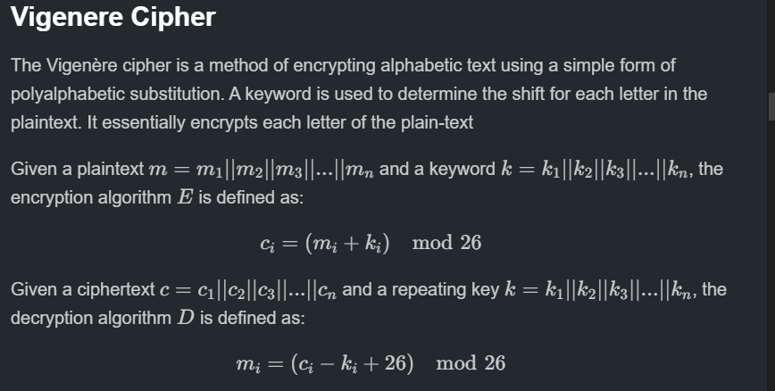
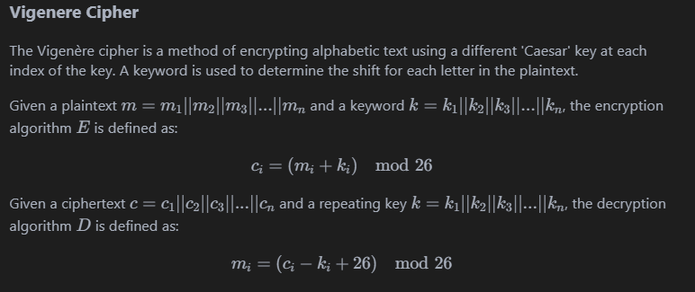
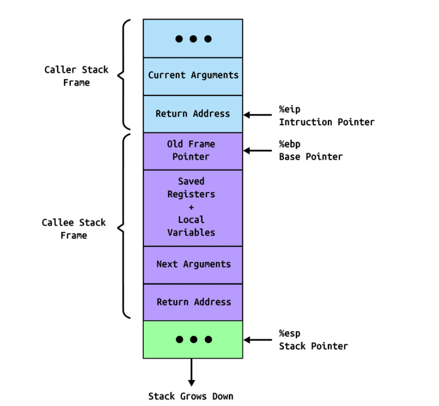

# Something Awesome Project 

!!! info Criteria
    - [ ] Evidence and summary of any research conducted, including a list of all relevant references 

    - [ ] Evidence and quality of your analysis/findings/outcomes in the report to extend on what is not obvious on the face of the output

    - [ ] Any issues you had and how you addressed them

    - [ ] Any professional/ethical issues you encountered or analysed what you did, and how effective it was.

    - [ ] Anything else you did that is evidence of you developing and demonstrating professional behaviour

    - [ ] Strengths and weaknesses of your approach. Evidence of claimed strengths, reflections on weaknesses.

    - [ ] [Why this project was challenging for you and how you changed as a result of doing it](#overall-growth)

    ### Course Objectives (as per the course outline)
    - [ ] Analysis 
    - [ ] Critical thinking 
    - [ ] Design 

!!! tip GitHub Link
    The project is on a [Github link](https://github.com/kaliypsocraft/something-awesome) containing the write-ups and challenges conducted in `picoCTF`. The link to this page is [here](https://github.com/kaliypsocraft/something-awesome).
    
    **NOTE**: Using the Github version to view `SAP_REPORT.md` via the preview tab may be easier to navigate due to the table of contents on the right-hand side. Exporting the `.pdf` seemed to omit some features.

    Please reference last-edit/commit to prove that editing of the document was not conducted after `1800 04 NOV 24`.

!!! warning Mission Statement
    The purpose of the project was to assist in my learning of broader fundamental cyber-security concepts and by extension provide a tool to other beginners of what I learnt. 
    
    The end state is to provide a suite of basic teaching tools (non-exhaustive) which can later be built upon. 

## Table of Contents
- [How To Mark](#how-to-mark)
- [Challenges Experienced](#challenges-experienced)
  - [Binary Exploitation](#binary-exploitation)
  - [Binary Exploitation Fixes 🔧](#binary-exploitation-fixes-wrench)
  - [Web Exploitation](#web-exploitation)
  - [Web Exploitation Fixes 🔧](#web-exploitation-fixes-)
  - [Cryptography](#cryptography)
  - [Cryptography Fixes 🔧](#cryptography-fixes-)
  - [Forensics](#forensics)
  - [Forensics Fixes 🔧](#forensics-fixes-)
  - [Reverse Engineering](#reverse-engineering)
  - [Reverse Engineering Fixes 🔧](#reverse-engineering-fixes-)

- [Diary Reflection](#diary)
  - [Week 1](#week-1)
  - [Week 2](#week-2)
  - [Week 3](#week-3)
  - [Week 4](#week-4)
  - [Week 5](#week-5)
  - [Week 6](#week-6)
  - [Week 7](#week-7)
  - [Week 8](#week-8)
- [References](#references)

The CTF medium provides immediate feedback on the progress of tasks. The concepts and techniques required were often just out-of-reach and required reading documentation and online material in order to attack problems. 

## How to Mark

This document is solely to document the summary of obstacles experienced. includes **five main-subsections** corresponding to **each CTF challenge-type**. Within each challenge-type 

!!! note `cat SAP_REPORT.[pdf|md]`
    At each section it includes a tree of obstacles/challenges. Along the way in learning how to solve these CTF problem. For example conducting buffer-overflow attacks requires knowledge on how the stack operates and the role of certain registers such as `eip` or `rip`. Note these trees are non-exhaustive and they simply are what I experienced thus far in the 6-7 weeks of conducting `picoCTF`. 

```
└── <Problem Type>
    ├── <Challenge 1>
    │   ├── <Sub-Challenge 1>
    |   ├── <Sub-Challenge 2>
    │   └── <Sub-Challenge 3>
    │
    ├── <Challenge 2>
    │   ├── <Sub-Challenge 1>
    │   └── <Sub-Challenge 2>
    └── <Challenge n>
```
> Example tree of obstacles

#### Other Files
The `REPORT.md` provides write-ups of picoCTF. PicoCTF is a Jeopardy-style CTF consisting of challenges related to [cryptography](#cryptography), [web exploitation](#web-exploitation), [forensics](#forensics), [reverse engineering](#reverse-engineering) and [binary exploitation](#binary-exploitation). In the given Github [link](https://github.com/kaliypsocraft/something-awesome) contains a `REPORT.md` file which contains the following:

!!! note `cat REPORT.md`
     It includes **five main-subsections** corresponding to **each CTF challenge-type**. Within each challenge-type there are two components. A **theoretical component** which is a compilation of my background research on the topics and a **practical component** which are represented by the write-ups. The write-ups contains much of the analysis, findings and personal reflections along the way. The write-ups are represented by a hyper-link to a particular challenge with approximately 5-10 write-ups per challenge-type. Below are some examples:


> Example of theoretical component 


> Example of practical component

!!! note What is in a write-up
    
    Within each **write-up** it is divided up as per the template provided on the Github repo.  
    1. There is a initial **preparatory stage** which involves the initial **research**, static and dynamic analysis of the program. 

    2. There is then an **attack phase** which dictates the payload and method of exploitation utilised in order to obtain the flag. 

    3. There is then a **lessons-learnt** tab which dictates the **challenges** which were required in order to overcome the problem. 

> Example template for each write-up

!!! info Examples
    Below are some stand-out write-ups conducted on exercises which I got alot out of them.
    ### Binary Exploitation:

    ### 
Good examples where I gained the most in each exercise include .... TODO: INSERT TO MAKE EASIER

As per the Table of Contents below this section there is a diary entry which is a weekly reflection on the progress of the project. It is divided up into **'what I did?'**, **'What challenges I faced'** and **'How to fix these errors'**. These simple headings provide a way to document my professional development and to find consistent weaknesses and some strengths along the way. 


## Challenges Experienced 
The general consensus with most of the challenges was knowing where to start and what tools to use. Since I was a beginner to CTFs intepreting a problem was difficult as I had no frame of reference for some challenges. For example, most challenges whereby I had limited-no experience required atleast an hour of background reading and researching in order to tackle them. The following sub-sections dictates the specific challenges experienced within each challenge-type.

!!! note
    The following sections outlines the specific obstacles experienced along the way during the conduct of the CTF and the writing of the report. There are two main components - first consists of the hurdles experienced and second the fixes utilised to rectify the issues.
---


### Binary Exploitation

```
└── Binary Exploitation
    ├── Buffer Overflow ──── Heap Overflow
    │   ├── ret2win                 └── use-after-free 
    |   │       └── gdb
    │   ├── rop chains 
    │   │       └── return oriented programming 
    │   └── ret2libc                └── gadgets
    │           └── registers
    ├── Format String Vulnerabilities
    │   ├── arbitary read
    │   └── arbitary write
    │                   └── format specifiers
    │                              └── specific sizes   
    ├── Gdb
    ├── Ghidra
    └── BinaryNinja
     
```
The main sub-challenge types I encountered in the binary-exploitation class were **buffer overflows** and **format string exploitations**. There was also one challenge which involved a **heap overflow**, exploiting a **use-after-free exploit**.

#### Buffer Overflows

Exploiting this vulnerability required being competent at the basics of `gdb` and how the stack worked. Using `gdb` although initially was quite 

The main challenges associated with buffer overflows occured when basic protections were introducted such as `NX-enabled` or `canary-enabled`. This required an enhanced-level of 

The main challenges with binary exploitation exercises was getting accustomed to canonical attacks such as buffer overflows, format string exploitations and return-oriented programming.  

Within the buffer-overflow type attacks learning ways to overcome basic file protections such as `NX-enabled` or `canary-enabled` was difficult. 

Learning new concepts such as these new concepts creates a tree of dependencies 
#### Format String Vulnerabilities

Learning format string exploits extended upon the knowledge from buffer overflows. The main challenges associated with format string vulnerabilities was understanding the impact of certain format specifiers. For example using `%p | %p` or `%x | %x` to find the offset was relatively straightforward. However, then using this information to conduct arbitary writes took some time to wrap my head around. 
### Binary Exploitation Fixes :wrench:
Improvements in binary exploitation

To improve in binary exploitation, I practiced with tools like `GDB` (GNU Debugger) and `pwntools`, which helped me better understand register manipulation and memory management. Visual aids, such as online stack visualization tools, also allowed me to grasp the flow of stack frames and memory layouts. 

Studying `32-bit` and `64-bit` calling conventions separately enabled me to identify architectural differences and increased my comfort with function prologues and epilogues.

Visualising format string vulnerabilities via drawing out a stack 

Reading the documentation provided by `printf(3) man` ([link](https://man7.org/linux/man-pages/man3/printf.3.html)) solidified

---

### Web Exploitation
```
└── Web Exploitation
    ├── Web Frameworks
    │    └── Injection-based attacks
    │       ├── SQL ── different version syntax
    |       ├── XSS
    │       └── CSRF
    │
    ├── Web Tokens
    │   └──JWT
    │   
    └── PHP
```

#### Web Frameworks
Web exploitation posed several challenges due to my limited knowledge of web development and network principles. Arguably it is one of the most important skills to have in my back-pocket.

Familiarity with web development frameworks and applications is paramount in this along with the other skills accustomed with penetration testing.

I also had limited understanding HTTP request headers such as `GET`, `POST`,`PUT` and `DELETE`.

#### Web Tokens
This linked closely with 

#### Injection-based Attacks
 SQL injection challenges, in particular, required an in-depth understanding of syntax. For example, some tasks filtered certain keywords, necessitating research into alternative SQL commands or obfuscation techniques to bypass these filters. 
### Web Exploitation Fixes :wrench:
Addressing challenges in web exploitation required learning web fundamentals, so I worked through beginner courses in SQL, HTML, and network protocols.

 For SQL injection tasks, I experimented with different types from SQLite to MySQL to understand their syntax differences. 

Using applications like `Burp Suite` improved my understanding of request/response patterns and helped in identifying and exploiting vulnerabilities.

---

### Cryptography
```
└── Cryptography
    ├── Classical Ciphers
    │   ├── Caesar Cipher/ROT-13
    |   ├── Vigenere Cipher
    │   └── Substitution Cipher
    │
    ├── Modern Cryptography
    │   ├── RSA ── Wieners Attack 
    │   └── Side channel attacks 
    └── XOR Ciphers
```


Having some experience in cryptography allowed me to approach challenges with a bit more familiarity. However, learning to integrate `pwntools` to craft and optimize payloads was still a challenge, as was fine-tuning scripts for efficiency. 

#### Manual Decryption
I also imposed a self-challenge to develop my own decryptors for classical ciphers, such as Vigenère and substitution ciphers, rather than relying on automated tools. 

#### Side Channel Attacks
Exercises which . For instance, working on a `Power Analysis` exercise introduced me to physical attack vectors that exploit unintentional information leakage, which was a fascinating area of research within cryptography that required me to learn about hardware vulnerabilities.
### Cryptography Fixes :wrench:
Improving my skills in cryptography meant getting more hands-on experience with `pwntools` for payload generation. 

Building custom decryptors using taught me practical cryptanalysis skills, which I complemented by researching side-channel attacks to better understand physical vulnerabilities in cryptographic systems.

---
### Forensics 
```
└── Forensics
    ├── File Formats
    │   ├── Hex Dumps
    |   ├── Metadata
    │   └── Endianness
    │
    ├── Network Analysis
    │   ├── Wireshark
    │   └── Packet Capture Analysis
    ├── Disk Imaging
    └── Steganography
```
#### File Formats
Forensics required research into file formats, forensic tools, and interpreting hex dumps. This involved a comprehensive understanding of file signatures, types, and low-level data structures. I worked with Linux command-line tools such as `strings` and `xxd` to extract hidden data and identify file characteristics, which helped build an understanding of file system layouts and common forensic analysis techniques.
#### Network Analysis
The main challenge associated with network analysis was getting a basic undestanding of the fundamentals of networks. By extension, grasping the fundamentals of Wireshark. 

#### Disk Imaging


#### Steganography

This was a new skill to learn about. 


### Forensics Fixes :wrench:
To build my forensics skills, I spent time learning Linux commands more thoroughly, focusing on tools like `xxd`, `strings`, and `hexdump` to analyze file structures and metadata. Studying specific file formats and signatures enabled me to better identify unusual patterns in hex dumps. I also practiced using forensics tools such as `Autopsy` for memory analysis, helping me develop a systematic approach to analyzing file data and hidden information.


---
### Reverse Engineering
```
└── Reverse Engineering
    ├──────────── Debuggers
Assembly Language      ├── gdb
    │                  └── windbg
    │
    ├── Disassemblers
    │   ├── BinaryNinja
    │   └── Ghidra
    └── C programming language
```
#### Assembly Language
Reverse engineering required similar foundational skills as binary exploitation, with an added emphasis on using disassemblers and debuggers. Since I had limited experience with assembly language and machine code, learning to interpret disassembly output required understanding each instruction's purpose, as well as recognizing common patterns such as loops, conditional branches, and function calls.
#### Debuggers


#### C Programming Language
Getting a deeper grasp of the `C` language was a necessary skill to build. 

#### Disassemblers
Once getting a grip of the basics of gdb and BinaryNinja, much of the obstacles involved staying mentally switched on with the flow of the programs. 

I spent considerable time experimenting with different debugging techniques, using breakpoints and stepping through code to monitor how variables and memory addresses changed. 
### Reverse Engineering Fixes :wrench:
For reverse engineering, I used disassemblers like `Ghidra` and debuggers such as `Gdb` to develop a structured approach to understanding disassembly. Working withassembly code snippets allowed me to understand common instruction sets and patterns. This further assisted in the obstacles in the binary exploitation problem sets.

Regular practice with `gdb` step-through debugging helped me better interpret function calls and memory allocations in unfamiliar binary files, ultimately boosting my confidence with low-level code.

---

### Other General Challenges
Other issues were more logistical but still affected my workflow. Commonly encountered PATH issues and package errors required time and patience to resolve. Often, I relied on Stack Overflow or community forums for troubleshooting, though in some cases, the solutions required manual adjustments to environment settings or reconfiguration of dependencies to ensure all tools functioned smoothly.

Other challenges included the ability to convey a new concept in text. This tested both my ability to assimulate the knowledge aswell as communicate it. 

### Meta-challenges
Learning basic markdown formatting was a nice skill to have in my back pocket. It provides nice features such as in-built. Converting the `.md` $\rightarrow$ `.html` $\rightarrow$ `.pdf` proved to be a non-trivial task. 

## Diary Reflection
 

!!! note Intention
    The diary serves as a logbook for weekly evaluations in order to enhance productivity and to maintain purpose. 

    Each week consists of a more detailed overview of what is conducted in order to advance the state of the project. 

    The intention behind the diary is to be mindful and to maximise intent with all activities on a day to day basis. It also gives a high-level overview of consistent weaknesses and picking up on some strengths too :).

!!! info Week 1
    ### What I did?
    - Week 1 was just getting the cogs moving and selecting between projects. At this stage, I was debating between a cryptography research project or a CTF write-up.

    ### What I need to improve?
    - Reduce screen time
    - Be swift and decisive with choosing a project

    ### How to fix errors?
    - Be mindful and deliberate with the selection of tasks and projects.
!!! note Week 2
    ### What I did?
    - Solving SQL Injections and Buffer Overflows (being hands-on)
    - These tasks further assisted me on my CTF write-ups/tutorial project.
    - They exposed me to more CTF-related challenges and gave me some insight into the thinking patterns required for CTFs and the psychology behind them.

    ### What I need to improve?
    - Develop a deeper understanding of SQL injection techniques and their real-world applications.
    - Practice more buffer overflow exercises to improve my confidence in exploiting this vulnerability.

    ### How to fix errors?
    - Use online platforms like Hack The Box and TryHackMe to practice SQL injections and buffer overflow challenges.
    - Set weekly goals for specific vulnerabilities to focus on, ensuring steady progress.

!!! tip Week 3
    ### What I did?
    - Conducted Wargames specifically on XSS Injection-related tasks.
    - Continued my Something Awesome Project - made a website via Canva.
    - Wrote Something Awesome Project Write-Ups on a markdown file ready to transfer over.
    - Finished 12 CTF challenges related to SAP.
    - Attended B-Sides!
    - There was a talk on exploitation of AI models and modern cryptographic attacks which intrigued me.
    - Engaged in discussions with industry professionals during the B-Sides event, gaining insights into emerging trends in cybersecurity.
    - Developed a better understanding of different types of XSS attacks and their mitigations.

    ### What I need to improve?
    - Strengthen my knowledge of different types of web vulnerabilities beyond XSS.
    - Enhance my ability to articulate findings and strategies in my write-ups for better clarity.

    ### How to fix errors?
    - Dedicate time to researching and practicing additional web vulnerabilities, such as CSRF and RCE.
    - Seek feedback on my write-ups from peers or mentors to improve my communication skills and technical accuracy.

!!! info Week 4
    ### What I did?
    - Completed advanced web exploitation challenges, particularly focusing on session management vulnerabilities.
    - Began learning about heap exploitation techniques, which will add depth to my Something Awesome Project.
    - Drafted additional CTF write-ups for the ongoing project, covering techniques like Cross-Site Scripting (XSS) and SQL Injection.

    ### What I need to improve?
    - Refine my understanding of heap exploitation, as some concepts are still unclear.
    - Improve time management between different tasks (CTF challenges, research, and project write-ups).

    ### How to fix errors?
    - Set aside focused study sessions specifically for heap exploitation concepts, using resources like wargames or tutorials.
    - Create a more structured daily schedule to balance CTF challenges, project progress, and personal research.

!!! note Week 5
    ### What I did?
    - This week conducted format strings practice on picoCTF as that is what we learnt in the Thursday Extended lecture
    - Conducted post-quantum cryptography research specifically post-quantum digital signatures
    - Read into a data structure 
    ### What I need to improve?
    - Once again phone has stolen my attention at times.
    - Rushing into a problem rather than taking the time to slow down and think.
    - Hitting dead ends in problems and feeling demoralised.
    ### How to fix errors?
    - Set aside time to be cognizant of *how to* solve a problem rather than diving straight in.
    - Be mindful and intentional in everything I do and be methodical in my thinking
!!! tip Week 6
    ### What I did?
    - 

    ### What I need to improve?
    - 
    ### How to fix errors?
    - Given a deadline of approximately 14 days. I need to conduct approximately 8-10 exercises a day. Since there is five challenge types, it would be wise
    to conduct one-two exercises per challenge-type a day.
    - The end-state of this is that I will be finished within a week. This will enable me another week to edit and flesh out the responses. I will give myself 30 minutes per challenge. Therefore at the very least it will be 3 - 5 hours of work per day.
    - Break this up into 2-3 deep work blocks. 

!!! info Week 7
    ### What I did?
    - I made the decision not to follow through with the website. The reason being was due to time constraints
    ### What I need to improve?

    ### How to fix errors?


!!! note Week 8
    ### What I did?

    ### What I need to improve?

    ### How to fix errors?
## Overall Growth
!!! note
    This section summarises the overall personal growth provided by this project. It culminates all the challenges experienced with the weekly diary to provide the final output.
To sum up, this project was relatively challenging mainly due to the wide-range of skills I was required to learn. Balancing the development of new skills with other tasks in the academic term was an intellectually stimulating and fulfilling experience. 
### References
#### Binary Exploitation
- https://security.stackexchange.com/questions/136647/why-must-a-ret2libc-attack-follow-the-order-system-exit-command/136659#136659
- https://github.com/longld/peda
- 
- 
-
- 
#### Cryptography
- 
- 
- 
- 
-
- 
#### Forensics
- 
- 
- 
- 
-
- 
#### Web Exploitation
- 
- 
- 
- 
-
- 
#### Other 
- [How the best hackers learn their craft](https://www.youtube.com/watch?v=6vj96QetfTg)
- [How processor clocks work](https://www.youtube.com/watch?v=PVNAPWUxZ0g)
- 
- 
-
- 
