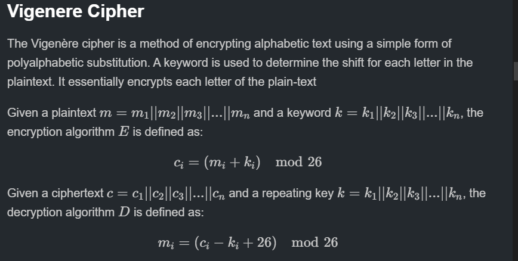
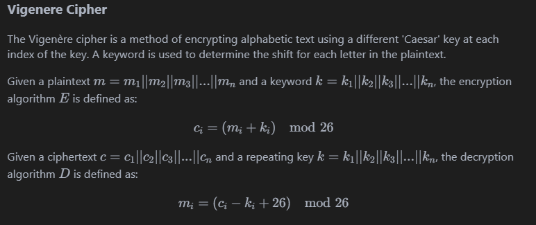

# Something Awesome Project 


- [ ] Evidence and summary of any research conducted, including a list of all relevant references 

- [ ] Evidence and quality of your analysis/findings/outcomes in the report to extend on what is not obvious on the face of the output

- [ ] Any issues you had and how you addressed them

- [ ] Any professional/ethical issues you encountered or analysed what you did, and how effective it was.

- [ ] Anything else you did that is evidence of you developing and demonstrating professional behaviour

- [ ] Strengths and weaknesses of your approach. Evidence of claimed strengths, reflections on weaknesses.

- [ ] [Why this project was challenging for you and how you changed as a result of doing it](#overall-growth)

Course Objectives (as per the course outline)
- [ ] Analysis 
- [ ] Critical thinking 
- [ ] Design 

!!! note Mission Statement
    The purpose of the project was to assist in my learning of broader fundamental cyber-security concepts and by extension provide a tool to other beginners of what I learnt. 

The CTF medium provides immediate feedback on the progress of tasks. The concepts and techniques required were often just out-of-reach and required reading documentation and online material in order to attack problems. 

TODO: Include purpose

## How to Mark

This document is solely to document the summary of obstacles experienced. includes **five main-subsections** corresponding to **each CTF challenge-type**. Within each challenge-type

!!! note Interpretation
    At each section it includes a tree of obstacles/challenges. Along the way in learning how to solve these CTF problems

```
└── <Problem Type>
    ├── <Challenge 1>
    │   ├── <Sub-Challenge 1>
    |   ├── <Sub-Challenge 2>
    │   └── <Sub-Challenge 3>
    │
    ├── <Challenge 2>
    │   ├── <Sub-Challenge 1>
    │   └── <Sub-Challenge 2>
    └── <Challenge n>
```
> Example tree of obstacles

#### Other Files
The `REPORT.md` provides write-ups of picoCTF. PicoCTF is a Jeopardy-style CTF consisting of challenges related to [cryptography](#cryptography), [web exploitation](#web-exploitation), [forensics](#forensics), [reverse engineering](#reverse-engineering) and [binary exploitation](#binary-exploitation). In the given Github [link](#https://github.com/kaliypsocraft/something-awesome) contains a `REPORT.md` file which contains the following:

!!! note Interpretation
     Within `REPORT.md` also includes **five main-subsections** corresponding to **each CTF challenge-type**. Within each challenge-type there are two components. A <font color="cyan">theoretical component</font> which is a compilation of my background research on the topics and a <font color="cyan">practical component </font>which is the write-ups. The write-ups are represented by a hyper-link to a particular challenge with approximately 5-10 write-ups per challenge-type. Below are some examples:


> Example of theoretical component 


> Example of practical component


> Example template for each write-up

!!! note 
    Within each **write-up** it is divided up as per the template provided on the Github repo.  
    1. There is a initial **preparatory stage** which involves the initial **research**, static and dynamic analysis of the program. 

    2. There is then an **attack phase** which dictates the payload and method of exploitation utilised in order to obtain the flag. 

    3. There is then a **lessons-learnt** tab which dictates the **challenges** which were required in order to overcome the problem. 

Good examples where I gained the most in each exercise include .... TODO: INSERT TO MAKE EASIER

As per the Table of Contents below this section there is a diary entry which is a weekly reflection on the progress of the project. It is divided up into **'what I did?'**, **'What challenges I faced'** and **'How to fix these errors'**. These simple headings provide a way to document my professional development and to find consistent weaknesses and some strengths along the way. 
## Table of Contents
- [Disclaimer](#disclaimer)
- [Features](#features)
- [Challenges Experienced](#challenges-experienced)
  - [Binary Exploitation](#binary-exploitation)
  - [Binary Exploitation Fixes 🔧](#binary-exploitation-fixes-)
  - [Web Exploitation](#web-exploitation)
  - [Web Exploitation Fixes 🔧](#web-exploitation-fixes-)
  - [Cryptography](#cryptography)
  - [Cryptography Fixes 🔧](#cryptography-fixes-)
  - [General Skills](#general-skills)
  - [General Skills Fixes 🔧](#general-skills-fixes-)
  - [Forensics](#forensics)
  - [Forensics Fixes 🔧](#forensics-fixes-)
  - [Reverse Engineering](#reverse-engineering)
  - [Reverse Engineering Fixes 🔧](#reverse-engineering-fixes-)

- [Diary Reflection](#diary)
  - [Week 1](#week-1)
  - [Week 2](#week-2)
  - [Week 3](#week-3)
  - [Week 4](#week-4)
  - [Week 5](#week-5)
  - [Week 6](#week-6)
  - [Week 7](#week-7)
  - [Week 8](#week-8)
- [Usage](#usage)
- [Contributing](#contributing)
- [License](#license)
- [Acknowledgments](#acknowledgments)
## Features


## Challenges Experienced 
The general consensus with most of the challenges was knowing where to start and what tools to use. Since I was a beginner to CTFs intepreting a problem was difficult as I had no frame of reference for some challenges. For example, most challenges whereby I had limited-no experience required atleast an hour of background reading and researching in order to tackle them. The following sub-sections dictates the specific challenges experienced within each challenge-type.

!!! info The purpose of this section is to outline the 
---


> Image credits: [here](#https://infosecwriteups.com/into-the-art-of-binary-exploitation-0x000001-stack-based-overflow-50fe48d58f10)


### Binary Exploitation

```
└── Binary Exploitation
    ├── Buffer Overflow
    │   ├── ret2win
    |   ├── rop chains
    │   └── ret2libc
    │
    ├── Format String Vulnerabilities
    │   ├── arbitary read
    │   └── arbitary write
    │
    ├── Gdb
    ├── Ghidra
    ├── BinaryNinja
    └── 
```

Binary exploitation required a deeper understanding of low-level programming, which included intensive research into registers, hardware, instruction sets, memory management, and stack mechanics. I had limited knowledge of these areas prior, so it was a steep learning curve.

The main challenges with binary exploitation exercises was getting accustomed to canonical attacks such as buffer overflows, format string exploitations and return-oriented programming.  

Within the buffer-overflow type attacks learning ways to overcome basic file protections such as `NX-enabled` or `canary-enabled` was difficult. 

Learning new concepts such as these new concepts creates a tree of dependencies 


TODO: Include screenshots of each challenge 


### Binary Exploitation Fixes :wrench:
To improve in binary exploitation, I practiced with tools like `GDB` (GNU Debugger) and `pwntools`, which helped me better understand register manipulation and memory management. Visual aids, such as online stack visualization tools, also allowed me to grasp the flow of stack frames and memory layouts. 

Studying `32-bit` and `64-bit` calling conventions separately enabled me to identify architectural differences and increased my comfort with function prologues and epilogues.

---


> Image credits: [here](#https://www.wallarm.com/what/what-is-exploit)
### Web Exploitation
```
└── Web Exploitation
    ├── Injections
    │   ├── SQL
    |   ├── XSS
    │   └── CSRF
    │
    ├── Web Tokens
    │   └──JWT
    │   
    └── PHP
```
Web exploitation posed several challenges due to my limited knowledge of web development and network principles. Tackling these challenges involved studying various components, including SQL, HTML, web tokens, and HTTP request types. SQL injection challenges, in particular, required an in-depth understanding of syntax. For example, some tasks filtered certain keywords, necessitating research into alternative SQL commands or obfuscation techniques to bypass these filters. 

- Different SQL dialects (such as MySQL, PostgreSQL, and SQLite) presented syntax variations that affected query construction. 
- Understanding the interactions between front-end and back-end processes helped me bridge my knowledge gaps in network requests and HTTP headers. Each of these steps was essential to gain the competency required to identify potential web vulnerabilities.
### Web Exploitation Fixes :wrench:
Addressing challenges in web exploitation required learning web fundamentals, so I worked through beginner courses in SQL, HTML, and network protocols. For SQL injection tasks, I experimented with different dialects to understand their syntax differences, which helped me tackle injection challenges more efficiently. Additionally, using web proxies like `Burp Suite` improved my understanding of request/response patterns and helped in identifying and exploiting vulnerabilities.

---


> Image credits: [here](#https://www.technologyreview.com/2019/07/12/134211/explainer-what-is-post-quantum-cryptography/)
### Cryptography
```
└── Cryptography
    ├── Classical Ciphers
    │   ├── Caesar Cipher/ROT-13
    |   ├── Vigenere Cipher
    │   └── Substitution Cipher
    │
    ├── Modern Cryptography
    │   ├── RSA ── Wieners Attack 
    │   └── Side channel attacks 
    └── XOR Ciphers
```


Having some experience in cryptography allowed me to approach challenges with a bit more familiarity. However, learning to integrate `pwntools` to craft and optimize payloads was still a challenge, as was fine-tuning scripts for efficiency. I also imposed a self-challenge to develop my own decryptors for classical ciphers, such as Vigenère and substitution ciphers, rather than relying on automated tools. This helped me gain a more profound understanding of manual cryptanalysis techniques like frequency analysis, letter pattern recognition, and ciphertext structure.


Encountering new cryptographic techniques like side-channel attacks was enlightening. For instance, working on a `Power Analysis` exercise introduced me to physical attack vectors that exploit unintentional information leakage, which was a fascinating area of research within cryptography that required me to learn about hardware vulnerabilities.
### Cryptography Fixes :wrench:
Improving my skills in cryptography meant getting more hands-on experience with `pwntools` for payload generation. I also studied cryptographic attacks and algorithms in-depth, which helped me optimize payloads and understand advanced cryptographic techniques. Building custom decryptors taught me practical cryptanalysis skills, which I complemented by researching side-channel attacks to better understand physical vulnerabilities in cryptographic systems.

---

> Image credits: [here](#https://ermprotect.com/blog/what-is-digital-forensics-and-when-do-you-need-it/)
### Forensics 
```
└── Forensics
    ├── File Formats
    │   ├── Hex Dumps
    |   ├── Vigenere Cipher
    │   └── Substitution Cipher
    │
    ├── Network Analysis
    │   ├── RSA── Wieners Attack ── Side Channel Attacks
    │   └── 
    └──
```
Forensics required research into file formats, forensic tools, and interpreting hex dumps. This involved a comprehensive understanding of file signatures, types, and low-level data structures. I worked with Linux command-line tools such as `strings` and `xxd` to extract hidden data and identify file characteristics, which helped build an understanding of file system layouts and common forensic analysis techniques.

Decoding file types and distinguishing legitimate data from corrupted or malicious code required a keen eye for patterns within hex dumps and metadata. This skill was critical when exploring altered files or partial data, where even slight changes in byte sequences could significantly impact analysis. I also had to learn about specific forensic tools and workflows, including data carving and extracting deleted or partially overwritten files.
### Forensics Fixes :wrench:
To build my forensics skills, I spent time learning Linux commands more thoroughly, focusing on tools like `xxd`, `strings`, and `hexdump` to analyze file structures and metadata. Studying specific file formats and signatures enabled me to better identify unusual patterns in hex dumps. I also practiced using forensics tools such as `Autopsy` for memory analysis, helping me develop a systematic approach to analyzing file data and hidden information.


---

>Image credits: [here](#https://www.secureblink.com/blogs/top-9-reverse-engineering-hacking-tools-for-cyber-security-experts)
### Reverse Engineering
```
└── Reverse Engineering
    ├── Debuggers
    │   ├── gdb
    │   └── windbg
    │
    ├── Disassemblers
    │   ├── BinaryNinja
    │   └── Ghidra
    └──
```
Reverse engineering required similar foundational skills as binary exploitation, with an added emphasis on using disassemblers and debuggers. Since I had limited experience with assembly language and machine code, learning to interpret disassembly output required understanding each instruction's purpose, as well as recognizing common patterns such as loops, conditional branches, and function calls.

I spent considerable time experimenting with different debugging techniques, using breakpoints and stepping through code to monitor how variables and memory addresses changed. As I developed more comfort with reverse engineering, I learned to recognize function patterns and optimize my approach to analyzing unfamiliar binary files.
### Reverse Engineering Fixes :wrench:
For reverse engineering, I used disassemblers like `Ghidra` and debuggers such as `Gdb` to develop a structured approach to understanding disassembly. Working with small, isolated assembly code snippets allowed me to grasp common instruction sets and patterns. Regular practice with breakpoints and step-through debugging helped me better interpret function calls and memory allocations in unfamiliar binary files, ultimately boosting my confidence with low-level code.

---

### General 'Petty' Challenges
Other issues were more logistical but still affected my workflow. Commonly encountered PATH issues and package errors required time and patience to resolve. Often, I relied on Stack Overflow or community forums for troubleshooting, though in some cases, the solutions required manual adjustments to environment settings or reconfiguration of dependencies to ensure all tools functioned smoothly.

### Meta-challenges
Learning basic markdown formatting was a nice skill to have in my back pocket. It provides nice features such as in-built 

## Diary Reflection
The diary serves as a logbook for weekly evaluations in order to enhance productivity and to maintain purpose. 

Each week consists of a more detailed overview of what is conducted in order to advance the state of the project. 

!!! info Intention
    The intention behind the diary is to be mindful and to maximise intent with all activities on a day to day basis. It also gives a high-level overview of consistent weaknesses and picking up on some strengths too :).

## Week 1
### What I did?
- Week 1 was just getting the cogs moving and selecting between projects. At this stage, I was debating between a cryptography research project or a CTF write-up.

### What I need to improve?
- Reduce screen time
- Be swift and decisive with choosing a project

### How to fix errors?
- Be mindful and deliberate with the selection of tasks and projects.

## Week 2
### What I did?
- Solving SQL Injections and Buffer Overflows (being hands-on)
- These tasks further assisted me on my CTF write-ups/tutorial project.
- They exposed me to more CTF-related challenges and gave me some insight into the thinking patterns required for CTFs and the psychology behind them.

### What I need to improve?
- Develop a deeper understanding of SQL injection techniques and their real-world applications.
- Practice more buffer overflow exercises to improve my confidence in exploiting this vulnerability.

### How to fix errors?
- Use online platforms like Hack The Box and TryHackMe to practice SQL injections and buffer overflow challenges.
- Set weekly goals for specific vulnerabilities to focus on, ensuring steady progress.

## Week 3
### What I did?
- Conducted Wargames specifically on XSS Injection-related tasks.
- Continued my Something Awesome Project - made a website via Canva.
- Wrote Something Awesome Project Write-Ups on a markdown file ready to transfer over.
- Finished 12 CTF challenges related to SAP.
- Attended B-Sides!
- There was a talk on exploitation of AI models and modern cryptographic attacks which intrigued me.
- Engaged in discussions with industry professionals during the B-Sides event, gaining insights into emerging trends in cybersecurity.
- Developed a better understanding of different types of XSS attacks and their mitigations.

### What I need to improve?
- Strengthen my knowledge of different types of web vulnerabilities beyond XSS.
- Enhance my ability to articulate findings and strategies in my write-ups for better clarity.

### How to fix errors?
- Dedicate time to researching and practicing additional web vulnerabilities, such as CSRF and RCE.
- Seek feedback on my write-ups from peers or mentors to improve my communication skills and technical accuracy.

## Week 4
### What I did?
- Completed advanced web exploitation challenges, particularly focusing on session management vulnerabilities.
- Began learning about heap exploitation techniques, which will add depth to my Something Awesome Project.
- Drafted additional CTF write-ups for the ongoing project, covering techniques like Cross-Site Scripting (XSS) and SQL Injection.

### What I need to improve?
- Refine my understanding of heap exploitation, as some concepts are still unclear.
- Improve time management between different tasks (CTF challenges, research, and project write-ups).

### How to fix errors?
- Set aside focused study sessions specifically for heap exploitation concepts, using resources like wargames or tutorials.
- Create a more structured daily schedule to balance CTF challenges, project progress, and personal research.

## Week 5
### What I did?
- This week conducted format strings practice on picoCTF as that is what we learnt in the Thursday Extended lecture
- Conducted post-quantum cryptography research specifically post-quantum digital signatures
- Read into a data structure 
### What I need to improve?
- Once again phone has stolen my attention at times.
- Rushing into a problem rather than taking the time to slow down and think.
- Hitting dead ends in problems and feeling demoralised.
### How to fix errors?
- Set aside time to be cognizant of *how to* solve a problem rather than diving straight in.
- Be mindful and intentional in everything I do and be methodical in my thinking
## Week 6
### What I did?
  - 

### What I need to improve?
- 
### How to fix errors?
- Given a deadline of approximately 14 days. I need to conduct approximately 8-10 exercises a day. Since there is five challenge types, it would be wise
to conduct one-two exercises per challenge-type a day.
- The end-state of this is that I will be finished within a week. This will enable me another week to edit and flesh out the responses. I will give myself 30 minutes per challenge. Therefore at the very least it will be 3 - 5 hours of work per day.
- Break this up into 2-3 deep work blocks. 

## Week 7
### What I did?

### What I need to improve?

### How to fix errors?


## Week 8
### What I did?

### What I need to improve?

### How to fix errors?
## Overall Growth
!!! Purpose
    This section summarises the overall personal growth provided by this project. It culminates all the challenges experienced with the weekly diary to provide the final output.
To sum up, this project was relatively challenging mainly due to the wide-range of skills I was required to learn. Balancing the development of new skills with other tasks in the academic term was an intellectually stimulating and fulfilling experience. 
### References
#### Binary Exploitation
- 
- 
- 
- 
-
- 
#### Cryptography
- 
- 
- 
- 
-
- 
#### Forensics
- 
- 
- 
- 
-
- 
#### Web Exploitation
- 
- 
- 
- 
-
- 
#### Other 
- [How the best hackers learn their craft](#https://www.youtube.com/watch?v=6vj96QetfTg)
- [How processor clocks work](#https://www.youtube.com/watch?v=PVNAPWUxZ0g)
- 
- 
-
- 
