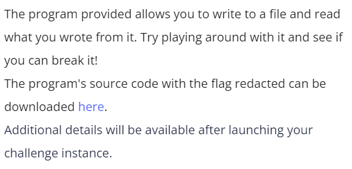
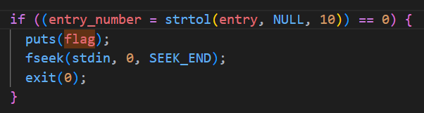
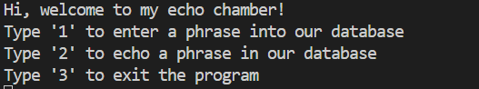
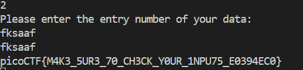

# CTF Write-Up: [Basic File Exploit][Binary Exploitation]

## Description

## Flag
The flag you obtained after solving the challenge. (e.g., `picoCTF{M4K3_5UR3_70_CH3CK_Y0UR_1NPU75_E0394EC0}`)

## Difficulty
- **Difficulty Level:** [medium]

## Tools Used
- `man` pages for known functions

## Write-Up

### Step 1: [Prepartory]

- Within the `data_read` function I found in order to output the flag, we need `entry_number = strtol(entry, NULL, 10)` to be evaluated as `0`.
- Upon reading the `man` page for the `strtol` function it evaulates to zero, if the there were no digits present in the string. In this case, the variable `entry` must not contain any integers for this. 

### Step 2: [Attack]
- Run `nc <host> <port>` 

- Pressing `1` I write to the database a string consisting of [a-zA-Z] only (I need this step otherwise it does not allow me to press `2`)
- Pressing `2` it asks for my `entry number` whereby I input a string consisting of [a-zA-Z].

## Lessons Learned
- `strtol` returns zero if a given input does not contain any digits. This makes sense since its literally converting a string to a long. If a string doesn't contain anything which resembles a long-integer then it ought to throw an error.

