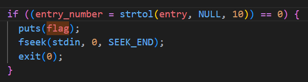
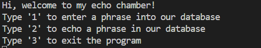
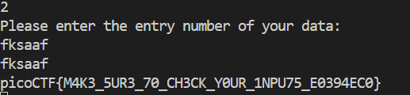

# CTF Write-Up: [Challenge Name]

## Description
A brief description of the challenge, including its title, type (e.g., web, crypto, pwn)

## Flag
The flag you obtained after solving the challenge. (e.g., `picoCTF{M4K3_5UR3_70_CH3CK_Y0UR_1NPU75_E0394EC0}`)

## Difficulty
- **Difficulty Level:** [medium]

## Tools Used
- List any tools or resources you used to solve the challenge (e.g., Wireshark, Burp Suite, Python, etc.).

## Write-Up

### Step 1: [Prepartory]

- Within the `data_read` function I found in order to output the flag, we need `entry_number = strtol(entry, NULL, 10)` to be evaluated as `0`.
- Upon reading the `man` page for the `strtol` function it evaulates to zero, if the there were no digits present in the string. In this case, the variable `entry` must not contain any integers for this. 

### Step 2: [Attack]
- Run `nc <host> <port>` 

- Pressing `1` I write to the database a string consisting of [a-zA-Z] only (I need this step otherwise it does not allow me to press `2`)
- Pressing `2` it asks for my `entry number` whereby I input a string consisting of [a-zA-Z].

### Step 3: [Reorganisation]
- During Step 2, it is not necessary to write to the database using only [a-zA-Z]. I tried a second time using [0-9] and it worked. However, when asked for the entry number it is essential we use only [a-zA-Z]. 
### Final Solution/Payload
- Summarize how you arrived at the final solution and any critical insights that helped you solve the challenge.

## Lessons Learned
- Discuss what you learned from the challenge and any techniques or concepts you found particularly interesting.

## References
- Link to any external resources, write-ups, or documentation that were helpful in solving the challenge.

