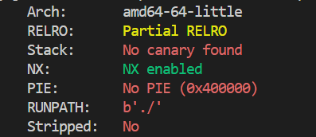

# CTF Write-Up: [Here is Libc][Binary Exploitation]

## Description
>I am once again asking for you to pwn this binary vuln libc.so.6 Makefile nc mercury.picoctf.net 1774


## Flag
The flag you obtained after solving the challenge. (e.g., `picoCTF{example_flag}`)

## Difficulty
- **Difficulty Level:** hard

## Tools Used
- List any tools or resources you used to solve the challenge (e.g., Wireshark, Burp Suite, Python, etc.).

## Write-Up

### Preparatory Phase

The first course of action was running `checksec vuln` to obtain the binary architecture and its protections. We find out that it is a 64-bit architecture with `NX` enabled which suggests that we cannot run our own shellcode on the stack. In conjuction with the name of the challenge we will need to likely use the `libc` file to obtain shell access. 


Running the binary locally presented issues giving an 
```
Inconsistency detected by ld.so: dl-call-libc-early-init.c: 37: _dl_call_libc_early_init: Assertion `sym != NULL' failed!
```
Using StackOverflow 
### Attack Phase

### Final Solution/Payload


### Lessons Learnt

## References
- Link to any external resources, write-ups, or documentation that were helpful in solving the challenge.

