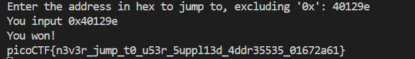
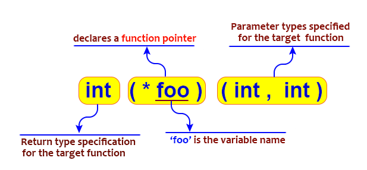

# CTF Write-Up: [Picker IV][Binary Exploitation1]

## Description
>Can you figure out how this program works to get the flag?
Connect to the program with netcat:

## Flag
The flag you obtained after solving the challenge. (e.g., `picoCTF{n3v3r_jump_t0_u53r_5uppl13d_4ddr35535_01672a61}`)

## Difficulty
- **Difficulty Level:** medium

## Tools Used
- gdb

## Write-Up

### Preparatory Phase
Use gdb to find the address of the win function via `gdb <binary>` $\rightarrow$ `info address win`


### Attack Phase
Simply entering the memory address without any consideration for endianness was enough to obtain the flag. 


### Lessons Learnt
Although the challenge was relatively easy compared to other binary exploitation scenarios - it did make me ponder on two things. What would happen if the memory address of the `win` function was randomised each time and also how do function pointers work. 

To address the former I searched up ways to bypass ASLR and came across a StackExchange [article](#https://security.stackexchange.com/questions/20497/stack-overflows-defeating-canaries-aslr-dep-nx): 

**ASLR Bypass Techniques**
- Direct RET Overwrite: Exploit non-ASLR modules to execute shellcode using jmp esp.

- Partial EIP Overwrite: Partially overwrite EIP or use information disclosure to find the correct EIP, relying on a non-ASLR module.

- Brute Force: If the exploit doesn’t crash the program, attempt to brute-force 256 target addresses until successful.

To address the latter I had a look at the source code and some online tutorials.
```c
  void (*foo)(void) = (void (*)())val;
  foo();
```


>Image credits: [here](#https://www.google.com/url?sa=i&url=https%3A%2F%2Fwww.w3resource.com%2Fc-programming%2Fc-pointers-and-functions.php&psig=AOvVaw0PukWUv474q4_oY3yx68KQ&ust=1730098862156000&source=images&cd=vfe&opi=89978449&ved=0CBgQ3YkBahcKEwjIkI7T_q2JAxUAAAAAHQAAAAAQHw)

Function pointers were briefly mentioned back in the introduction to programming course. 
## References
- https://security.stackexchange.com/questions/20497/stack-overflows-defeating-canaries-aslr-dep-nx
- https://stackoverflow.com/questions/840501/how-do-function-pointers-in-c-work

