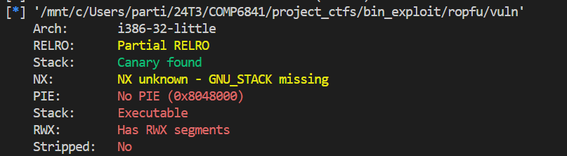

# CTF Write-Up: [Challenge Name]

## Description
A brief description of the challenge, including its title, type (e.g., web, crypto, pwn)

## Flag
The flag you obtained after solving the challenge. (e.g., `picoCTF{example_flag}`)

## Difficulty
- **Difficulty Level:** [hard]

## Tools Used
- List any tools or resources you used to solve the challenge (e.g., Wireshark, Burp Suite, Python, etc.).

## Write-Up

### Step 1: [First Step Title]
- Run `file vuln` in order to determine the architecture

- Use `gdb ./vuln` to find offset 

- Ran `checksec vuln` to check if stack is executable.

- Since the stack is executable I suspect I need to write shell-code to the buffer and jump to it. Therefore, my next goal is to obtain the address of the start of the buffer. 

Now I can begin my attack.

### Step 2: [Second Step Title]
- Describe the second step in your process. Detail your thought process and any obstacles encountered.

### Step 3: [Third Step Title]
- Continue to describe subsequent steps until the solution is reached. 

### Final Solution/Payload
- Summarize how you arrived at the final solution and any critical insights that helped you solve the challenge.

## Lessons Learned
- Discuss what you learned from the challenge and any techniques or concepts you found particularly interesting.

## References
- Link to any external resources, write-ups, or documentation that were helpful in solving the challenge.

