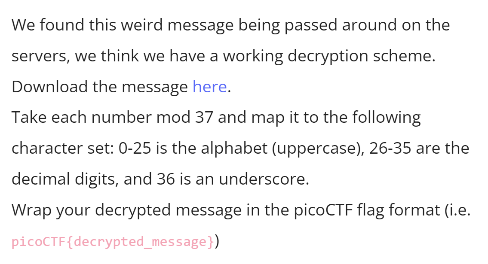

# CTF Write-Up: [Challenge Name]

## Description

## Flag
The flag you obtained after solving the challenge. (e.g., `picoCTF{R0UND_N_R0UND_79C18FB3}`)

## Difficulty
- **Difficulty Level:** [medium]

## Tools Used
- List any tools or resources you used to solve the challenge (e.g., Wireshark, Burp Suite, Python, etc.).

## Write-Up

### Step 1: [Prepartory]
- Describe the first step you took to approach the challenge. Include any commands, scripts, or techniques used.

### Step 2: [Attack]
- Describe the second step in your process. Detail your thought process and any obstacles encountered.

### Step 3: [Reorganisation]
- Continue to describe subsequent steps until the solution is reached. 

### Final Solution/Payload
```python
f = open("message.txt", "r")
cipher_text = f.readline()
cipher_text = cipher_text.split()

semi_plain_text = [int(c) % 37 for c in cipher_text]
plain_text = ""

for code in semi_plain_text:
    if 0 <= code and code <= 25:
        plain_text += chr(code + 65)
    elif 26 <= code and code <= 35:
        plain_text += chr(code + 22)
    elif code == 36:
        plain_text += '_'
print(plain_text)
```
## Lessons Learned
- Discuss what you learned from the challenge and any techniques or concepts you found particularly interesting.

## References
- Link to any external resources, write-ups, or documentation that were helpful in solving the challenge.

