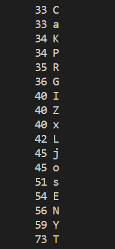
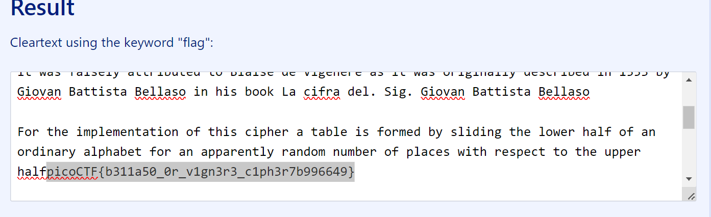

# CTF Write-Up: [La Cifra De][Cryptography]

## Description
>I found this cipher in an old book. Can you figure out what it says? Connect with nc jupiter.challenges.picoctf.org 5726.


## Flag
The flag you obtained after solving the challenge. (e.g., `picoCTF{b311a50_0r_v1gn3r3_c1ph3r7b996649}`)

## Difficulty
- **Difficulty Level:** medium

## Tools Used
- https://www.guballa.de/vigenere-solver

## Write-Up

### Preparatory Phase
Upon connecting to the server the client receives a block of text. It is enciphered, however the punctuation and word lengths are maintained Furthermore numbers which likely indicate years in history are maintained. 
```
Ne iy nytkwpsznyg nth it mtsztcy vjzprj zfzjy rkhpibj nrkitt ltc tnnygy ysee itd tte cxjltk

Ifrosr tnj noawde uk siyyzre, yse Bnretèwp Cousex mls hjpn xjtnbjytki xatd eisjd

Iz bls lfwskqj azycihzeej yz Brftsk ip Volpnèxj ls oy hay tcimnyarqj dkxnrogpd os 1553 my Mnzvgs Mazytszf Merqlsu ny hox moup Wa inqrg ipl. Ynr. Gotgat Gltzndtg Gplrfdo

Ltc tnj tmvqpmkseaznzn uk ehox nivmpr g ylbrj ts ltcmki my yqtdosr tnj wocjc hgqq ol fy oxitngwj arusahje fuw ln guaaxjytrd catizm tzxbkw zf vqlckx hizm ceyupcz yz tnj fpvjc hgqqpohzCZK{m311a50_0x_a1rn3x3_h1ah3x7g996649}

Ehk ktryy herq-ooizxetypd jjdcxnatoty ol f aordllvmlbkytc inahkw socjgex, bls sfoe gwzuti 1467 my Rjzn Hfetoxea Gqmexyt.
Tnj Gimjyèrk Htpnjc iy ysexjqoxj dosjeisjd cgqwej yse Gqmexyt Doxn ox Fwbkwei Inahkw.

Tn 1508, Ptsatsps Zwttnjxiax tnbjytki ehk xz-cgqwej ylbaql rkhea (g rltxni ol xsilypd gqahggpty) ysaz bzuri wazjc bk f nroytcgq nosuznkse ol yse Bnretèwp Cousex.

Gplrfdo’y xpcuso butvlky lpvjlrki tn 1555 gx l cuseitzltoty ol yse lncsz. Yse rthex mllbjd ol yse gqahggpty fce tth snnqtki cemzwaxqj, bay ehk fwpnfmezx lnj yse osoed qptzjcs gwp mocpd hd xegsd ol f xnkrznoh vee usrgxp, wnnnh ify bk itfljcety hizm paim noxwpsvtydkse.
```

I suspected it to be either a subsitution cipher or Vigenere cipher. The reason being was due to the constant repeating of the trigram `yse` and `ltc`. I ran `grep -o . cipher.txt | sort -f | uniq -ic | sort` and noticed a relatively even spread of frequencies which indicates it likely is a Vigenere cipher
.

### Attack Phase
Using an online tool https://www.guballa.de/vigenere-solver, we were able to obtain the decryption quite easily. Reading their source code made me realise how non-trivial even breaking classical ciphers can be via [here](#https://www.guballa.de/bits-and-bytes/implementierung-des-vigenere-solvers).
### Final Solution/Payload


### Lessons Learnt
Conducting a Vigenere break manually without intervention from online tools is a relatively non-trivial task. Without knowledge of the key-length and key itself an operator would need to conduct Kasiski examination. This only produces a tentative list of possible key lengths. Once this is discovered one can conduct frequency analysis and using a fitness function: https://stackoverflow.com/questions/36620231/understanding-fitness-function
## References
- https://www.guballa.de/vigenere-solver
