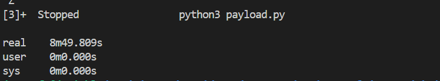
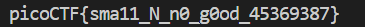

# CTF Write-Up: [Mind Your Ps and Qs][Cryptography]

## Description
>In RSA, a small e value can be problematic, but what about N? Can you decrypt this? values


## Flag
The flag you obtained after solving the challenge. (e.g., `picoCTF{sma11_N_n0_g0od_45369387}`)

## Difficulty
- **Difficulty Level:** medium

## Tools Used
- FactorDb
- Cryptodome library

## Write-Up

### Preparatory Phase
Within the given `values` file we are greeted with 
> Decrypt my super sick RSA:
c: 8533139361076999596208540806559574687666062896040360148742851107661304651861689
n: 769457290801263793712740792519696786147248001937382943813345728685422050738403253
e: 65537

Using the challenge name and the relatively small-size of $n$ being $\log_2{n} \approx 268$ bits. For reference most modern RSA moduli are atleast $2048$ bits. 


### Attack Phase

My first instinct was to simply brute force the prime factorisation. I will first take the ceiling of $\sqrt n = p$ and then decrement the value until $n / p = q$ where $q \in \mathbb{Z}^{+}$  and $p \mod n \equiv 0$.  

My first attempt at a payload using the above naive solution: 
```py
import math 

c = 8533139361076999596208540806559574687666062896040360148742851107661304651861689
n = 769457290801263793712740792519696786147248001937382943813345728685422050738403253
e = 65537

temp_p = math.ceil(math.sqrt(n))
print(temp_p)
temp_q = temp_p
while True:
    if n % temp_p == 0:
        break
    else:
        temp_p -= 1
        temp_q = n / temp_p
        
```

This seemed impractical as even after a few minutes it did not achieve an outcome. I then found a website called [FactorDb](https://factordb.com/index.php?query=769457290801263793712740792519696786147248001937382943813345728685422050738403253) which contains a database of known prime factorisations of integers. 

Based on the findings from the database we obtain `p =  1617549722683965197900599011412144490161` and `q = 475693130177488446807040098678772442581573`. 
### Final Solution/Payload
``` py
import math 
from Cryptodome.Util.number import long_to_bytes

c = 8533139361076999596208540806559574687666062896040360148742851107661304651861689
n = 769457290801263793712740792519696786147248001937382943813345728685422050738403253
e = 65537
p = 1617549722683965197900599011412144490161
q = 475693130177488446807040098678772442581573
assert(n == p * q) 

totient = (p - 1)*(q - 1)
d = pow(e, -1, totient)
m = pow(c, d, n)
print(long_to_bytes(m).decode())

```

### Lessons Learnt
- Dealing with big-integers can pose issues with precision. Even with 'small' numbers in cryptography such as within the 128-256 bit range for RSA, it can pose a computation challenge to be precise. 

- When dealing with small moduli, the FactorDb website can prove useful in finding the prime factorisation. 

- An interesting attack that does not utilise online-tools involved a Coppersmith attack using lattice concepts from linear algebra: https://eprint.iacr.org/2015/398.pdf. 
## References
- [Factor data base](https://factordb.com/index.php?query=769457290801263793712740792519696786147248001937382943813345728685422050738403253)

