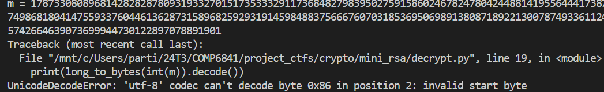

# CTF Write-Up: [Mini RSA][Cryptography]

## Description
>What happens if you have a small exponent? There is a twist though, we padded the plaintext so that (M ** e) is just barely larger than N. Let's decrypt this: ciphertext


## Flag
The flag you obtained after solving the challenge. (e.g., `picoCTF{e_sh0u1d_b3_lArg3r_85d643d5}`)

## Difficulty
- **Difficulty Level:** medium

## Tools Used
- gmpy2 library
- Cryptodome library

## Write-Up

### Preparatory Phase
The candidate receives a `ciphertext` file which contains the following 
```
N: 1615765684321463054078226051959887884233678317734892901740763321135213636796075462401950274602405095138589898087428337758445013281488966866073355710771864671726991918706558071231266976427184673800225254531695928541272546385146495736420261815693810544589811104967829354461491178200126099661909654163542661541699404839644035177445092988952614918424317082380174383819025585076206641993479326576180793544321194357018916215113009742654408597083724508169216182008449693917227497813165444372201517541788989925461711067825681947947471001390843774746442699739386923285801022685451221261010798837646928092277556198145662924691803032880040492762442561497760689933601781401617086600593482127465655390841361154025890679757514060456103104199255917164678161972735858939464790960448345988941481499050248673128656508055285037090026439683847266536283160142071643015434813473463469733112182328678706702116054036618277506997666534567846763938692335069955755244438415377933440029498378955355877502743215305768814857864433151287
e: 3

ciphertext (c): 1220012318588871886132524757898884422174534558055593713309088304910273991073554732659977133980685370899257850121970812405700793710546674062154237544840177616746805668666317481140872605653768484867292138139949076102907399831998827567645230986345455915692863094364797526497302082734955903755050638155202890599808147276605782889813772992918898400408026067642464141885067379614918437023839625205930332182990301333585691581437573708925507991608699550931884734959475780164693178925308303420298715231388421829397209435815583140323329070684583974607064056215836529244330562254568162453025117819569708767522400676415959028292550922595255396203239357606521218664984826377129270592358124859832816717406984802489441913267065210674087743685058164539822623810831754845900660230416950321563523723959232766094292905543274107712867486590646161628402198049221567774173578088527367084843924843266361134842269034459560612360763383547251378793641304151038512392821572406034926965112582374825926358165795831789031647600129008730

```
Using basic RSA fundamentals we know that $m^{3} \mod N \equiv c.$ We can rewrite this as $m^{3} = n \cdot k + c$ for some $k \in \mathbb{Z}.$  Therefore I need to find the cube-root of $n \cdot k + c$. Since $k$ is unknown it had to be brute-forced via a loop - it should not take too long since "$m^{3}$ is barely bigger than $n$" from the challenge description. 


### Attack Phase
 I knew I had to find the cube-root of $c$, but since it was a big-number I had to resort to a solution I found on StackOverflow: https://stackoverflow.com/questions/356090/how-to-compute-the-nth-root-of-a-very-big-integer. However, this did not work due to the sheer-size of the cipher-text. 
 

 I then found the `gmpy2` library which upon reading their documentation had a function which conducted the $n$th root operation
 

An alternative solution was to factor N using the [factorDb](#https://factordb.com/) but this would likely not have been in the spirit of the challenge. 
### Final Solution/Payload
``` py
import gmpy2
from Cryptodome.Util.number import long_to_bytes

N = 1615765684321463054078226051959887884233678317734892901740763321135213636796075462401950274602405095138589898087428337758445013281488966866073355710771864671726991918706558071231266976427184673800225254531695928541272546385146495736420261815693810544589811104967829354461491178200126099661909654163542661541699404839644035177445092988952614918424317082380174383819025585076206641993479326576180793544321194357018916215113009742654408597083724508169216182008449693917227497813165444372201517541788989925461711067825681947947471001390843774746442699739386923285801022685451221261010798837646928092277556198145662924691803032880040492762442561497760689933601781401617086600593482127465655390841361154025890679757514060456103104199255917164678161972735858939464790960448345988941481499050248673128656508055285037090026439683847266536283160142071643015434813473463469733112182328678706702116054036618277506997666534567846763938692335069955755244438415377933440029498378955355877502743215305768814857864433151287
e = 3
c = 1220012318588871886132524757898884422174534558055593713309088304910273991073554732659977133980685370899257850121970812405700793710546674062154237544840177616746805668666317481140872605653768484867292138139949076102907399831998827567645230986345455915692863094364797526497302082734955903755050638155202890599808147276605782889813772992918898400408026067642464141885067379614918437023839625205930332182990301333585691581437573708925507991608699550931884734959475780164693178925308303420298715231388421829397209435815583140323329070684583974607064056215836529244330562254568162453025117819569708767522400676415959028292550922595255396203239357606521218664984826377129270592358124859832816717406984802489441913267065210674087743685058164539822623810831754845900660230416950321563523723959232766094292905543274107712867486590646161628402198049221567774173578088527367084843924843266361134842269034459560612360763383547251378793641304151038512392821572406034926965112582374825926358165795831789031647600129008730

m = 0 
k = 0
for k in range(10000):
    n = N * k + c
    m, validation = gmpy2.iroot(n, 3)
    if validation:
        break
m = long_to_bytes(m).decode()
print(m)
```

### Lessons Learnt
- Like in the [Mind Your P and Q's](https://github.com/kaliypsocraft/something-awesome/blob/main/crypto/mind_your_p_and_qs/mind_your_p_and_qs.md) exercise , dealing with big-integers can pose issues with precision. In this case using the generic functions from `math` were not enough to obtain the $n$th root of a number. It required the heavy lifting provided by `gmpy2`.


- Converting into byte format such that I could decode the plain-text was abit finicky. A simple conversion using `long_to_bytes` followed by a `.decode()` function usally is enough to obtain the flags.

## References
- https://gmpy2.readthedocs.io/en/latest/mpz.html#mpz-functions
- https://stackoverflow.com/questions/38314118/overflowerror-python-int-too-large-to-convert-to-c-long-on-windows-but-not-ma
