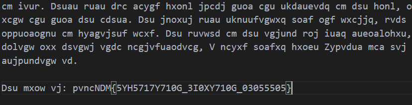

# CTF Write-Up: [Substitution 1][Cryptography]

## Description
>A message has come in but it seems to be all scrambled. Luckily it seems to have the key at the beginning. Can you crack this substitution cipher?

## Flag
The flag you obtained after solving the challenge. (e.g., `picoCTF{example_flag}`)

## Difficulty
- **Difficulty Level:** medium

## Tools Used
- List any tools or resources you used to solve the challenge (e.g., Wireshark, Burp Suite, Python, etc.).

## Write-Up

### Preparatory Phase
Prior to any frequency analysis which is a common threat for substitution ciphers was for me to analyse the text file. 
Because punctuation and word lengths are maintained we can ascertain alot of information. Furthermore it appeared the flag was denoted at the bottom in cipher-text. Hence we can conclude `pvncNDM` maps to `picoCTF`.

### Attack Phase
This cipher is trivially defeated using online tools such as https://www.guballa.de/substitution-solver and https://planetcalc.com/8047/
### Final Solution/Payload

### Lessons Learnt
- Learning some basic command line tools made finding the frequency quite seamless - `grep -o . <file> | sort -f | uniq -ic | sort`

## References
- Link to any external resources, write-ups, or documentation that were helpful in solving the challenge.

