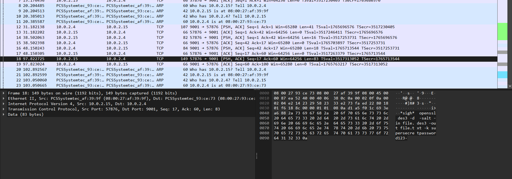

# CTF Write-Up: [Challenge Name][Challenge Type]

## Description
>Download this packet capture and find the flag.
Download packet capture

## Flag
`picoCTF{nc_73115_411_0ee7267a}`

## Difficulty
- **Difficulty Level:** medium

## Tools Used
- Wireshark
## Write-Up

### Preparatory Phase
The problem provides the user a `.pcap` file. Upon opening the file within Wireshark it appears that data is transmitted/received via TCP.

Upon further inspection of each packet there appears to be unencrypted communication between two parties. Within packet `No.18` appears to contain the secret key to decrypt a 'secret file'

The command was given by:
`openssl des3 -d -salt -in file.des3 -out file.txt -k supersecretpassword123`

### Attack Phase

Now with the information gathered during the preparation phase, it was my job to find where the files were stored. We notice there is a `GET` request following this from 

Another note worthing packet contained. This is likely the salt which encrypted the message and hence it required in the decrpytion of the message. Given the command provided does not explicitly require salt - upon further research it states that the first 16 bytes of an encrypted file-header contains its salt.

I placed that text into `file.des` and ran the command but it did not work.

### Final Solution/Payload

The final solution involved first exporting the packet into a binary file. Then running `openssl des3 -d -salt -in target.bin -out file.txt -k supersecretpassword123`.

### Lessons Learnt
To extend myself beyond the scope of this challenge I had to gain a deeper understanding of the OSI Model. 

- Openssl only decrypts and encrypts if in binary form for some reason in this instance. I therefore had to first export Packet bytes first before applying the command.
## References
- https://www.youtube.com/watch?v=Fn__yRYW6Wo

