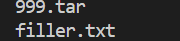
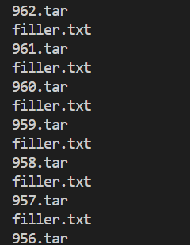
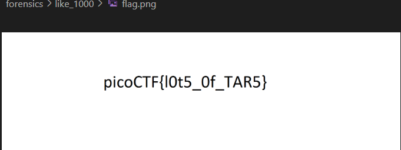

# CTF Write-Up: [Like 1000][Forensics]

## Description
>This .tar file got tarred a lot.
## Flag
`picoCTF{l0t5_0f_TAR5}`

## Difficulty
- **Difficulty Level:** medium

## Write-Up

### Preparatory Phase

The user is provided with a `.tar` file. 

Upon further research we can "untar" a tar file via `tar -xvf <file>.tar`. Upon doing this it appears that we are provied with a new `.tar` file and `filler.txt`. This reminds me a Russian nested doll :).



### Attack Phase

Using the above information this suggests we need a script to automate this. However I was abit rusty with `bash` and managed to do a `for` loop for a `while` loop?!?!? The main premise of the script was to iteratively 'untar' the tar file from 1000, counting down.


It was a relatively slow process for some reason, I need to look at ways to optimise the loop. 


Eventually we get to the end and obtain a `flag.png` file.


### Final Solution/Payload
```bash
#!/bin/bash

counter=1000
while [ "$counter" -ge 1 ]
do
    tar -xvf $counter.tar
    prev_counter=$counter
    ((counter--))
    rm -rf $prev_counter.tar
done
```
### Lessons Learnt
A `.tar` file was developed in 1979 for Unix-like operating systems. They bundle different files into one and is not compressed. However it is common to see a `.tar.gz` file which combines the aforementioned canonical tar file, compressed using `gzip`.

We can use `tar -xvf <file>.tar` to untar the file.
## References
- https://en.wikipedia.org/wiki/Tar_(computing)
- https://pendrivelinux.com/how-to-open-a-tar-file-in-unix-or-linux/
