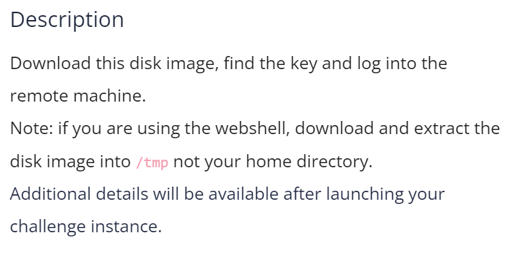
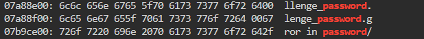

# CTF Write-Up: [Operation Oni][Forensics]

## Description

## Flag
The flag you obtained after solving the challenge. (e.g., `picoCTF{example_flag}`)

## Difficulty
- **Difficulty Level:** [medium]

## Tools Used
- List any tools or resources you used to solve the challenge (e.g., Wireshark, Burp Suite, Python, etc.).

## Write-Up

### Step 1: [First Step Title]
- I had to understand what a disk image was first. 
### Step 2: [Second Step Title]
- Upon downloading the `disk.img.gz` file I had to decompress it since `.gz` is a compressed file. 
- This was conducted via `gzip -d disk.img.gz`
### Step 3: [Third Step Title]
- Running `xxd disk.img` broke the web-shell
- Therefore I ran `xxd disk.img | grep picoCTF` but it didn't work
- I then ran `xxd disk.img | grep password`

- Quite interesting as I found 

### Final Solution/Payload
- Summarize how you arrived at the final solution and any critical insights that helped you solve the challenge.

## Lessons Learned
- Discuss what you learned from the challenge and any techniques or concepts you found particularly interesting.

## References
- Link to any external resources, write-ups, or documentation that were helpful in solving the challenge.

