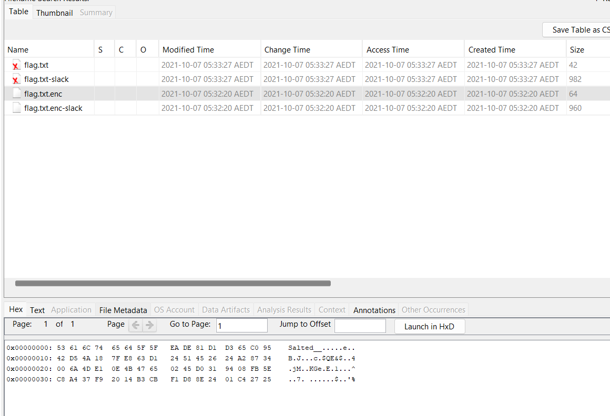
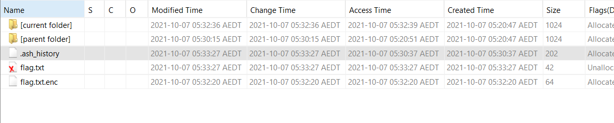
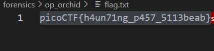

# CTF Write-Up: [Operation Orchid][Forensics]

## Description
>Download this disk image and find the flag.
Note: if you are using the webshell, download and extract the disk image into /tmp not your home directory.
Download compressed disk image
## Flag
`picoCTF{h4un71ng_p457_5113beab}`

## Difficulty
- **Difficulty Level:** medium

## Tools Used
- Autopsy
## Write-Up

### Preparatory Phase
Given a disk image I fired up `Autopsy` immediately. It was tool which served me well in the SleuthKit challenges aswell and made the digital forensics process quite straight-forward. 

I notice this was a similar challenge to `sleuthkit apprentice`, this time I will take an alternate approach rather than using `Sleuthkit` commands.
### Attack Phase

The first thing I conducted was go to `Tools` $\rightarrow$ `File search by Attribute` and place the word `flag`. We do find a `flag.txt` file and an encrypted `flag` file.



Upon further investigation, the file where `flag.txt.enc` is situtated in contains a `.ash.history` file which contains:


```
touch flag.txt
nano flag.txt 
apk get nano
apk --help
apk add nano
nano flag.txt 
openssl
openssl aes256 -salt -in flag.txt -out flag.txt.enc -k unbreakablepassword1234567
shred -u flag.txt
ls -al
halt
```

Therefore we do the reverse in order to decrypt the `.enc` file using `openssl aes256 -d -salt -in flag.txt.enc -out flag.txt -k unbreakablepassword1234567`

We altered the flag to include `-d` to denote decryption and swapped the input and outputs.
### Final Solution/Payload




### Lessons Learnt
- Using basic Autopsy tools for digital forensics related taskings.
## References
- https://www.autopsy.com/

