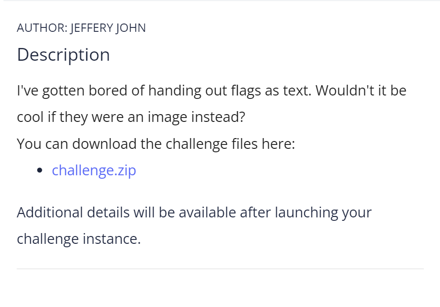

# CTF Write-Up: [Challenge Name]

## Description

## Flag
The flag you obtained after solving the challenge. (e.g., `picoCTF{p33k_@_b00_19eccd10}`)

## Difficulty
- **Difficulty Level:** [easy]

## Tools Used
- List any tools or resources you used to solve the challenge (e.g., Wireshark, Burp Suite, Python, etc.).

## Write-Up

### Step 1: [First Step Title]
- Describe the first step you took to approach the challenge. Include any commands, scripts, or techniques used.
### Final Solution
- Summarize how you arrived at the final solution and any critical insights that helped you solve the challenge.

## Lessons Learned
- Discuss what you learned from the challenge and any techniques or concepts you found particularly interesting.

## References
- Link to any external resources, write-ups, or documentation that were helpful in solving the challenge.
