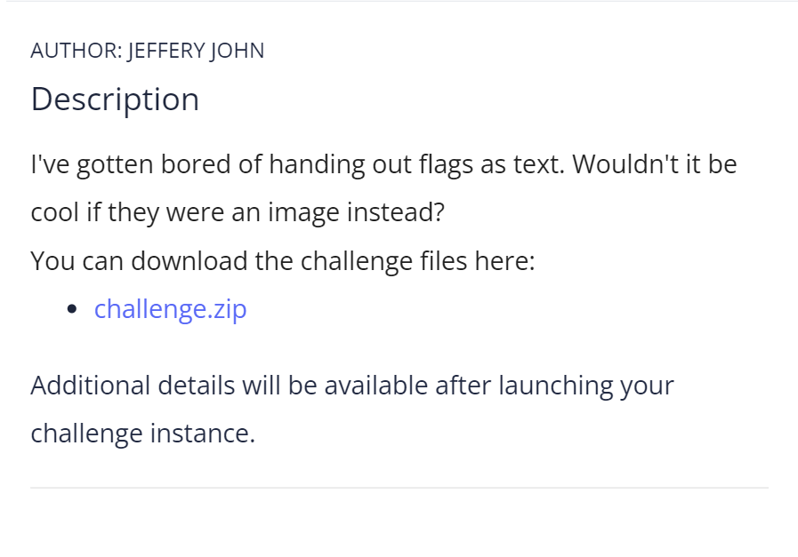

# CTF Write-Up: [Scan_Surprise][Forensics]

## Description

## Flag
The flag you obtained after solving the challenge. (e.g., `picoCTF{p33k_@_b00_19eccd10}`)

## Difficulty
- **Difficulty Level:** [easy]

## Tools Used
- zbar-tools libray
## Write-Up

### Steps
- This challenge was rather easy
- First `unzip flag.png` whereby the user was provided a QR-code
- Run `zbarimg flag.png` which is library which enables the creation and decoding of QR Codes. 
- The user obtains the flag simply from running the above command

## Lessons Learned
- Discuss what you learned from the challenge and any techniques or concepts you found particularly interesting.

## References
- https://medium.com/@anshulgarwal45/title-generating-and-reading-qr-codes-from-the-command-line-in-rhel-b314e6108bb0
