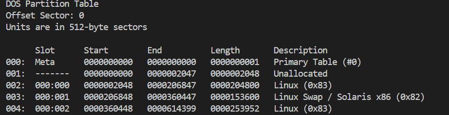
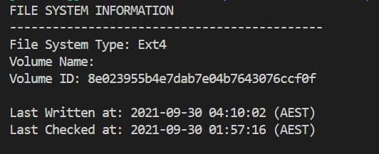

# CTF Write-Up: [Sleuthkit Apprentice][Forensics]

## Description
> Download this disk image and find the flag.
Note: if you are using the webshell, download and extract the disk image into /tmp not your home directory.
Download compressed disk image
## Flag
`picoCTF{by73_5urf3r_2f22df38}`

## Difficulty
- **Difficulty Level:** medium

## Tools Used
- Sleuthkit
- Autopsy
## Write-Up

### Preparatory Phase
I was provided a disk image which means it contains a snapshot of all the contents of a computer's drive in a compressed format. 

Using the name of the challenge I assumed we have to use some `Sleuthkit` commands. Looking up the documentation of Sleuthkit [here](https://wiki.sleuthkit.org/index.php?title=The_Sleuth_Kit_commands), we can find some potentially useful commands to examine our disk image file.

Running `mmls disk.flag.img` we obtain the partition layout of the volume system. 

Using the following `.pdf` file [here](https://gurramvinayiiit.wordpress.com/wp-content/uploads/2016/11/introduciton-tothe-sleuthkit.pdf) I was ab
I then run `fls disk.flag.img` to attempt to list out the directories and files within the image. However, it stated that it `Cannot determine file system type`. I then run `fsstat -o 2048 disk.flag.img` where 2048 is the offset we obtained from running `mmls`. 

### Attack Phase
Now that we know the `File System Type` and the offsets of each partition we can begin the attack phase. We will attempt to find the flag using `grep` in conjuction with `fls`. I want to recursively search within each directory so with we run `fls -f ext4 -o <offset> -r disk.flag.img `. 

The `-f` flag is to specify the file system type, the `-o` specifies the partition offsets and the `-r` specifies to display recursively all files and directories. 

We run `fls -f ext4 -o 2048 -r disk.flag.img  | grep flag` and `fls -f ext4 -o 206848 disk.flag.img -r | grep flag` to no avail. Finally on the final offset `fls -f ext4 -o 360448 -r disk.flag.img | grep flag` we obtain

 

Now looking at the possible commands to use to open the file I see `fcat - Output the contents of a file based on its name.` It didn't seem to work so I saw another command called `icat - Output the contents of a file based on its inode number.`

An alternate solution was to use `Autopsy` which is built on top of the `Sleuthkit` suite of tools. 

Opening up the file in Autopsy and conducting a `File search by attribute` and searching for flag gives the candidate: 

### Final Solution/Payload
> Main Solution

> Alternate Solution via Autopsy

