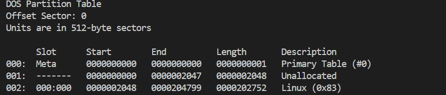
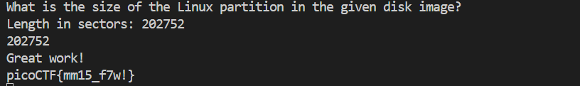

# CTF Write-Up: [Sleuth Kit Intro][Forensics]

## Description
>Download the disk image and use mmls on it to find the size of the Linux partition. Connect to the remote checker service to check your answer and get the flag.


## Flag
The flag you obtained after solving the challenge. (e.g., `picoCTF{mm15_f7w!}`)

## Difficulty
- **Difficulty Level:** medium

## Tools Used
- SleuthKit
- `man` pages

## Write-Up

### Preparatory Phase

Given a `.gz` file we first unzip the `gzip` file via 
```bash
gzip -d disk.img.gz
```
Upon doing this I run `mmls` from the Sleuth Kit library on the disk image as per the question's instructions. 


>Output from `mmls disk.img`

Reading the `man` page on `mmls` it states that `mmls` "displays the layout of parititions of a volume system."

A challenge here was first understanding what **partitions** were and what a **volume system** in the context of files.

### Attack Phase
Running the given remote server the program asks for the length of the Linux Partition. Using the output from `mmls` it was 202752 which ascertained from the `Length` column corresponding to the `Linux` description from the output above.
### Final Solution/Payload


### Lessons Learnt

Although the challenge itself was relatively straightforward, understanding how to interpret mmls at a lower level was a hurdle. This was my first time using SleuthKit, so I had to research and study its documentation. As shown above in the preparatory phase, I needed to gain a deeper understanding of both **partitions** and **volume systems**. Although having this knowledge didn’t directly assist in solving this particular challenge, it will likely be valuable for more advanced forensic challenges and will further enhance my computer literacy.
## References
- https://github.com/sleuthkit/sleuthkit
- https://www.autopsy.com/
- https://linuxize.com/post/how-to-unzip-gz-file/
- [disk image video](#https://www.youtube.com/watch?v=t_-bIEx813g)

