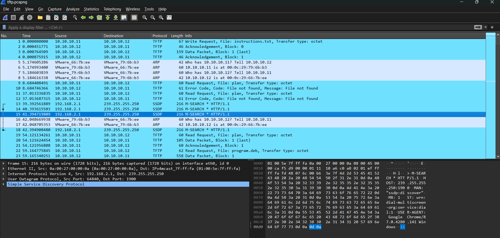

# CTF Write-Up: [Trivial Flag Transfer Protocol][Forensics]

## Description
>Figure out how they moved the flag.

## Flag
The flag you obtained after solving the challenge. (e.g., `picoCTF{h1dd3n_1n_pLa1n_51GHT_18375919}`)

## Difficulty
- **Difficulty Level:** medium

## Tools Used
- Wireshark
- steghide

## Write-Up

### Preparatory Phase
I had limited knowledge in networking, let alone how Wireshark worked so in this phase it required some reading. The candidate obtains a `.pcapng` file. 

I also need to know how to intepret Wireshark and how to use its basic features such as filtering e.g. I also needed how to know how to intepret the information provided to me in the packet capture file.

Upon reading the capture file we notice the use of `TFTP` which upon a simple Google search we come across the [Trivial File Transfer Protocol](#https://en.wikipedia.org/wiki/Trivial_File_Transfer_Protocol). It is a simple protocol which enables reading and writing of a file to a remote server. 

My main goal was to attempt to download all the files being sent over this network using TFTP. I searched up on Google and on a [forum](#https://osqa-ask.wireshark.org/questions/46389/capturing-packets-and-extracting-files-from-pcap/) it said to go to File $\rightarrow$ Export Objects $\rightarrow$ TFTP. 

### Attack Phase
The first thing I did was run `cat instructions.txt` with the output being `GSGCQBRFAGRAPELCGBHEGENSSVPFBJRZHFGQVFTHVFRBHESYNTGENAFSRE.SVTHERBHGNJNLGBUVQRGURSYNTNAQVJVYYPURPXONPXSBEGURCYNA`. It looks like a cipher or a Base64 encoding. Using an online tool I trial and errored, Base 64 decoding, Vigenere and finally a Caesar cipher. I figured out it was a 13-shift Caesar cipher, also known as a ROT-13 cipher.

Running `cat plan` we again obtain `VHFRQGURCEBTENZNAQUVQVGJVGU-QHRQVYVTRAPR.PURPXBHGGURCUBGBF`. I assume it is encoded with ROT-13 again. Using a basic translate script `tr 'A-Za-z' 'N-ZA-Mn-za-m' < plan` this conducts a basic ROT-13 decryption (and encryption)

The plain text we received: `IUSEDTHEPROGRAMANDHIDITWITH-DUEDILIGENCE.CHECKOUTTHEPHOTOS`

The photos remaining in the packet are `.bmp` files. I have limited understanding of bitmap files. Viewing the photos directly produces no blatant signs of flag. 

> Images appear to just be landscapes

I assume there is some form of steganography. Searching up 'BMP file steganography' there is a common theme of `LSB` steganography. This didn't seem to give any form of breakthrough.

Reading the clue from the last message more clearly I see that it states using the program. The current file capture contains a `program.deb` file. A `.deb` file is simply a Debian software package file which can be installed with any package manager. 

Upon using `dpkg -i program.deb` I obtained the following output which suggests that `steghide` is the software. Reading the documentation, I ran `steghide extract -sf picture1.bmp -p "DUEDILIGENCE"`. I assumed this was the password due to the given clue in the `plan` file. Unfortunately I received `steghide: could not extract any data with that passphrase!`. I did the same with `picture2.bmp` and received the same error message. 

However with `steghide extract -sf picture3.bmp -p "DUEDILIGENCE"` it extracted a `flag.txt` file. Upon `cat flag.txt` we received our flag :).

### Final Solution/Payload

### Lessons Learnt
- **What is a packet**
A packet is a segment of data which is typically divided up into two components. 
1. It contains a header with control information e.g. source/destination addresses and error correcting codes. 
2. It contains a payload with user data which is intended for reading by the end-user. 
- **What is a packet capture?**
A packet capture is a snapshot of data packets travelling over a network. They are typically used security engineers to detect potentially malicious traffic. On the flip-side it can also be used by malicious actors who can obtain sensitive information or information of a particular target. 

- **What is TFTP**
This was a simple file transfer protocol developed in the 1980s. It provides read and write capabilities for users over a network. 

- **Basic scripting to decrypt ROT-13**
Using the `tr`/translate bash command I was able to easily decrypt ROT13 cipher using `tr 'A-Za-z' 'N-ZA-Mn-za-m'`

- **What is LSB Steganography?**
Each byte of an image which consists of 8 bits. Each pixel contains a RGB (red, green, blue) value which consists of a tuple of 8-bit binary encoding. For example, rgb(255, 255, 255). Now for LSB steganography we write our secret message within the last bit of a byte. This only changes the value at a pixel by atmost 1. This is not noticable at a large scale. 
- **What is .deb files?**
It is a Debian software package file. I can open it using `sudo dpkg -i /path/to/file.deb`. 
## References
- https://www.solarwinds.com/resources/it-glossary/pcap

- https://pcapng.com/

- https://crypto.stackexchange.com/questions/48128/uncovering-file-hidden-in-bmp

- https://www.lifewire.com/deb-file-2620596