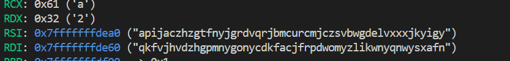
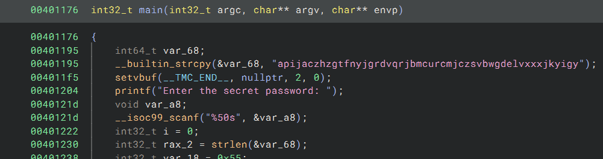
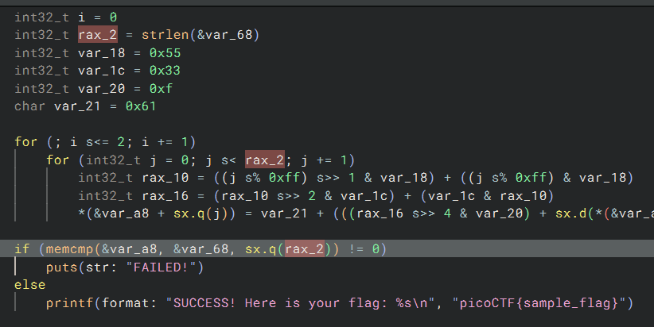
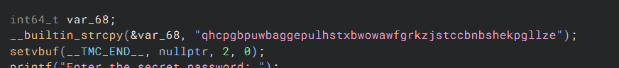
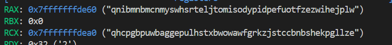

# CTF Write-Up: [Challenge Name]

## Description

## Flag
The flag you obtained after solving the challenge. (e.g., `picoCTF{example_flag}`)

## Difficulty
- **Difficulty Level:** [easy/medium/hard]

## Tools Used
- List any tools or resources you used to solve the challenge (e.g., Wireshark, Burp Suite, Python, etc.).

## Write-Up

### Step 1: [First Step Title]
- Given a binary so I first attempted to gather intelligence from gdb. I used the command `maint print symbols` in order to obtain all the symbols.

- Using binaryninja I find the secret value is stored in variable named `var_68.`

- It appears the password is `qhcpgbpuwbaggepulhstxbwowawfgrkzjstccbnbshekpgllze`

### Step 2: [Second Step Title]
- Upon running the binary and inputting `qhcpgbpuwbaggepulhstxbwowawfgrkzjstccbnbshekpgllze`, I receive an error saying `FAILED!`.
- Inspecting the code, it appears that the binary encodes the user input and my suspscions under `gdb` were confirmed.

- Going back to binaryninja I was able to obtain the code for the encoding and developed a decoding algorithm. 

### Step 3: [Third Step Title]
- Continue to describe subsequent steps until the solution is reached. 

### Final Solution/Payload
- Summarize how you arrived at the final solution and any critical insights that helped you solve the challenge.

## Lessons Learned
- Discuss what you learned from the challenge and any techniques or concepts you found particularly interesting.

## References
- Link to any external resources, write-ups, or documentation that were helpful in solving the challenge.

