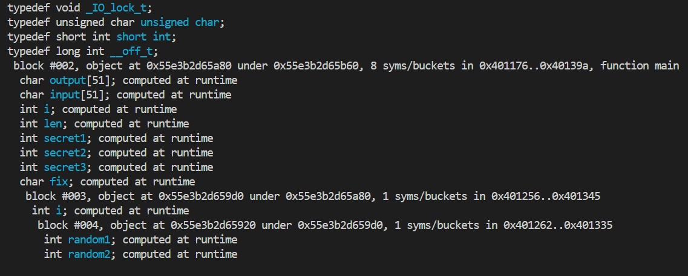
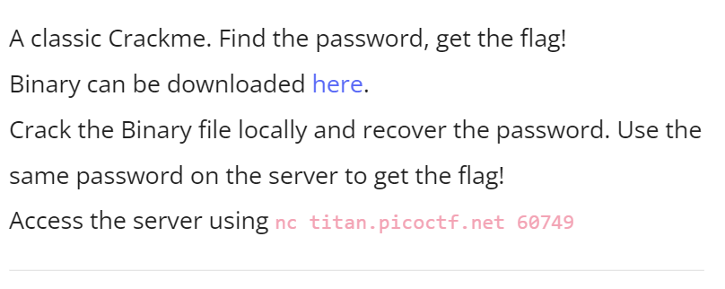
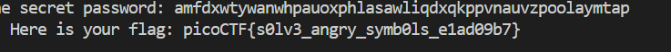
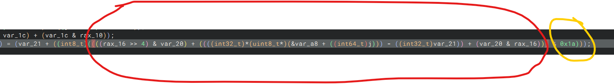

# CTF Write-Up: [Crack Me 0x100][Reverse Engineering]

## Description
>A classic Crackme. Find the password, get the flag!
Binary can be downloaded here.
Crack the Binary file locally and recover the password. Use the same password on the server to get the flag!

## Flag
The flag you obtained after solving the challenge. (e.g., `picoCTF{s0lv3_angry_symb0ls_e1ad09b7}`)

## Difficulty
- **Difficulty Level:** medium

## Tools Used
- gdb
- BinaryNinja

## Write-Up

### Step 1: [Prepartory Phase]
Given a binary so I first attempted to gather information from gdb. I used the command `main print symbols` in order to obtain all the symbols. This proved futile and just provided me with junk which I could not intepret.

Using Binaryninja I find the secret value is stored in variable named `var_68`. The password is revealed as `qhcpgbpuwbaggepulhstxbwowawfgrkzjstccbnbshekpgllze`. 

> NOTE: this binary is the newer version

### Step 2: [Attack Phase]
Upon running the binary and inputting the provided password `qhcpgbpuwbaggepulhstxbwowawfgrkzjstccbnbshekpgllze`, I receive an error saying `FAILED!`. This was somewhat expected since it seemed a bit too good to be true that the password was 

Inspecting the code, it appears that the binary encodes the user input. My suspicions under `gdb` were confirmed as the `rsi` register which holds my user input was not equal to what I intended on providing the program.


Going back to BinaryNinja I was able to obtain the code for the encoding and developed a decoding algorithm. 

Upon reading this code, I will need to extract the original value from the circled red location; with the LHS of the equation mapping to my intended password:

By rearranging the equation by making the circled parameter the subject I was able to obtain a decoding algorithm. This did not work for some reason. I found out that I had an older binary, so now the password was `apijaczhzgtfnyjgrdvqrjbmcurcmjczsvbwgdelvxxxjkyigy` instead. 
Using the decoding algorithm I then ran the remote server and ultimately, we were able to receive: 

### Final Solution/Payload
`decode.py`
```py
c = "apijaczhzgtfnyjgrdvqrjbmcurcmjczsvbwgdelvxxxjkyigy"
p = ['' for _ in c]
var_18 = 0x55
var_1c = 0x33
var_20 = 0xf
var_21 = 0x61
rax_10 = 0
rax_16 = 0

for i in range(3):
    for j in range(len(c)):
        rax_10 = (var_18 & (j % 0xff)) + (var_18 & ((j % 0xff) >> 1))
        rax_16 = (var_1c & rax_10) + (var_1c & (rax_10 >> 2))
        normalise_cipher = (ord(c[j]) - 97) % 26
        temp = (normalise_cipher - ((var_20 & rax_16) + (var_20 & (rax_16 >> 4)))) % 26
        p[j] = chr(temp + 97)
    c = ''.join(p)

print(c)
```

## Lessons Learned
1. Understanding lower level C required me to put on my COMP1521 hat and lower-level hat on again. Reinforced how arrays are simply sequential blocks of memory at that array[1] was simply syntatic sugar.


2. Be aware of the correct version of the binary, as owners may alter the challenges slightly. I likely bulk downloaded these challenges in the past few weeks and did not think the owner would actively alter the binaries. 

3. Have attention to detail with regards to parathesis in equations. I spent so long manipulating the equation only to realise I misplaced a bracket which led to a wrong answer. 
 

## References
- 

