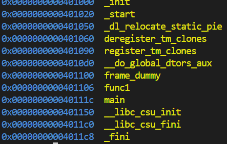
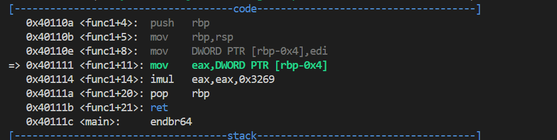
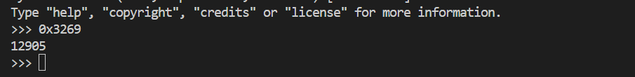

# CTF Write-Up: [Gdb Baby Step][Reverse Engineering]

## Description
>main calls a function that multiplies eax by a constant. The flag for this challenge is that constant in decimal base. If the constant you find is 0x1000, the flag will be picoCTF{4096}.
Debug this.
## Flag
`picoCTF{12905}`

## Difficulty
- **Difficulty Level:** medium

## Tools Used
- gdb
## Write-Up

### Preparatory Phase
Using `gdb` on the binary I first run `info functions` in order to gain some information regarding what functions were present in the program. 

I notice a `func1` function which potentially could be of interest to me, hence I note it down for a potential breakpoint.

I now attempt to run the binary but it outputs nothing. Therefore it suggests to me that I need to place a breakpoint either at `main` or `func1` under gdb and step through the program to find the flag.

### Attack Phase

I first place a breakpoint at `func1`. Immediately I notice a `imul` instruction followed by `eax, eax, 0x3269`. 

### Final Solution/Payload
Using `python3`, we converted the hexadecimal representation into a decimal representation to obtain our flag.

### Lessons Learnt
Learning basic gdb commands such as stepping
## References
- https://www.felixcloutier.com/x86/imul
TODO: Ensure these go into the `SUBMISSION_REPORT.md`

