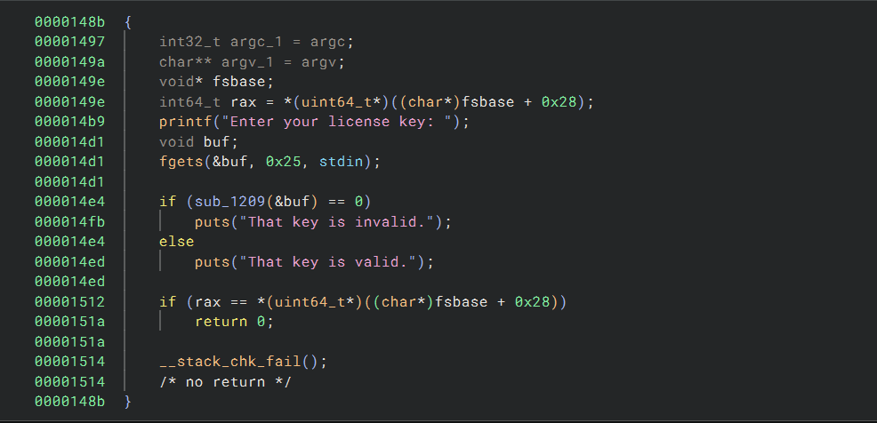
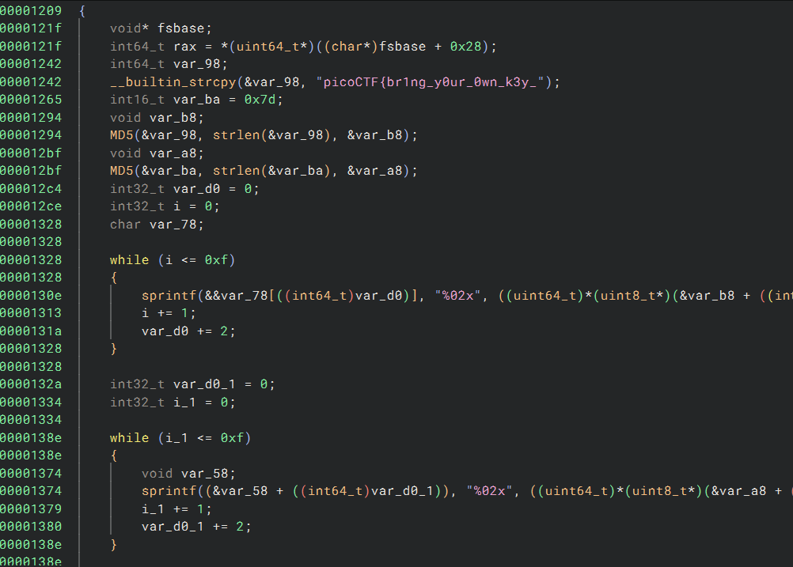
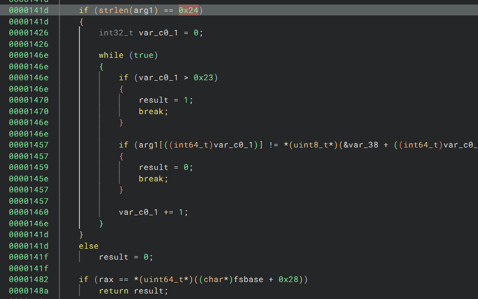

# CTF Write-Up: [Challenge Name][Challenge Type]

## Description
>Can you get the flag?
Reverse engineer this binary.

## Flag
The flag you obtained after solving the challenge. (e.g., `picoCTF{example_flag}`)

## Difficulty
- **Difficulty Level:** [hard]

## Tools Used
- BinaryNinja
- gdb

## Write-Up

### Preparatory Phase
Analysing the binary in BinaryNinja we see that there appears to be a check via the `sub_1209` function which takes in user input via `fgets()`

Within the `sub_1209` function I see a part of the flag stored within the `var_98` variable. We need the function to not return `0` in order to be deemed valid. 

There appears to a few conditions for this to occur. 
1. The length user input needs to be exactly `0x24` which is 36 characters. 
2. We need the `var_c0_1` variable to be greater than `0x23` or 35. This means we need to constantly increment the counter within the loop without entering the `arg[var_c0_1] != var_38[var_c0_1]`. Thus we need the `arg` argument to be the same as the `var_38` argument for each charcater.
3. We also need the `rax` register to equal `fsbase + 0x28` - This part I was abit confused at first. However it seemed that `rax` was declared as `fsbase + 0x28`.

I now needed to see what `var_38` stored and it appeared to store the MD5 Hash of `picoCTF{br1ng_y0ur_0wn_k3y_`

### Attack Phase

### Final Solution/Payload

### Lessons Learnt

## References
- Link to any external resources, write-ups, or documentation that were helpful in solving the challenge.

