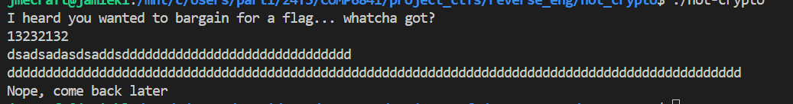
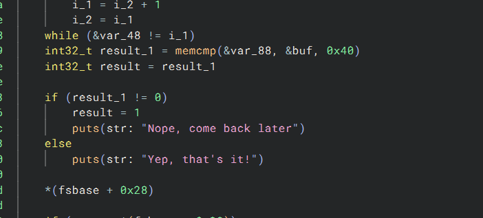
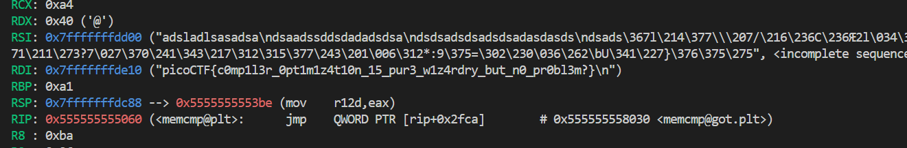

# CTF Write-Up: [Not Crypto][Reverse Engineering]

## Description
>A brief description of the challenge
## Flag
`picoCTF{c0mp1l3r_0pt1m1z4t10n_15_pur3_w1z4rdry_but_n0_pr0bl3m?}`

## Difficulty
- **Difficulty Level:** hard

## Tools Used
- gdb
## Write-Up

### Preparatory Phase
I first conduct a dynamic analysis via running the program. 

I then decided to conduct some static analysis. Opening up the binary in BinaryNinja, I notice a check using `memcmp` 

Perhaps in the attack phase I need to use `gdb` and add a breakpoint prior to that `memcmp` being called in order to find the value there. 

### Attack Phase
In `gdb` I first run `info functions` to obtain the symbols present. I notice that is has `memcmp@plt`, so therefore I placed a breakpoint there via `b memcmp@plt`.

Running this we then hit our break point and notice that within the `rdi` register i.e. the first argument

### Final Solution/Payload

- If a payload was used place into here, otherwise use screenshot of the flag

### Lessons Learnt
- It reinforced the calling conventions within a 64-bit system namely that `rdi` holds the first argument. It also further reinforced the lessons learnt about `plt` from binary exploitation.
## References
- TODO: Ensure these go into the `SUBMISSION_REPORT.md`

