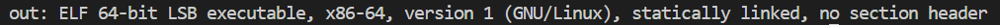

# CTF Write-Up: [Packer][Reverse Engineering]

## Description
`Reverse this linux executable?
binary`

Given just a binary file we must manipulate and examine it such that we obtain the flag.
## Flag
The flag you obtained after solving the challenge. (e.g., `picoCTF{U9X_UnP4ck1N6_B1n4Ri3S_5dee4441}`)

## Difficulty
- **Difficulty Level:** [medium]

## Tools Used
- CyberChef
- `strings` and `file` command in Linux
- `upx -d` in Linux
- `gdb`

## Write-Up

### Step 1: [Prepartory]
- I first ran `gdb ./out` and received no information. This suggested all the symbols were somehow removed and not present:
 
- Run `file out` and I learn that it is: 

- I then run `strings file` which extracts ASCII-printable strings from a given binary and I receive: 

- This makes me suspscious that this has to do with a UPX compression. Upon researching on Google, the first Google search I came across was . A natural reaction is to unpack the UPX packing. 

### Step 2: [Attack]
- First step was installing `upx` via `sudo apt install upx`
- 
- Referencing the `man` page there was a decompress flag. In order to decompress a file I must conduct `upx -d <file_name>.`

- Upon doing this I ran `strings out` and was finally able to see alot more information. I ran `strings out | grep -i password` (Case-insensitive) in order to obtain the password: 

- `7069636f4354467b5539585f556e5034636b314e365f42316e34526933535f35646565343434317d`, appeared to likely be a hexadecimal number therefore used CyberChef to obtain and decode: 

### Step 3: [Third Step Title]
- Continue to describe subsequent steps until the solution is reached. 

### Final Solution/Payload
- Summarize how you arrived at the final solution and any critical insights that helped you solve the challenge.

## Lessons Learned
- Discuss what you learned from the challenge and any techniques or concepts you found particularly interesting.

## References
- Link to any external resources, write-ups, or documentation that were helpful in solving the challenge.

