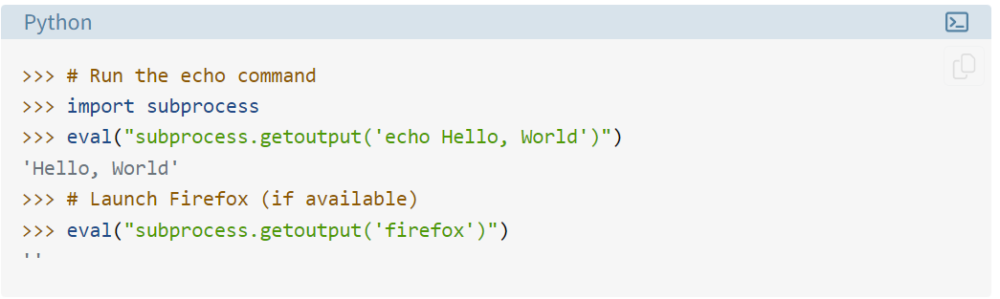

# CTF Write-Up: [Picker 1][Binary Exploitation]

## Description
>This service can provide you with a random number, but can it do anything else?

## Flag
The flag you obtained after solving the challenge. (e.g., `picoCTF{4_d14m0nd_1n_7h3_r0ugh_6e04440d}`)

## Difficulty
- **Difficulty Level:** medium

## Tools Used
- Python documentation
- Cyberchef

## Write-Up

### Step 1: [Preparatory Phase]
Static analysis of the code-base suggests that inputing a function name will cause the program to call it via the `eval` function.
 

> Example usage of eval - Credits: https://realpython.com/python-eval-function/ 
### Step 2: [Attack Phase]
Using the above knowledge I inputted `win` into the program in order for `eval` to call it. Within the function the program reads the `flag.txt` file and converts it into hexadecimal representation.
 
 
 
 Upon receving the string of hexadecimal digits, I used CyberChef's FromHex feature in order to decode the flag. 
 

## Lessons Learned
Remember to have high attention to detail to the workings of the program. I received the string of hexadecimal digits and thought I did something wrong. However, upon further inspection the program specifically converts the letters of the flag into a hexadecimal digit as per the `win` function.

## References
- https://realpython.com/python-eval-function/

