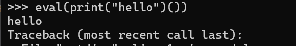

# CTF Write-Up: [Picker 2][Binary Exploitation]

## Description

## Flag
The flag you obtained after solving the challenge. (e.g., `picoCTF{f1l73r5_f41l_c0d3_r3f4c70r_m1gh7_5ucc33d_0b5f1131}`)

## Difficulty
- **Difficulty Level:** medium

## Tools Used
- Python documentation

## Write-Up

### Step 1: [Prepartory Phase]
Unlike the previous exercise we cannot directly use `eval` to call the win function as there is no a filter.

This suggested I likely needed to directly inject the code within the `win` function into the `eval` call.

> I wanted to print this

### Step 2: [Attack Phase]

Using the above knowledge I inputted `print(open('flag.txt', 'r').read` (since the program appends () to the end of the string) into the function but it did not work. However upon inputting `print(open('flag.txt', 'r').read()` revealing the flag.

## Lessons Learned
`eval` will still call the function even if its of the form `print()()` as shown here: 

## References

https://realpython.com/python-eval-function/

