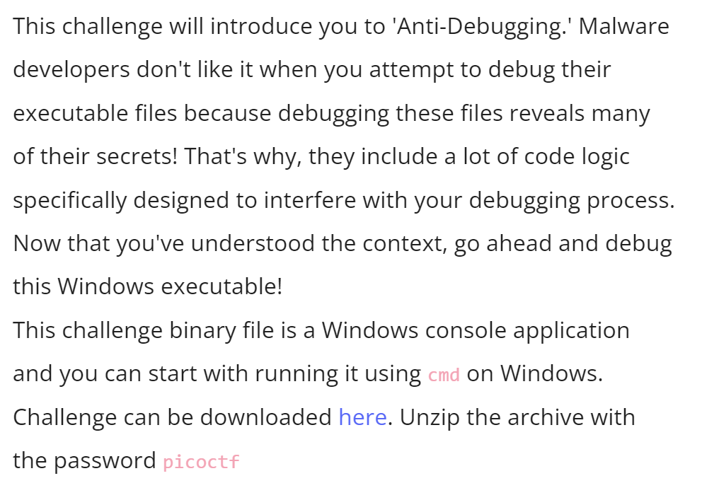
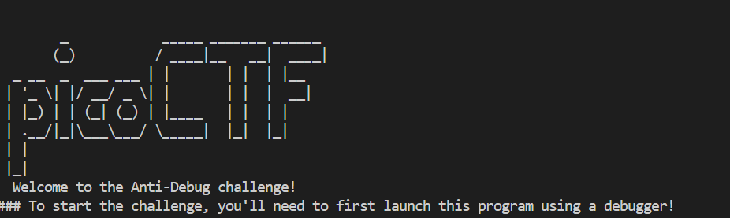
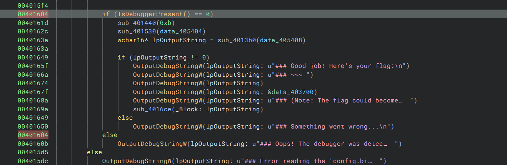
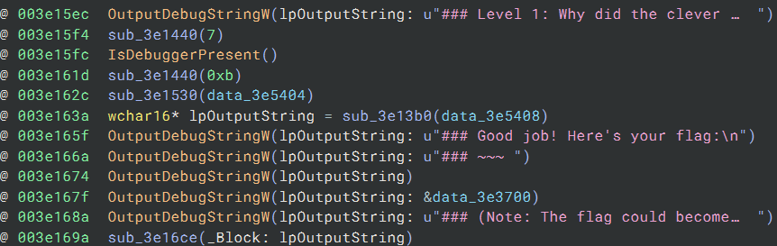
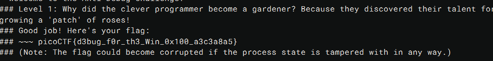

# CTF Write-Up: [Win Anti Dbg 0x100][Reverse Engineering]

## Description

## Flag
The flag you obtained after solving the challenge. (e.g., `picoCTF{d3bug_f0r_th3_Win_0x100_a3c3a8a5}`)

## Difficulty
- **Difficulty Level:** [medium]

## Tools Used
- BinaryNinja
- WinDBG
- Youtube

## Write-Up

### Step 1: [Prepartory]
- As per the name I likely need to install `windbg` in order to do the challenge. I realised later that the challenge is called Win **Anti Debug**, therefore this deduction was wrong :(.
- Upon running the executable via I obtain: 

- Playing around with `windbg` was abit confusing at first, so I switched to BinaryNinja during the attack phase.

### Step 2: [Attack]
- Open the executable in BinaryNinja

- Another clue was when running the binary there was a riddle which alluded to `patching`. Patching a binary essentially alters the flow of the program to work in our favour. 
- The key area to alter is the `if (isDebuggerPresent() == 0)` in order to obtain our flag.
- I altered the code to always jump into the code block containing the flag by removing the conditional statements.

- Saving this file and rerunning the debugger we obtain our flag.

### Step 3: [Third Step Title]
- Continue to describe subsequent steps until the solution is reached. 

### Final Solution/Payload
- Summarize how you arrived at the final solution and any critical insights that helped you solve the challenge.

## Lessons Learned
- Discuss what you learned from the challenge and any techniques or concepts you found particularly interesting.

## References
- https://www.youtube.com/watch?v=HlEk7P_VZfg

