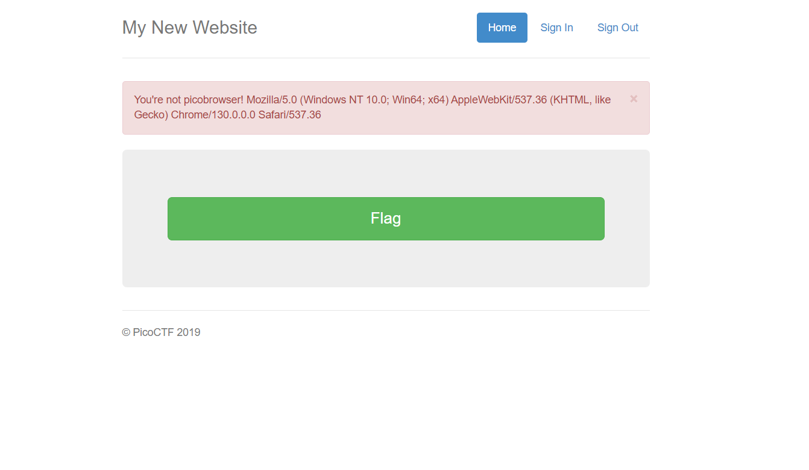
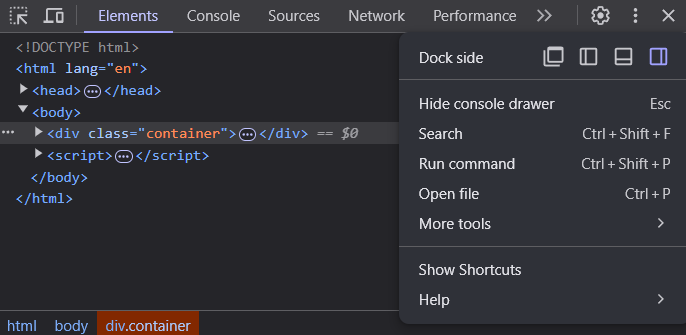
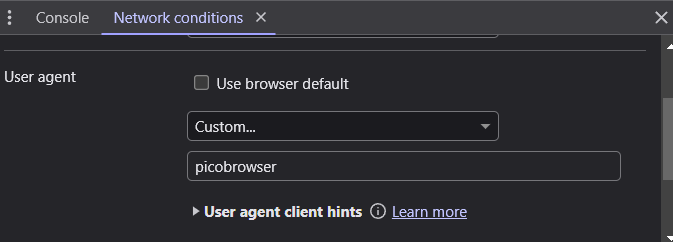
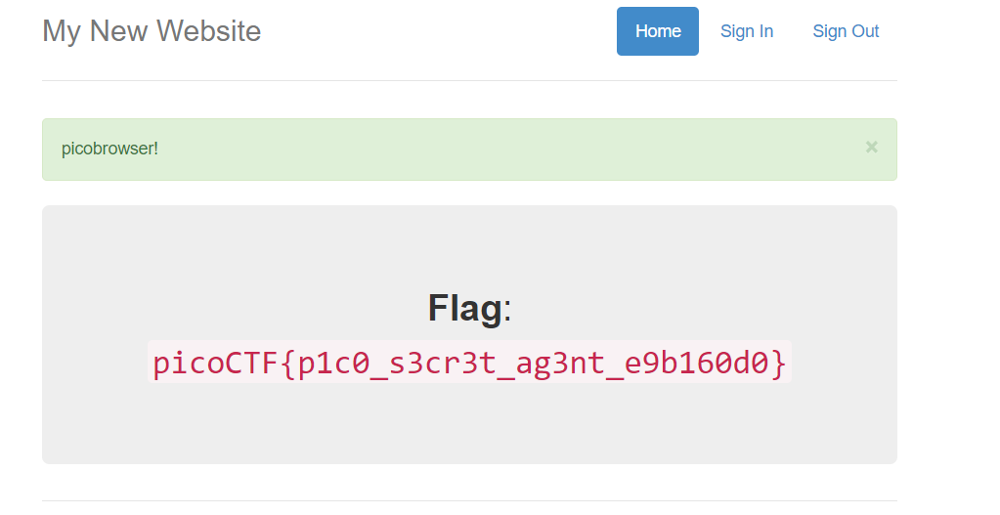

# CTF Write-Up: [Pico Browser][Web Exploitation]

## Description
>This website can be rendered only by picobrowser, go and catch the flag!

## Flag
The flag you obtained after solving the challenge. (e.g., `picoCTF{p1c0_s3cr3t_ag3nt_e9b160d0}`)

## Difficulty
- **Difficulty Level:** medium

## Tools Used
- Inspect Element
- Google

## Write-Up

### Preparatory Phase
Clicking on the given website I was greeted with: 

I conducted some research to see how websites were able to detect what browser I was using. Most websites identify the browser via a `User Agent String`. 

### Attack Phase
Upon learning this a natural response is to firstly find how to modify the `User Agent String.` This is located via going into `inspect element` then clicking the three vertical dots on the top-right corner. 

We then click `more tools` and then enter `network conditions.` Scrolling down to the bottom we find 
Refreshing the page we obtain our flag :)
### Final Solution/Payload

### Lessons Learnt
- Most websites identify your browser type and operating system via the User Agent ID.
## References
- [How websites know what browser you are on](#https://superuser.com/questions/1779654/how-do-websites-detect-my-browser)

