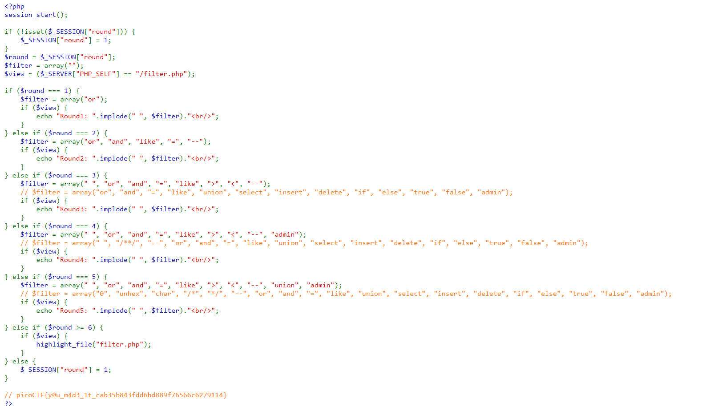

# CTF Write-Up: [Web Gauntlet 1][Web Exploitation]

## Description
>Can you beat the filters? Log in as admin http://jupiter.challenges.picoctf.org:19593/ http://jupiter.challenges.picoctf.org:19593/filter.php

## Flag
The flag you obtained after solving the challenge. (e.g., `picoCTF{y0u_m4d3_1t_cab35b843fdd6bd889f76566c6279114}`)

## Difficulty
- **Difficulty Level:** medium

## Write-Up

### Preparatory Phase
Revising basic payloads and 

### Attack Phase
Given five sub-challenges where by each challenge has new filters placed on the user input. For example, 

At about Round 4 was when I had some problems, namely with 

The reason it was abit more difficult was because it filtered out the word 'admin'. 

The previous three rounds I used the same payload since it did not filter for the `#` comment tag. I first attempted to conduct a `UNION`-based attack by trying to find potentially the password for admin in some table - however the program seemed to filter out white-space. Upon further research online I found out we can concatenate strings in SQL via 
>Source: https://portswigger.net/web-security/sql-injection/cheat-sheet

Now my final payload was `adm'||'in';#` which could work for all five Gauntlet challenges.

### Final Solution/Payload

### Lessons Learnt
Using SQL documentation and finding the right one can take some time. For example I initially found many other 'sql injection cheatsheets' but they did not include the concatenation. Therefore perserverance in scowering the net was vital in the success of this challenge.
## References
- https://portswigger.net/web-security/sql-injection/cheat-sheet

