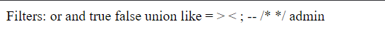
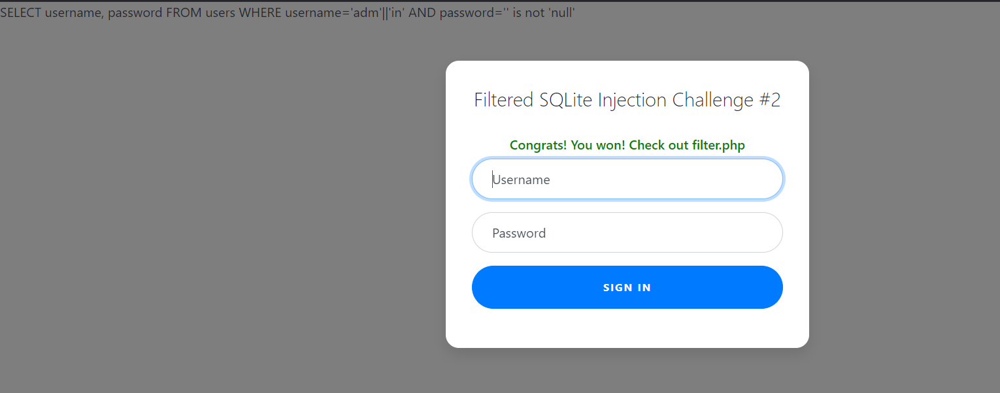

# CTF Write-Up: [Web Gauntlet 2][Web Exploitation]

## Description
>This website looks familiar... Log in as admin Site: http://mercury.picoctf.net:65261/ Filter: http://mercury.picoctf.net:65261/filter.php

## Flag
The flag you obtained after solving the challenge. (e.g., `picoCTF{0n3_m0r3_t1m3_e2db86ae880862ad471aa4c93343b2bf}`)

## Difficulty
- **Difficulty Level:** medium

## Write-Up

### Preparatory Phase
Reading the `filter.php` webpage I could not conduct a `UNION`-based attack or use a canonical `BOOLEAN`-based attack via `OR`/`AND`. I also likely could not just use the username field and comment out the password field since `;` was filtered out aswell. Therefore I could not terminate the query. 

### Attack Phase
I first attempted the query from Web Gauntlet 1 but removed the `;`. It unfortunately did not work as my query was not being terminated. Hence this clued me into having to use not only the username field but also the password field.

Upon further research I found a promising query via `is not`. The payload `'' is not null` should evaluate to TRUE thus this will form the payload for the password field. 
### Final Solution/Payload

### Lessons Learnt
The main lesson learnt in the challenge was I found out about the `is not` key word for SQL injections. This can be useful if the more well known `or` and `and` boolean operators are filtered out. 

## References
- https://www.tutorialspoint.com/sql/sql-not.htm

